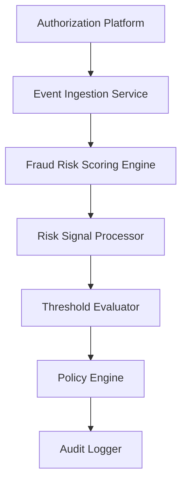

#### 1. High-Level Design

- **Summary:** This epic implements the foundational fraud detection capability that ingests transaction events from the authorization platform, evaluates risk using fraud-risk models considering multiple signals (unusual amounts, geographic inconsistencies, velocity, compromised cards, merchant behavior), produces risk decisions mapped to treatment levels, and applies configurable thresholds to determine alert requirements.

- **Component Flow:**

- **Integration Points:**
  - **Upstream:** Card authorization/transaction platform (transaction events)
  - **Downstream:** Fraud-risk engine/model service (risk scoring), Policy/decision engine (risk-to-action mapping), Analytics and audit infrastructure (decision logging, model performance monitoring), Alert service (alert creation trigger)

- **Key Assumptions:**
  - Transaction events include all required risk signals (device data, location, merchant category, transaction history context).
  - Fraud-risk models are versioned and model version metadata is captured in audit trails.

- **NFR Highlights:** Risk evaluation must meet agreed transaction-time SLA for near-real-time processing; System must support transaction spikes without unacceptable alert delays; High availability for security-critical services; Strong encryption for sensitive data; Idempotency and event versioning for reliability.

#### 2. Validation Report

- **Requirements Coverage:** The design addresses transaction event ingestion, risk scoring, configurable threshold management, risk decision model implementation (low/medium/high/confirmed fraud), risk signal evaluation (all listed signals), policy engine integration, idempotency handling, fail-safe policy when risk engine unavailable, audit trails with model versions, and model performance monitoring.