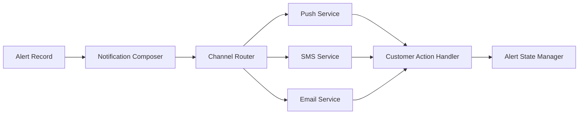

#### 1. High-Level Design

- **Summary:** This epic delivers the customer-facing fraud alert experience that notifies cardholders of suspicious transactions through multiple channels (push, SMS, email, in-app) with transaction context and enables quick confirmation or reporting actions, including alert state lifecycle management and notification fallback handling.

- **Component Flow:**

- **Integration Points:**
  - **Upstream:** Alert service (canonical alert record creation), Fraud detection engine (risk threshold trigger)
  - **Downstream:** Notification providers (push, SMS, email), Customer identity/authentication service (action authorization), Customer response service (decision recording), Analytics services (lifecycle event tracking), Audit infrastructure (delivery records)

- **Key Assumptions:**
  - Notification providers support delivery status callbacks or polling mechanisms for tracking.
  - Customer notification preferences are stored and accessible in real-time during alert composition.

- **NFR Highlights:** Alert delivery must meet near-real-time SLA from transaction event to customer notification; Notification delivery success tracked by channel; Secure deep links to prevent unauthorized actions; Never display full card numbers; Rate-limit sensitive endpoints.

#### 2. Validation Report

- **Requirements Coverage:** The design covers multi-channel notification delivery, alert content composition with transaction details, plain-language risk messaging, customer confirmation/reporting actions, alert state management, notification fallback, preference management with security overrides, active/resolved alert viewing, delivery tracking, retry logic, duplicate prevention, alert grouping, authentication requirements, and accessibility.