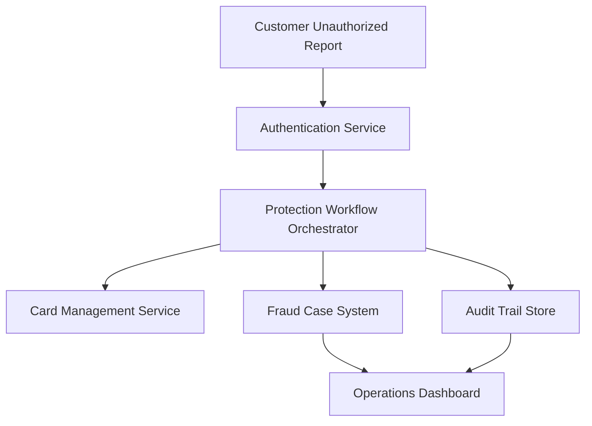

#### 1. High-Level Design

- **Summary:** This epic implements security workflows triggered when customers report unauthorized transactions, including authentication of customer responses, card/account protection actions (blocking, securing, replacement), fraud case creation, investigation initiation, and audit trail recording with operations visibility for fraud analysts.

- **Component Flow:**

- **Integration Points:**
  - **Upstream:** Customer response service (unauthorized report trigger), Customer identity/authentication service (response authentication)
  - **Downstream:** Card-management/protection service (blocking, replacement), Fraud case-management system (investigation, dispute), Analytics/audit infrastructure (lifecycle tracking), Customer-support systems (fraud interactions), Dispute management systems (case resolution)

- **Key Assumptions:**
  - Card blocking actions complete synchronously or provide immediate confirmation within operational SLA.
  - Fraud case-management system supports API-based case creation with required metadata fields.

- **NFR Highlights:** Protection workflows must complete within target operational SLA from unauthorized report to security action; High availability for security-critical services; Strong authentication for sensitive fraud-response actions; Zero critical security/privacy defects before GA.

#### 2. Validation Report

- **Requirements Coverage:** The design addresses unauthorized transaction reporting, card/account protection triggering, authentication/authorization, fraud case creation, card replacement workflow, investigation/dispute initiation, audit trails, operations visibility, alert outcome tracking, customer response analysis, step-up authentication, security event logging, and retention policy implementation.