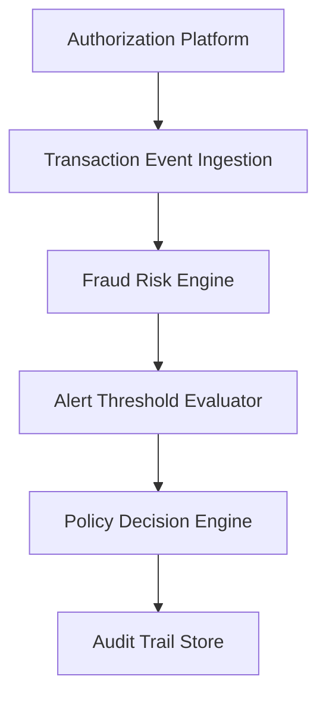

#### 1. High-Level Design

- **Summary:** This epic implements the core fraud detection engine that ingests transaction events from the authorization platform, evaluates risk using a fraud-risk scoring engine, applies configurable thresholds, and determines appropriate actions (approve, alert, hold, decline) with audit trails for all decisions.

- **Component Flow:**

- **Integration Points:**
  - **Upstream:** Card authorization/transaction platform (transaction events)
  - **Downstream:** Fraud-risk engine/model (risk scoring), Policy/decision engine (risk-to-action mapping), Analytics and audit infrastructure (event capture, metrics), Alert service (alert creation)

- **Key Assumptions:**
  - Transaction events arrive in a standardized format with required fields (amount, merchant, location, card identifier, timestamp).
  - Fraud-risk engine provides risk scores within transaction-time SLA constraints.

- **NFR Highlights:** Risk evaluation and alert triggering must meet agreed transaction-time SLA for near-real-time processing; High availability for security-critical services; Encrypt sensitive data in transit and at rest; Support transaction spikes without unacceptable delays.

#### 2. Validation Report

- **Requirements Coverage:** The design covers transaction ingestion, risk scoring, threshold evaluation, policy-based decision mapping, idempotency controls, risk signal processing, audit trails, and fail-safe handling when the risk engine is unavailable. All dependencies and NFRs are addressed.