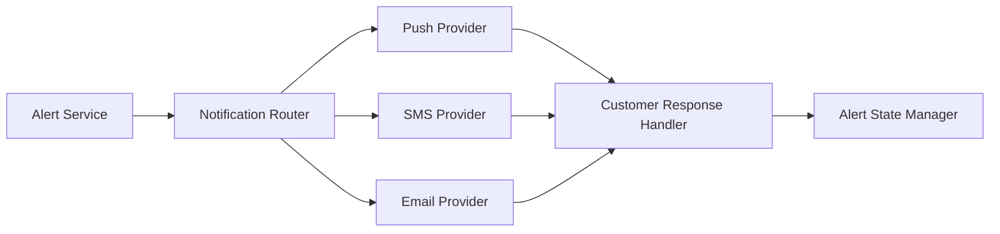

#### 1. High-Level Design

- **Summary:** This epic delivers the customer-facing fraud alert experience with multi-channel notification delivery (push, SMS, email, in-app), transaction detail presentation, and customer response workflows (confirm or report fraud), including alert state management and fallback channel handling.

- **Component Flow:**

- **Integration Points:**
  - **Upstream:** Alert service (canonical alert record creation), Fraud detection engine (alert trigger)
  - **Downstream:** Notification providers (push, SMS, email), Customer identity/authentication service (response authorization), Customer response service (decision recording), Analytics infrastructure (lifecycle event tracking)

- **Key Assumptions:**
  - Notification providers expose standard APIs for delivery status tracking and retry logic.
  - Customer authentication tokens are valid for the duration of alert response actions.

- **NFR Highlights:** Alert delivery must meet near-real-time SLA from transaction event to customer notification; Strong authentication required before sensitive fraud-response actions; Never display full card numbers; Rate-limit sensitive endpoints.

#### 2. Validation Report

- **Requirements Coverage:** The design addresses all scope elements including multi-channel delivery, transaction detail presentation, confirm/report actions, notification preferences with security overrides, fallback channels, alert state management, retry/failure handling, and edge cases (offline customers, duplicates, traveling customers).