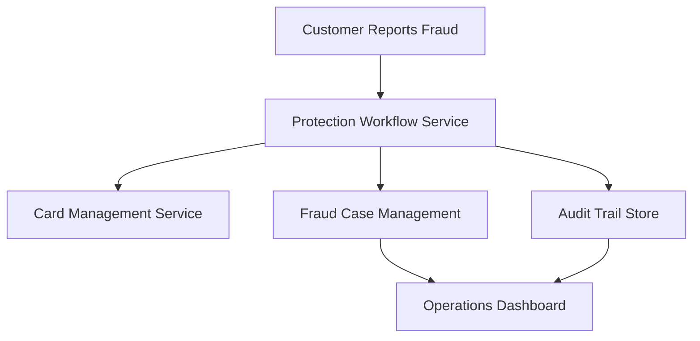

#### 1. High-Level Design

- **Summary:** This epic implements the security response triggered when customers report unauthorized transactions, including card blocking, account protection, investigation initiation, and operational monitoring dashboards for fraud teams to track alert outcomes, false positives, and system performance.

- **Component Flow:**

- **Integration Points:**
  - **Upstream:** Customer response service (fraud report trigger)
  - **Downstream:** Card-management/protection service (blocking, replacement), Fraud case-management system (investigation, dispute), Analytics/monitoring infrastructure (metrics, dashboards), Customer-support systems (escalation)

- **Key Assumptions:**
  - Card blocking and replacement workflows are synchronous or provide status callbacks within SLA timeframes.
  - Fraud case records follow a standard schema compatible with existing case-management systems.

- **NFR Highlights:** Complete unauthorized-report protection workflows within target operational SLA; High availability for security-critical services; Apply least-privilege access and encryption; Zero critical security/privacy defects before GA.

#### 2. Validation Report

- **Requirements Coverage:** The design covers all stated scope including card blocking, replacement triggering, investigation initiation, audit trails, operations dashboards, fraud loss/false positive tracking, and data retention enforcement. Integration points align with dependencies listed in the epic.