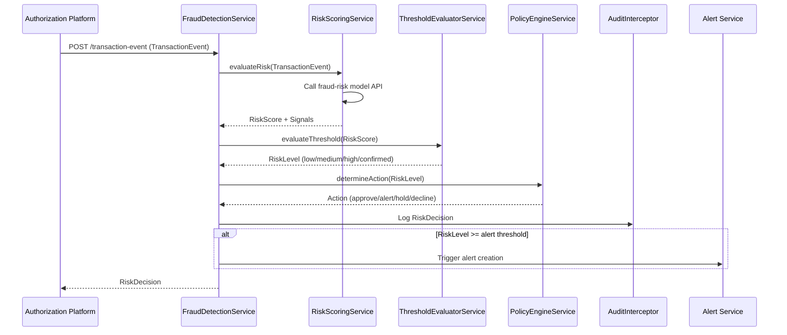

# Low-Level Design: QE-6190 - Real-Time Fraud Detection and Risk Scoring

## a. Architecture Mapping

| HLD Component | AngularJS Artifact |
|---|---|
| Event Ingestion Service | `FraudDetectionService` (Factory) - handles transaction event reception |
| Fraud Risk Scoring Engine | `RiskScoringService` (Service) - wraps API calls to fraud-risk model |
| Risk Signal Processor | `RiskSignalProcessor` (Service) - evaluates velocity, geo, amount, merchant signals |
| Threshold Evaluator | `ThresholdEvaluatorService` (Service) - applies configurable thresholds |
| Policy Engine | `PolicyEngineService` (Service) - maps risk levels to actions (approve/alert/hold/decline) |
| Audit Logger | `AuditInterceptor` ($httpProvider interceptor) - logs all risk decisions |

**Folder Structure:**
```
app/
  fraud-detection/
    fraud-detection.module.js
    fraud-detection.service.js
    risk-scoring.service.js
    risk-signal-processor.service.js
    threshold-evaluator.service.js
    policy-engine.service.js
  shared/
    interceptors/
      audit.interceptor.js
```

## b. Component Specifications

| Component Name | Artifact Type | Responsibility | Key Dependencies |
|---|---|---|---|
| `FraudDetectionService` | Factory | Ingests transaction events, orchestrates risk evaluation flow | `RiskScoringService`, `ThresholdEvaluatorService`, `PolicyEngineService` |
| `RiskScoringService` | Service | Calls fraud-risk model API, returns risk score and signals | `$http`, `ConfigService` |
| `RiskSignalProcessor` | Service | Processes velocity, geo-inconsistency, unusual amount, compromised card signals | None |
| `ThresholdEvaluatorService` | Service | Compares risk score against configurable thresholds (low/medium/high/confirmed) | `ConfigService` |
| `PolicyEngineService` | Service | Maps risk level to action (approve/alert/hold/decline) | `$http` (policy API) |
| `AuditInterceptor` | Interceptor | Logs all risk decisions with model version, event ID, timestamp | `$q`, `AuditService` |

## c. Data Model

```javascript
TransactionEvent = {
  eventId: String,
  cardId: String,
  amount: Number,
  merchantName: String,
  merchantCategory: String,
  location: { lat: Number, lon: Number },
  timestamp: String (ISO8601),
  deviceData: Object,
  transactionHistory: Array<Object>
}

RiskDecision = {
  eventId: String,
  riskScore: Number,
  riskLevel: String, // 'low' | 'medium' | 'high' | 'confirmed'
  action: String, // 'approve' | 'alert' | 'hold' | 'decline'
  signals: Array<String>,
  modelVersion: String,
  timestamp: String
}

RiskSignal = {
  signalType: String, // 'velocity' | 'geo' | 'amount' | 'merchant' | 'compromised'
  severity: String, // 'low' | 'medium' | 'high'
  metadata: Object
}
```

## d. Data Flow

When a transaction event arrives from the authorization platform, `FraudDetectionService` receives it and passes it to `RiskScoringService`, which calls the fraud-risk model API to compute a risk score and extract signals. The score is evaluated by `ThresholdEvaluatorService` against configurable thresholds to determine the risk level (low/medium/high/confirmed). `PolicyEngineService` then maps the risk level to an action (approve/alert/hold/decline). The decision is logged via `AuditInterceptor` with model version and event metadata. If the risk level crosses the alert threshold, an alert creation trigger is sent to the Alert Service. The UI (if applicable) displays transaction status and any hold/decline messaging.

## e. Primary Sequence Diagram



## f. Implementation Notes

- DI: All services use constructor injection with `$inject` array annotation for minification safety.
- API calls: `RiskScoringService` and `PolicyEngineService` centralize all external API calls; controllers never call APIs directly.
- Idempotency: `FraudDetectionService` checks event ID against cache (via `CacheFactory`) to prevent duplicate processing.
- Fail-safe: If risk engine API fails, `PolicyEngineService` applies default "approve with manual review" policy.
- ES6: Arrow functions, `const`/`let`, template literals used throughout; Babel transpiles to ES5.

## g. Error Handling

Centralized `$http` interceptor catches API failures; risk engine unavailability triggers fail-safe policy; user-facing errors surfaced via shared notification service.

## h. Security Notes

Token-based authentication via existing SSO; sensitive transaction data encrypted in transit (TLS); audit logs exclude full card numbers; rate-limiting applied to risk evaluation endpoints.