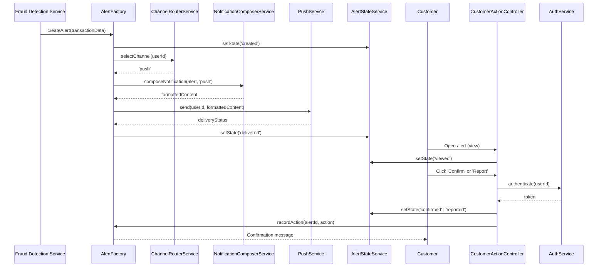

# Low-Level Design: QE-6191 - Multi-Channel Alert Notification and Customer Response

## a. Architecture Mapping

| HLD Component | AngularJS Artifact |
|---|---|
| Alert Record | `AlertFactory` (Factory) - manages canonical alert state |
| Notification Composer | `NotificationComposerService` (Service) - formats alert content per channel |
| Channel Router | `ChannelRouterService` (Service) - selects delivery channel based on preferences |
| Push/SMS/Email Services | `PushService`, `SmsService`, `EmailService` (Services) - wrap provider APIs |
| Customer Action Handler | `CustomerActionController` (Controller) + `customer-action.html` (View) |
| Alert State Manager | `AlertStateService` (Service) - tracks alert lifecycle (created→delivered→viewed→confirmed/reported) |

**Folder Structure:**
```
app/
  alerts/
    alerts.module.js
    alert.factory.js
    notification-composer.service.js
    channel-router.service.js
    push.service.js
    sms.service.js
    email.service.js
    alert-state.service.js
    customer-action.controller.js
    views/customer-action.html
  shared/
    services/
      auth.service.js
```

## b. Component Specifications

| Component Name | Artifact Type | Responsibility | Key Dependencies |
|---|---|---|---|
| `AlertFactory` | Factory | Singleton managing alert records and state | `$http`, `AlertStateService` |
| `NotificationComposerService` | Service | Formats transaction details, risk message, action buttons per channel | None |
| `ChannelRouterService` | Service | Determines delivery channel (push→SMS→email fallback) based on preferences | `PreferencesService` |
| `PushService` | Service | Sends push notifications via provider API | `$http` |
| `SmsService` | Service | Sends SMS via provider API | `$http` |
| `EmailService` | Service | Sends email via provider API | `$http` |
| `AlertStateService` | Service | Transitions alert state (created/queued/delivered/viewed/confirmed/reported/resolved/expired) | `$http` |
| `CustomerActionController` | Controller | Handles confirm/report actions, authenticates user, updates alert state | `AuthService`, `AlertFactory`, `AlertStateService` |

## c. Data Model

```javascript
Alert = {
  alertId: String,
  transactionId: String,
  amount: Number,
  merchantName: String,
  timestamp: String,
  location: String,
  maskedCardId: String, // e.g., "**** 1234"
  riskMessage: String, // plain-language
  state: String, // 'created' | 'queued' | 'delivered' | 'viewed' | 'confirmed' | 'reported' | 'resolved' | 'expired'
  deliveryChannel: String, // 'push' | 'sms' | 'email' | 'in-app'
  createdAt: String,
  deliveredAt: String,
  viewedAt: String,
  respondedAt: String
}

CustomerAction = {
  alertId: String,
  action: String, // 'confirm' | 'report'
  userId: String,
  timestamp: String
}

NotificationPreferences = {
  userId: String,
  primaryChannel: String, // 'push' | 'sms' | 'email'
  fallbackChannel: String,
  securityOverride: Boolean
}
```

## d. Data Flow

When a fraud alert is triggered, `AlertFactory` creates a canonical alert record. `ChannelRouterService` selects the delivery channel based on `NotificationPreferences` (with security policy overrides). `NotificationComposerService` formats the alert content (transaction details, risk message, action buttons). The selected channel service (`PushService`, `SmsService`, or `EmailService`) delivers the notification and updates `AlertStateService` to 'delivered'. When the customer opens the alert, the view updates state to 'viewed'. The customer interacts with `CustomerActionController` to confirm or report the transaction. `AuthService` authenticates the action, and `AlertStateService` transitions the alert to 'confirmed' or 'reported'. If delivery fails, `ChannelRouterService` retries with the fallback channel.

## e. Primary Sequence Diagram



## f. Implementation Notes

- DI: All services use `$inject` array annotation for minification safety.
- API calls: Channel services (`PushService`, `SmsService`, `EmailService`) centralize provider API calls.
- Retry logic: `ChannelRouterService` implements exponential backoff for failed deliveries; max 3 retries before fallback.
- Deep links: Alert notifications include secure deep links with time-limited tokens validated by `AuthService`.
- ES6: Arrow functions, `const`/`let`, template literals; Babel transpiles to ES5.

## g. Error Handling

Centralized `$http` interceptor catches delivery failures; fallback channel triggered on primary failure; user-facing errors surfaced via shared notification service.

## h. Security Notes

Strong authentication via `AuthService` before confirm/report actions; deep links use time-limited tokens; rate-limiting on customer action endpoints; never display full card numbers.