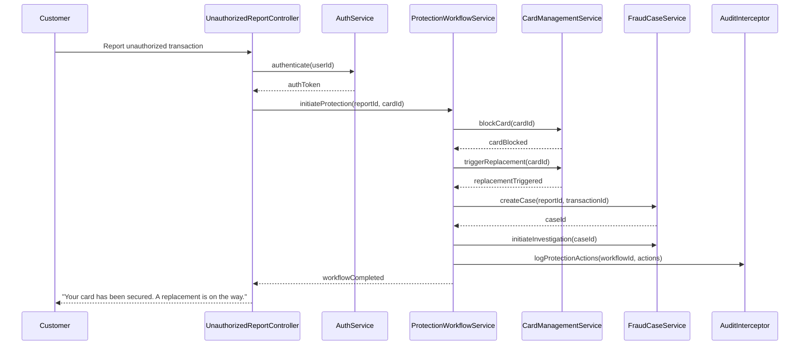

# Low-Level Design: QE-6192 - Account Protection and Fraud Case Management

## a. Architecture Mapping

| HLD Component | AngularJS Artifact |
|---|---|
| Customer Unauthorized Report | `UnauthorizedReportController` (Controller) + `unauthorized-report.html` (View) |
| Authentication Service | `AuthService` (Service) - validates customer identity before protection actions |
| Protection Workflow Orchestrator | `ProtectionWorkflowService` (Service) - coordinates card blocking, case creation, audit logging |
| Card Management Service | `CardManagementService` (Service) - wraps card blocking/replacement API |
| Fraud Case System | `FraudCaseService` (Service) - creates fraud case records, initiates investigation |
| Audit Trail Store | `AuditInterceptor` ($httpProvider interceptor) - logs all protection actions |
| Operations Dashboard | `OperationsDashboardController` (Controller) + `operations-dashboard.html` (View) |

**Folder Structure:**
```
app/
  fraud-protection/
    fraud-protection.module.js
    unauthorized-report.controller.js
    protection-workflow.service.js
    card-management.service.js
    fraud-case.service.js
    operations-dashboard.controller.js
    views/unauthorized-report.html
    views/operations-dashboard.html
  shared/
    services/
      auth.service.js
    interceptors/
      audit.interceptor.js
```

## b. Component Specifications

| Component Name | Artifact Type | Responsibility | Key Dependencies |
|---|---|---|---|
| `UnauthorizedReportController` | Controller | Handles customer unauthorized transaction report, triggers protection workflow | `AuthService`, `ProtectionWorkflowService` |
| `AuthService` | Service | Authenticates customer before sensitive fraud-response actions | `$http`, `TokenService` |
| `ProtectionWorkflowService` | Service | Orchestrates card blocking, case creation, investigation initiation, audit logging | `CardManagementService`, `FraudCaseService`, `AuditInterceptor` |
| `CardManagementService` | Service | Calls card-management API to block card, trigger replacement | `$http` |
| `FraudCaseService` | Service | Creates fraud case record, initiates investigation, links to dispute system | `$http` |
| `AuditInterceptor` | Interceptor | Logs all protection actions with timestamps, user ID, action type | `$q`, `AuditService` |
| `OperationsDashboardController` | Controller | Displays fraud analyst dashboard with alert outcomes, response rates, protection metrics | `FraudCaseService`, `AnalyticsService` |

## c. Data Model

```javascript
UnauthorizedReport = {
  reportId: String,
  alertId: String,
  transactionId: String,
  userId: String,
  reportedAt: String,
  authenticatedBy: String // auth token reference
}

ProtectionWorkflow = {
  workflowId: String,
  reportId: String,
  cardId: String,
  actions: Array<String>, // ['card_blocked', 'replacement_triggered', 'case_created', 'investigation_initiated']
  status: String, // 'initiated' | 'in_progress' | 'completed' | 'failed'
  completedAt: String,
  slaTarget: Number, // milliseconds
  slaMet: Boolean
}

FraudCase = {
  caseId: String,
  reportId: String,
  transactionId: String,
  userId: String,
  status: String, // 'open' | 'investigating' | 'resolved' | 'disputed'
  assignedTo: String,
  createdAt: String,
  resolvedAt: String,
  outcome: String // 'confirmed_fraud' | 'false_positive' | 'dispute_filed'
}

OperationsMetrics = {
  totalAlerts: Number,
  deliveredAlerts: Number,
  viewedAlerts: Number,
  confirmedAlerts: Number,
  reportedAlerts: Number,
  protectionWorkflowsCompleted: Number,
  averageResponseTime: Number, // milliseconds
  falsePositiveRate: Number,
  fraudLossRate: Number
}
```

## d. Data Flow

When a customer reports an unauthorized transaction via `UnauthorizedReportController`, `AuthService` authenticates the user. Upon successful authentication, `ProtectionWorkflowService` initiates the protection workflow by calling `CardManagementService` to block the card and trigger replacement. Simultaneously, `FraudCaseService` creates a fraud case record and initiates investigation. `AuditInterceptor` logs all actions with timestamps and user context. The workflow status is tracked until completion, and SLA compliance is recorded. Fraud analysts access `OperationsDashboardController` to view alert outcomes, response rates, protection metrics, and investigate cases. If the workflow fails, retry logic is applied, and escalation is triggered if SLA is breached.

## e. Primary Sequence Diagram



## f. Implementation Notes

- DI: All services use `$inject` array annotation for minification safety.
- API calls: `CardManagementService` and `FraudCaseService` centralize external API calls; controllers never call APIs directly.
- SLA tracking: `ProtectionWorkflowService` records workflow start/end times and compares against target SLA; breaches trigger alerts to operations team.
- Retry logic: Card blocking and case creation failures trigger exponential backoff retry (max 3 attempts) before escalation.
- ES6: Arrow functions, `const`/`let`, template literals; Babel transpiles to ES5.

## g. Error Handling

Centralized `$http` interceptor catches API failures; protection workflow failures trigger retry logic and escalation; user-facing errors surfaced via shared notification service.

## h. Security Notes

Strong authentication via `AuthService` before protection actions; step-up authentication for high-risk actions; audit logs exclude full card numbers; least-privilege access enforced for fraud analyst dashboard.