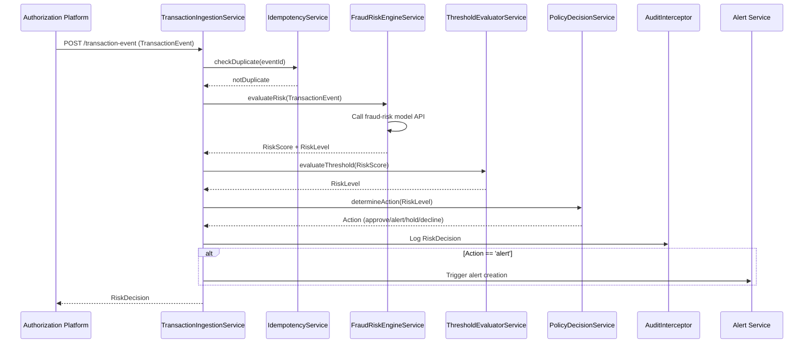

# Low-Level Design: QE-6193 - Real-Time Fraud Detection and Risk Evaluation

## a. Architecture Mapping

| HLD Component | AngularJS Artifact |
|---|---|
| Transaction Event Ingestion | `TransactionIngestionService` (Service) - receives and validates transaction events |
| Fraud Risk Engine | `FraudRiskEngineService` (Service) - wraps fraud-risk model API |
| Alert Threshold Evaluator | `ThresholdEvaluatorService` (Service) - applies configurable thresholds |
| Policy Decision Engine | `PolicyDecisionService` (Service) - maps risk to actions (approve/alert/hold/decline) |
| Audit Trail Store | `AuditInterceptor` ($httpProvider interceptor) - logs all risk decisions |

**Folder Structure:**
```
app/
  fraud-detection/
    fraud-detection.module.js
    transaction-ingestion.service.js
    fraud-risk-engine.service.js
    threshold-evaluator.service.js
    policy-decision.service.js
  shared/
    interceptors/
      audit.interceptor.js
```

## b. Component Specifications

| Component Name | Artifact Type | Responsibility | Key Dependencies |
|---|---|---|---|
| `TransactionIngestionService` | Service | Receives transaction events, validates format, checks idempotency | `$http`, `IdempotencyService` |
| `FraudRiskEngineService` | Service | Calls fraud-risk model API, returns risk score and decision | `$http`, `ConfigService` |
| `ThresholdEvaluatorService` | Service | Compares risk score against configurable thresholds | `ConfigService` |
| `PolicyDecisionService` | Service | Maps risk level to action (approve/alert/hold/decline) | `$http` (policy API) |
| `AuditInterceptor` | Interceptor | Logs all risk decisions with model version, event ID, timestamp | `$q`, `AuditService` |
| `IdempotencyService` | Service | Tracks processed event IDs to prevent duplicate processing | `CacheFactory` |

## c. Data Model

```javascript
TransactionEvent = {
  eventId: String,
  cardId: String,
  amount: Number,
  merchantName: String,
  merchantCategory: String,
  location: { lat: Number, lon: Number },
  timestamp: String,
  deviceData: Object
}

RiskDecision = {
  eventId: String,
  riskScore: Number,
  riskLevel: String, // 'low' | 'medium' | 'high' | 'confirmed'
  action: String, // 'approve' | 'alert' | 'hold' | 'decline'
  modelVersion: String,
  timestamp: String
}

PolicyRule = {
  riskLevel: String,
  action: String,
  requiresAlert: Boolean
}
```

## d. Data Flow

When a transaction event arrives from the authorization platform, `TransactionIngestionService` receives and validates it, checking `IdempotencyService` to prevent duplicate processing. The event is passed to `FraudRiskEngineService`, which calls the fraud-risk model API to compute a risk score and decision. `ThresholdEvaluatorService` evaluates the score against configurable thresholds to determine the risk level (low/medium/high/confirmed). `PolicyDecisionService` maps the risk level to an action (approve/alert/hold/decline) based on policy rules. The decision is logged via `AuditInterceptor` with model version and event metadata. If the action is 'alert', the Alert Service is triggered. The decision is returned to the authorization platform.

## e. Primary Sequence Diagram



## f. Implementation Notes

- DI: All services use `$inject` array annotation for minification safety.
- API calls: `FraudRiskEngineService` and `PolicyDecisionService` centralize external API calls; controllers never call APIs directly.
- Idempotency: `IdempotencyService` uses `CacheFactory` to track processed event IDs with TTL (24 hours).
- Fail-safe: If fraud-risk engine API fails, `PolicyDecisionService` applies default "approve with manual review" policy.
- ES6: Arrow functions, `const`/`let`, template literals; Babel transpiles to ES5.

## g. Error Handling

Centralized `$http` interceptor catches API failures; fraud-risk engine unavailability triggers fail-safe policy; user-facing errors surfaced via shared notification service.

## h. Security Notes

Token-based authentication via existing SSO; sensitive transaction data encrypted in transit (TLS); audit logs exclude full card numbers; rate-limiting applied to ingestion endpoints.