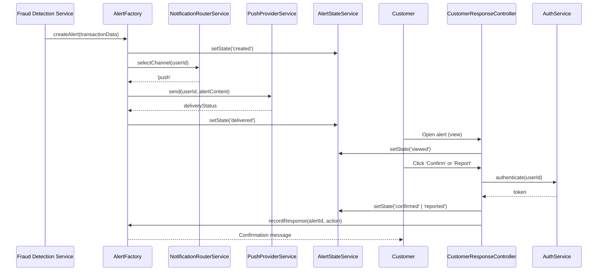

# Low-Level Design: QE-6194 - Customer Alert Notification and Response Management

## a. Architecture Mapping

| HLD Component | AngularJS Artifact |
|---|---|
| Alert Service | `AlertFactory` (Factory) - manages canonical alert records |
| Notification Router | `NotificationRouterService` (Service) - selects delivery channel |
| Push/SMS/Email Providers | `PushProviderService`, `SmsProviderService`, `EmailProviderService` (Services) - wrap provider APIs |
| Customer Response Handler | `CustomerResponseController` (Controller) + `customer-response.html` (View) |
| Alert State Manager | `AlertStateService` (Service) - tracks alert lifecycle |

**Folder Structure:**
```
app/
  alerts/
    alerts.module.js
    alert.factory.js
    notification-router.service.js
    push-provider.service.js
    sms-provider.service.js
    email-provider.service.js
    alert-state.service.js
    customer-response.controller.js
    views/customer-response.html
  shared/
    services/
      auth.service.js
```

## b. Component Specifications

| Component Name | Artifact Type | Responsibility | Key Dependencies |
|---|---|---|---|
| `AlertFactory` | Factory | Singleton managing alert records and state | `$http`, `AlertStateService` |
| `NotificationRouterService` | Service | Determines delivery channel (push→SMS→email fallback) | `PreferencesService` |
| `PushProviderService` | Service | Sends push notifications via provider API | `$http` |
| `SmsProviderService` | Service | Sends SMS via provider API | `$http` |
| `EmailProviderService` | Service | Sends email via provider API | `$http` |
| `AlertStateService` | Service | Transitions alert state (created/queued/delivered/viewed/confirmed/reported/resolved/expired) | `$http` |
| `CustomerResponseController` | Controller | Handles confirm/report actions, authenticates user, updates alert state | `AuthService`, `AlertFactory`, `AlertStateService` |

## c. Data Model

```javascript
Alert = {
  alertId: String,
  transactionId: String,
  amount: Number,
  merchantName: String,
  timestamp: String,
  location: String,
  maskedCardId: String,
  riskMessage: String,
  state: String, // 'created' | 'queued' | 'delivered' | 'viewed' | 'confirmed' | 'reported' | 'resolved' | 'expired'
  deliveryChannel: String,
  createdAt: String,
  deliveredAt: String,
  viewedAt: String,
  respondedAt: String
}

CustomerResponse = {
  alertId: String,
  action: String, // 'confirm' | 'report'
  userId: String,
  timestamp: String
}

NotificationPreferences = {
  userId: String,
  primaryChannel: String,
  fallbackChannel: String,
  securityOverride: Boolean
}
```

## d. Data Flow

When a fraud alert is triggered, `AlertFactory` creates a canonical alert record. `NotificationRouterService` selects the delivery channel based on `NotificationPreferences` (with security policy overrides). The selected provider service (`PushProviderService`, `SmsProviderService`, or `EmailProviderService`) delivers the notification and updates `AlertStateService` to 'delivered'. When the customer opens the alert, the view updates state to 'viewed'. The customer interacts with `CustomerResponseController` to confirm or report the transaction. `AuthService` authenticates the action, and `AlertStateService` transitions the alert to 'confirmed' or 'reported'. If delivery fails, `NotificationRouterService` retries with the fallback channel.

## e. Primary Sequence Diagram



## f. Implementation Notes

- DI: All services use `$inject` array annotation for minification safety.
- API calls: Provider services centralize external API calls; controllers never call APIs directly.
- Retry logic: `NotificationRouterService` implements exponential backoff for failed deliveries; max 3 retries before fallback.
- Deep links: Alert notifications include secure deep links with time-limited tokens validated by `AuthService`.
- ES6: Arrow functions, `const`/`let`, template literals; Babel transpiles to ES5.

## g. Error Handling

Centralized `$http` interceptor catches delivery failures; fallback channel triggered on primary failure; user-facing errors surfaced via shared notification service.

## h. Security Notes

Strong authentication via `AuthService` before confirm/report actions; deep links use time-limited tokens; rate-limiting on customer response endpoints; never display full card numbers.