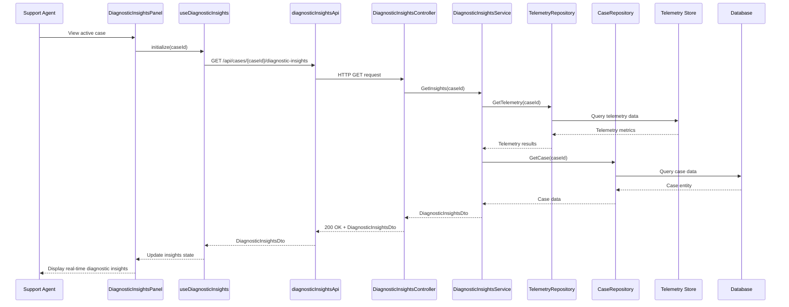

# LLD – SCRUM-33049 – Real-Time Diagnostic Insights

a. Story Summary
- Provide real-time diagnostic insights about member issues for support agents viewing active cases.
- Aggregate and present key telemetry and case data in a concise summary within the diagnostic panel.

b. Architecture Mapping (brief)
- Frontend (React)
  - `DiagnosticInsightsPanel` (Component): Displays real-time summary of diagnostic insights for the active case.
  - `InsightMetricCard` (Component): Shows individual metric or insight (e.g., error rate, last failure time).
  - `useDiagnosticInsights` (Custom Hook): Manages live data retrieval (polling or WebSocket) and state updates.
  - `diagnosticInsightsApi` (API Client): Fetches current diagnostic insights for a member case.
- Backend (C# / ASP.NET Core)
  - `DiagnosticInsightsController` (Controller): Provides endpoints for retrieving aggregated diagnostic insights.
  - `DiagnosticInsightsService` (Service): Aggregates telemetry and case data into consumable insights.
  - `TelemetryRepository` (Repository): Reads telemetry data (e.g., from time-series DB or log store).
  - `CaseRepository` (Repository): Retrieves case metadata related to the member issue.
  - `DiagnosticInsight`, `DiagnosticInsightsSnapshot` (Entities/Models): Represent computed insights and snapshots.
  - `DiagnosticInsightDto`, `DiagnosticInsightsDto` (DTOs): Structures for returning insights summary to the UI.
- Recommended Folder Structure
  - React `src/`: `components/Diagnostic/DiagnosticInsightsPanel.tsx`, `components/Diagnostic/InsightMetricCard.tsx`, `hooks/useDiagnosticInsights.ts`, `api/diagnosticInsightsApi.ts`.
  - .NET: `Controllers/DiagnosticInsightsController.cs`, `Services/DiagnosticInsightsService.cs`, `Repositories/TelemetryRepository.cs`, `Repositories/CaseRepository.cs`, `Models/DTOs/DiagnosticInsightsDto.cs`.

c. Component Specifications
| Name                      | Layer        | Artifact Type | Responsibility                                                                | Key Dependencies                                     |
|---------------------------|-------------|---------------|-------------------------------------------------------------------------------|-----------------------------------------------------|
| DiagnosticInsightsPanel   | React       | Component     | Render real-time summary of diagnostic insights for the active case.         | useDiagnosticInsights, InsightMetricCard            |
| InsightMetricCard         | React       | Component     | Display single insight metric/value with label and styling.                  | shared Card/UI components                           |
| useDiagnosticInsights     | React       | Custom Hook   | Fetch and periodically refresh diagnostic insights; manage loading/errors.    | diagnosticInsightsApi, useState/useEffect           |
| diagnosticInsightsApi     | React       | API Client    | Wrap HTTP calls for retrieving diagnostic insights from backend.             | apiClient (Axios/fetch), auth context               |
| DiagnosticInsightsController | API      | Controller    | Expose endpoint to get current diagnostic insights for a case.               | DiagnosticInsightsService, ASP.NET routing          |
| DiagnosticInsightsService | Service     | Service Class | Aggregate telemetry and case data into high-level insights.                  | TelemetryRepository, CaseRepository, logger         |
| TelemetryRepository       | Data        | Repository    | Retrieve telemetry metrics from telemetry data source.                        | Telemetry DB client/EF Core                         |
| CaseRepository            | Data        | Repository    | Retrieve case metadata and status.                                           | DbContext, EF Core                                  |
| DiagnosticInsight         | Data        | Model         | Represent a single insight metric/value pair.                                 | n/a                                                 |
| DiagnosticInsightsDto     | Service/API | DTO           | Transport collection of insight metrics to frontend.                          | AutoMapper/Custom mapping                           |

d. API Contract
| Method | Route                                      | Request DTO | Response DTO          | Status Codes                     |
|--------|--------------------------------------------|------------|-----------------------|----------------------------------|
| GET    | /api/cases/{caseId}/diagnostic-insights    | n/a        | DiagnosticInsightsDto | 200 OK, 401, 404, 500           |

e. Data Model (brief)
- C# Models/DTOs
  - `DiagnosticInsight` (Model)
    - `string Key`
    - `string Label`
    - `string Value`
    - `string? Unit`
  - `DiagnosticInsightsDto`
    - `string CaseId`
    - `IEnumerable<DiagnosticInsight> Insights`
    - `DateTime GeneratedAt`

- TypeScript Interfaces
  - `DiagnosticInsight` (UI)
    - `key: string`
    - `label: string`
    - `value: string`
    - `unit?: string`
  - `DiagnosticInsights` (UI)
    - `caseId: string`
    - `insights: DiagnosticInsight[]`
    - `generatedAt: string`

f. Data Flow (one paragraph)
When the support agent views a member’s active case, `DiagnosticInsightsPanel` mounts and `useDiagnosticInsights` calls `diagnosticInsightsApi.getInsights(caseId)`; this triggers a GET request to `DiagnosticInsightsController`, which invokes `DiagnosticInsightsService` to aggregate telemetry and case data via `TelemetryRepository` and `CaseRepository`, producing a `DiagnosticInsightsDto` containing key insight metrics; the controller returns this as JSON, the hook updates state and optionally sets up a polling interval to refresh data, and `DiagnosticInsightsPanel` renders `InsightMetricCard` components for each insight, updating them in near real-time as new data arrives.

g. Primary Sequence Diagram

h. Implementation Notes (brief)
- Use `setInterval` within `useDiagnosticInsights` (with cleanup) or server push (e.g., WebSockets) if later required for true real-time updates.
- Keep insights limited and aggregated (e.g., 5–10 key metrics) to avoid overwhelming the UI.
- In the backend, cache frequently used telemetry to minimize load on telemetry stores.
- Use structured logging around insight generation for observability.
- Ensure DTO mapping keeps keys stable for React list rendering.

i. Assumptions (brief)
- Telemetry and case data sources are available and accessible via repositories.
- Real-time is approximated via short polling intervals (e.g., 15–30 seconds) for this story.
- The diagnostic panel already has `caseId` available when loading insights.

j. Error Handling (ONE line)
- ASP.NET Core global exception handling returns ProblemDetails JSON and the UI shows a non-blocking banner if insights cannot be loaded.

k. Security Notes (ONE line)
- Standard input validation and secure API calls assumed, with endpoints restricted to authenticated support agents using JWT bearer tokens.
