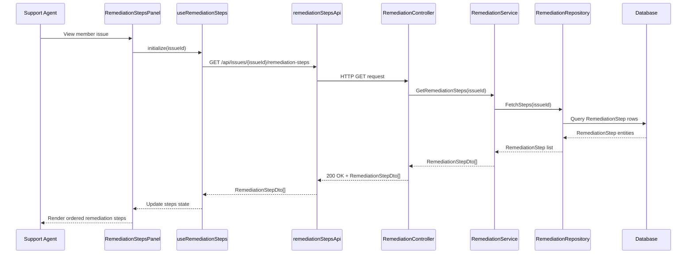

# LLD – SCRUM-33050 – AI-Generated Remediation Steps

a. Story Summary
- Present AI-generated, step-by-step remediation instructions for a member issue in the diagnostic panel.
- Ensure the steps are shown as an ordered list that agents can easily follow.

b. Architecture Mapping (brief)
- Frontend (React)
  - `RemediationStepsPanel` (Component): Displays ordered list of remediation steps for a specific issue.
  - `RemediationStepItem` (Component): Represents an individual step with step number and description.
  - `useRemediationSteps` (Custom Hook): Fetches remediation steps and manages loading/error state.
  - `remediationStepsApi` (API Client): Communicates with backend to retrieve remediation steps for an issue.
- Backend (C# / ASP.NET Core)
  - `RemediationController` (Controller): Provides endpoint for fetching remediation steps for a member issue.
  - `RemediationService` (Service): Coordinates AI generation or retrieval of remediation steps.
  - `RemediationRepository` (Repository): Stores/remembers previously generated remediation instructions, if needed.
  - `RemediationStep` (Entity): Represents a single remediation step for an issue.
  - `RemediationStepDto` (DTO): Structure returned to UI with ordered steps.
- Recommended Folder Structure
  - React `src/`: `components/Remediation/RemediationStepsPanel.tsx`, `components/Remediation/RemediationStepItem.tsx`, `hooks/useRemediationSteps.ts`, `api/remediationStepsApi.ts`.
  - .NET: `Controllers/RemediationController.cs`, `Services/RemediationService.cs`, `Repositories/RemediationRepository.cs`, `Models/Entities/RemediationStep.cs`, `Models/DTOs/RemediationStepDto.cs`.

c. Component Specifications
| Name                    | Layer        | Artifact Type | Responsibility                                                              | Key Dependencies                                   |
|-------------------------|-------------|---------------|-----------------------------------------------------------------------------|---------------------------------------------------|
| RemediationStepsPanel   | React       | Component     | Render ordered list of remediation steps for the current issue.            | useRemediationSteps, RemediationStepItem          |
| RemediationStepItem     | React       | Component     | Render individual step with number and formatted description.              | shared Typography, CSS modules                    |
| useRemediationSteps     | React       | Custom Hook   | Fetch remediation steps for an issue and manage loading/error state.       | remediationStepsApi, useState/useEffect           |
| remediationStepsApi     | React       | API Client    | Wrap HTTP GET call to remediation steps endpoint.                          | apiClient (Axios/fetch), auth context             |
| RemediationController   | API         | Controller    | Expose API to retrieve remediation steps for a given issue.                | RemediationService, ASP.NET routing               |
| RemediationService      | Service     | Service Class | Fetch or generate ordered remediation steps for an issue.                  | RemediationRepository, external AI engine         |
| RemediationRepository   | Data        | Repository    | Persist and retrieve remediation steps.                                     | DbContext, EF Core                                 |
| RemediationStep         | Data        | Entity        | Represent a single remediation step associated with an issue.              | EF Core                                           |
| RemediationStepDto      | Service/API | DTO           | Transport remediation step data to frontend in correct order.              | AutoMapper, RemediationStep entity                |

d. API Contract
| Method | Route                                | Request DTO | Response DTO          | Status Codes                 |
|--------|--------------------------------------|------------|-----------------------|------------------------------|
| GET    | /api/issues/{issueId}/remediation-steps | n/a        | RemediationStepDto[]  | 200 OK, 401, 404, 500        |

e. Data Model (brief)
- C# Entities/DTOs
  - `RemediationStep` (Entity)
    - `Guid Id`
    - `string IssueId`
    - `int Order`
    - `string Title`
    - `string Description`
  - `RemediationStepDto`
    - `Guid Id`
    - `int Order`
    - `string Title`
    - `string Description`

- TypeScript Interfaces
  - `RemediationStep` (UI)
    - `id: string`
    - `order: number`
    - `title: string`
    - `description: string`

f. Data Flow (one paragraph)
When viewing a member’s issue in the diagnostic panel, `RemediationStepsPanel` mounts and `useRemediationSteps` calls `remediationStepsApi.getSteps(issueId)`; this issues a GET request to `RemediationController`, which calls `RemediationService` to retrieve or generate remediation steps; the service uses `RemediationRepository` and any external AI engines to gather ordered `RemediationStep` entities, maps them to `RemediationStepDto` objects, and returns them to the controller; the controller responds with JSON, `useRemediationSteps` updates its state, and `RemediationStepsPanel` renders an ordered list of `RemediationStepItem` components, each showing the step number and description.

g. Primary Sequence Diagram

h. Implementation Notes (brief)
- Use React’s `useEffect` to refetch steps whenever `issueId` changes.
- Sort steps by `order` field on both backend and frontend to guarantee correct ordering.
- Implement backend retrieval/generation as async and cache results where possible to reduce AI calls.
- Consider idempotent generation by checking existing stored steps before calling AI again.
- Use semantic HTML ordered lists (`<ol>`) for accessibility in `RemediationStepsPanel`.

i. Assumptions (brief)
- AI generation of remediation steps is available via a separate service invoked by `RemediationService`.
- Remediation steps are read-only in this story; agents do not edit steps here.
- Each issue has at most one active set of remediation steps at a time.

j. Error Handling (ONE line)
- Centralized exception middleware returns ProblemDetails JSON, with React showing an inline error message in the panel if steps cannot be loaded.

k. Security Notes (ONE line)
- Standard input validation and secure API calls assumed, with endpoints authorized for authenticated support agents via JWT bearer tokens.
