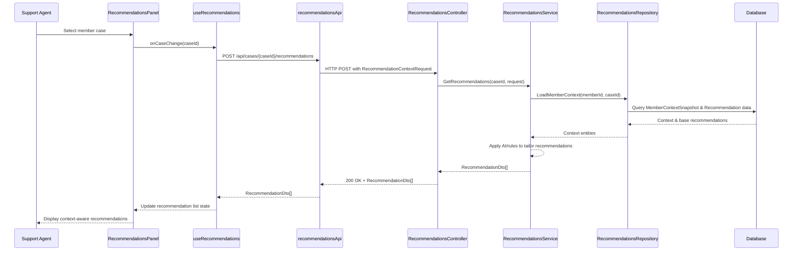

# LLD – SCRUM-33051 – Context-Aware Recommendations Panel

a. Story Summary
- Provide context-aware recommendations tailored to a member’s history and current issue as viewed in the diagnostic panel.
- Display relevant recommendations to support agents when a member’s case is selected.

b. Architecture Mapping (brief)
- Frontend (React)
  - `RecommendationsPanel` (Component): Displays list of recommendations for the selected member case.
  - `RecommendationItem` (Component): Renders individual recommendation details and actions (e.g., view more, apply).
  - `useRecommendations` (Custom Hook): Orchestrates fetching recommendations when case selection changes and manages loading/error state.
  - `recommendationsApi` (API Client): Calls backend to retrieve context-aware recommendations for a case.
- Backend (C# / ASP.NET Core)
  - `RecommendationsController` (Controller): Exposes endpoint to fetch recommendations for a member case.
  - `RecommendationsService` (Service): Orchestrates context analysis and retrieval/generation of recommendations.
  - `RecommendationsRepository` (Repository): Persists recommendation templates and history if needed.
  - `Recommendation`, `MemberContextSnapshot` (Entities): Represent recommendations and captured context used to generate them.
  - `RecommendationDto`, `RecommendationContextRequest` (DTOs): Carry request/response data between UI and service.
- Recommended Folder Structure
  - React `src/`: `components/Recommendations/RecommendationsPanel.tsx`, `components/Recommendations/RecommendationItem.tsx`, `hooks/useRecommendations.ts`, `api/recommendationsApi.ts`.
  - .NET: `Controllers/RecommendationsController.cs`, `Services/RecommendationsService.cs`, `Repositories/RecommendationsRepository.cs`, `Models/Entities/Recommendation.cs`, `Models/Entities/MemberContextSnapshot.cs`, `Models/DTOs/RecommendationDto.cs`.

c. Component Specifications
| Name                         | Layer        | Artifact Type | Responsibility                                                           | Key Dependencies                                   |
|------------------------------|-------------|---------------|--------------------------------------------------------------------------|---------------------------------------------------|
| RecommendationsPanel         | React       | Component     | Render list of context-aware recommendations for selected member case.   | useRecommendations, RecommendationItem            |
| RecommendationItem           | React       | Component     | Display single recommendation text and optional action controls.         | shared Button/Link components                     |
| useRecommendations           | React       | Custom Hook   | Fetch recommendations when case changes and handle loading/errors.       | recommendationsApi, useState/useEffect            |
| recommendationsApi           | React       | API Client    | Wrap HTTP calls to backend recommendations endpoint.                     | apiClient (Axios/fetch), auth context             |
| RecommendationsController    | API         | Controller    | Provide endpoint to get context-aware recommendations per case.          | RecommendationsService, ASP.NET routing           |
| RecommendationsService       | Service     | Service Class | Analyze member history & issue details to produce recommendations.       | RecommendationsRepository, external AI service    |
| RecommendationsRepository    | Data        | Repository    | Persist recommendation data and retrieve context information.            | DbContext, EF Core                                |
| Recommendation               | Data        | Entity        | Represent a recommendation linked to member context and issue.           | EF Core                                           |
| MemberContextSnapshot        | Data        | Entity        | Capture relevant member history and issue context used for decisions.    | EF Core                                           |
| RecommendationDto            | Service/API | DTO           | Transport recommendation data to the frontend.                           | AutoMapper, Recommendation entity                 |
| RecommendationContextRequest | API         | DTO           | Capture context identifiers from UI (member case, issue ID).             | Model binding, data annotations                   |

d. API Contract
| Method | Route                                       | Request DTO                   | Response DTO              | Status Codes                     |
|--------|---------------------------------------------|-------------------------------|---------------------------|----------------------------------|
| POST   | /api/cases/{caseId}/recommendations         | RecommendationContextRequest  | RecommendationDto[]       | 200 OK, 400, 401, 404, 500       |

e. Data Model (brief)
- C# Entities/DTOs
  - `Recommendation` (Entity)
    - `Guid Id`
    - `string CaseId`
    - `string MemberId`
    - `string Title`
    - `string Description`
    - `int Priority`
    - `DateTime CreatedAt`
  - `MemberContextSnapshot` (Entity)
    - `Guid Id`
    - `string MemberId`
    - `string CaseId`
    - `string ContextDataJson`
    - `DateTime CapturedAt`
  - `RecommendationDto`
    - `Guid Id`
    - `string Title`
    - `string Description`
    - `int Priority`
  - `RecommendationContextRequest`
    - `string MemberId`
    - `string CurrentIssueSummary`

- TypeScript Interfaces
  - `Recommendation` (UI)
    - `id: string`
    - `title: string`
    - `description: string`
    - `priority: number`
  - `RecommendationContextRequest`
    - `memberId: string`
    - `currentIssueSummary: string`

f. Data Flow (one paragraph)
When a support agent selects a member’s case in the diagnostic panel, `RecommendationsPanel` is rendered or updated and `useRecommendations` detects the case change, calling `recommendationsApi.getRecommendations(caseId, contextRequest)`; the API client sends a POST to `RecommendationsController`, which forwards the `RecommendationContextRequest` to `RecommendationsService`; the service retrieves or builds a `MemberContextSnapshot`, optionally invokes an external AI or rules engine via `RecommendationsRepository` and related integrations, and produces a list of `Recommendation` entities mapped to `RecommendationDto` objects; the controller returns these as JSON, `useRecommendations` updates state, and `RecommendationsPanel` displays the tailored recommendations via `RecommendationItem` components.

g. Primary Sequence Diagram

h. Implementation Notes (brief)
- Use `useEffect` with `caseId` as dependency to trigger recommendation fetch when selected case changes.
- Use a loading skeleton or spinner in `RecommendationsPanel` while recommendations are being fetched.
- Implement backend recommendation generation as async tasks and use AutoMapper for DTO mapping.
- Structure recommendation text for readability, possibly supporting markdown or simple formatting.
- Log key context attributes used for recommendations for observability and debugging.

i. Assumptions (brief)
- The diagnostic panel provides `caseId` and `memberId` to the React layer when a case is selected.
- External AI or recommendation engine integration is abstracted behind `RecommendationsService` and is available.
- Recommendations are read-only from the agent’s perspective in this story; applying them is handled elsewhere.

j. Error Handling (ONE line)
- Global API error handling via ASP.NET Core middleware and React-level error boundary/toast notifications for failed recommendation fetches.

k. Security Notes (ONE line)
- Standard input validation and secure API calls assumed, with recommendations endpoints protected by JWT-based authentication and role checks for support agents.
