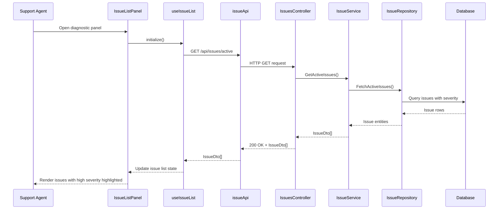

# LLD – SCRUM-33052 – Issue Severity Highlighting

a. Story Summary
- Enable visual highlighting of high-severity issues in the diagnostic panel for support agents.
- Dynamically update severity indicators when an issue is identified as high severity by the system.

b. Architecture Mapping (brief)
- Frontend (React)
  - `IssueListPanel` (Component): Displays list of active issues with severity badges and highlighting styles.
  - `IssueSeverityBadge` (Component): Renders severity label (e.g., High, Medium, Low) with appropriate styling.
  - `useIssueList` (Hook – existing/assumed): Retrieves active issues and exposes list data including severity.
  - `issueApi` (API client – existing/extended): Fetches issue data with severity information.
- Backend (C# / ASP.NET Core)
  - `IssuesController` (Controller – extended): Returns active issues including severity classification.
  - `IssueService` (Service – extended): Applies or retrieves issue severity from rules or external systems.
  - `IssueRepository` (Repository – extended): Persists issue severity field in storage.
  - `Issue` (Entity – extended): Includes severity attribute.
  - `IssueDto` (DTO – extended): Exposes severity to clients.
- Recommended Folder Structure
  - React `src/`: `components/Issues/IssueListPanel.tsx`, `components/Issues/IssueSeverityBadge.tsx`, `hooks/useIssueList.ts`, `api/issueApi.ts`.
  - .NET: `Controllers/IssuesController.cs`, `Services/IssueService.cs`, `Repositories/IssueRepository.cs`, `Models/Entities/Issue.cs`, `Models/DTOs/IssueDto.cs`.

c. Component Specifications
| Name                | Layer        | Artifact Type | Responsibility                                                        | Key Dependencies                             |
|---------------------|-------------|---------------|-----------------------------------------------------------------------|---------------------------------------------|
| IssueListPanel      | React       | Component     | Render list of issues and apply visual highlight for high severity.   | useIssueList, IssueSeverityBadge            |
| IssueSeverityBadge  | React       | Component     | Show severity label and colored badge per issue.                      | CSS module/theme, shared Typography         |
| useIssueList        | React       | Custom Hook   | Fetch and provide active issues with severity to UI.                  | issueApi, useState/useEffect                |
| issueApi            | React       | API Client    | Call backend endpoints to retrieve issues with severity metadata.     | apiClient (Axios/fetch), auth provider      |
| IssuesController    | API         | Controller    | Provide endpoints to list issues including severity.                  | IssueService, ASP.NET routing               |
| IssueService        | Service     | Service Class | Handle business logic for determining and updating issue severity.    | IssueRepository, external rules/AI service  |
| IssueRepository     | Data        | Repository    | Persist and fetch issues and their severity from DB.                  | DbContext, EF Core                           |
| Issue               | Data        | Entity        | Domain entity representing a member issue with severity attribute.    | EF Core                                     |
| IssueDto            | Service/API | DTO           | Transport issue data including severity to the frontend.              | AutoMapper, Issue entity                    |

d. API Contract
| Method | Route                       | Request DTO | Response DTO       | Status Codes                 |
|--------|-----------------------------|------------|--------------------|------------------------------|
| GET    | /api/issues/active          | n/a        | IssueDto[]         | 200 OK, 401, 500             |
| GET    | /api/issues/{issueId}       | n/a        | IssueDto           | 200 OK, 401, 404, 500        |

e. Data Model (brief)
- C# Entities/DTOs
  - `Issue` (Entity – extended)
    - `string Id`
    - `string MemberId`
    - `string Title`
    - `string Description`
    - `string Severity` (e.g., "Low", "Medium", "High", "Critical")
    - `DateTime CreatedAt`
    - `string Status`
  - `IssueDto`
    - `string Id`
    - `string Title`
    - `string Severity`
    - `string Status`

- TypeScript Interfaces
  - `Issue` (UI)
    - `id: string`
    - `title: string`
    - `severity: 'Low' | 'Medium' | 'High' | 'Critical'`
    - `status: string`

f. Data Flow (one paragraph)
When the support agent opens the diagnostic panel, `IssueListPanel` mounts and `useIssueList` calls `issueApi.getActiveIssues`, which requests `/api/issues/active` from `IssuesController`; the controller fetches issues via `IssueService`, which may compute or retrieve severity from `IssueRepository` and returns a list of `IssueDto` objects; the controller returns this list as JSON, the hook updates its state, and `IssueListPanel` renders each issue with `IssueSeverityBadge`, applying a specific CSS class to visually highlight any issue with high or critical severity.

g. Primary Sequence Diagram

h. Implementation Notes (brief)
- Use CSS utility classes or a theming system to apply distinct background/border colors for high severity items.
- Ensure the data model’s severity field is non-null with a default (e.g., "Low") to avoid rendering issues.
- Use memoization in React (e.g., `React.memo`) for `IssueSeverityBadge` to avoid unnecessary re-renders.
- On the backend, centralize severity calculation rules in `IssueService` for maintainability.
- Include severity in indexes/queries if filtering/sorting by severity is required.

i. Assumptions (brief)
- Severity is computed by upstream systems or rules and is not edited directly by the support agent.
- Only high and critical severity levels trigger prominent visual highlighting; others use standard display styles.
- The diagnostic panel already retrieves active issues, and this story primarily enhances the existing list with severity metadata and styling.

j. Error Handling (ONE line)
- Centralized exception middleware returns ProblemDetails JSON for API errors, and the UI displays a generic error banner if issue retrieval fails.

k. Security Notes (ONE line)
- Standard input validation and secure API calls assumed, with backend endpoints protected by JWT bearer authentication.
