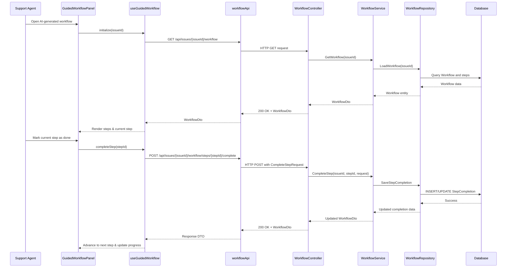

# LLD – SCRUM-33053 – Guided Troubleshooting Workflow

a. Story Summary
- Provide a guided troubleshooting workflow for support agents to move through AI-generated resolution steps in order.
- Track completion of each step and automatically advance to the next step while showing overall progress.

b. Architecture Mapping (brief)
- Frontend (React)
  - `GuidedWorkflowPanel` (Component): Displays current troubleshooting step, step details, and progression controls.
  - `WorkflowStepList` (Component): Shows list of all steps with completion status and progress indicator.
  - `useGuidedWorkflow` (Custom Hook): Manages current step index, completion state, and API interactions.
  - `workflowApi` (API Client): Fetches workflow steps and persists step completion for a given issue.
- Backend (C# / ASP.NET Core)
  - `WorkflowController` (Controller): Exposes endpoints to retrieve workflows and mark steps as completed.
  - `WorkflowService` (Service): Encapsulates business logic for workflow progression and validation.
  - `WorkflowRepository` (Repository): Manages persistence of workflows and step completion state.
  - `Workflow`, `WorkflowStep`, `WorkflowStepCompletion` (Entities): Model workflows, steps, and completion events.
  - `WorkflowDto`, `WorkflowStepDto`, `CompleteStepRequest` (DTOs): API contracts for workflow retrieval and update.
- Recommended Folder Structure
  - React `src/`: `components/GuidedWorkflow/GuidedWorkflowPanel.tsx`, `components/GuidedWorkflow/WorkflowStepList.tsx`, `hooks/useGuidedWorkflow.ts`, `api/workflowApi.ts`.
  - .NET: `Controllers/WorkflowController.cs`, `Services/WorkflowService.cs`, `Repositories/WorkflowRepository.cs`, `Models/Entities/Workflow.cs`, `Models/Entities/WorkflowStep.cs`, `Models/Entities/WorkflowStepCompletion.cs`, `Models/DTOs/WorkflowDto.cs`.

c. Component Specifications
| Name                      | Layer        | Artifact Type | Responsibility                                                           | Key Dependencies                                  |
|---------------------------|-------------|---------------|--------------------------------------------------------------------------|--------------------------------------------------|
| GuidedWorkflowPanel       | React       | Component     | Display current step details with actions to mark step as done.          | useGuidedWorkflow, WorkflowStepList              |
| WorkflowStepList          | React       | Component     | Show list of steps and visual progress/completion indicators.            | useGuidedWorkflow, shared ProgressBar component  |
| useGuidedWorkflow         | React       | Custom Hook   | Manage workflow state, handle step completion, handle API calls.         | workflowApi, useState/useEffect                  |
| workflowApi               | React       | API Client    | Wrap HTTP calls for fetching workflow steps and posting completion data. | apiClient (Axios/fetch), auth context            |
| WorkflowController        | API         | Controller    | Provide endpoints to get workflows and mark steps completed.             | WorkflowService, ASP.NET Core routing            |
| WorkflowService           | Service     | Service Class | Orchestrate workflow retrieval, progression logic, and validations.      | WorkflowRepository, logger, AutoMapper           |
| WorkflowRepository        | Data        | Repository    | Persist workflows and step completion state.                             | DbContext, EF Core                                |
| Workflow                  | Data        | Entity        | Represent a troubleshooting workflow linked to an issue.                 | EF Core                                           |
| WorkflowStep              | Data        | Entity        | Represent an individual troubleshooting step.                            | EF Core                                           |
| WorkflowStepCompletion    | Data        | Entity        | Capture completion status for each step per issue/agent.                 | EF Core                                           |
| WorkflowDto               | Service/API | DTO           | Provide workflow details and step statuses to UI.                        | AutoMapper, Workflow, WorkflowStep entities      |
| WorkflowStepDto           | Service/API | DTO           | Provide individual step details and completion status.                   | AutoMapper                                       |
| CompleteStepRequest       | API         | DTO           | Capture step completion input from UI.                                   | Model binding, data annotations                  |

d. API Contract
| Method | Route                                           | Request DTO           | Response DTO      | Status Codes                     |
|--------|-------------------------------------------------|-----------------------|-------------------|----------------------------------|
| GET    | /api/issues/{issueId}/workflow                  | n/a                   | WorkflowDto       | 200 OK, 401, 404, 500            |
| POST   | /api/issues/{issueId}/workflow/steps/{stepId}/complete | CompleteStepRequest   | WorkflowDto       | 200 OK, 400, 401, 404, 409, 500  |

e. Data Model (brief)
- C# Entities/DTOs
  - `Workflow` (Entity)
    - `Guid Id`
    - `string IssueId`
    - `string Name`
    - `ICollection<WorkflowStep> Steps`
  - `WorkflowStep` (Entity)
    - `Guid Id`
    - `Guid WorkflowId`
    - `int Order`
    - `string Title`
    - `string Description`
  - `WorkflowStepCompletion` (Entity)
    - `Guid Id`
    - `string IssueId`
    - `Guid StepId`
    - `string AgentId`
    - `bool IsCompleted`
    - `DateTime CompletedAt`
  - `WorkflowDto`
    - `Guid Id`
    - `string IssueId`
    - `string Name`
    - `IEnumerable<WorkflowStepDto> Steps`
    - `int CurrentStepIndex`
    - `int TotalSteps`
  - `WorkflowStepDto`
    - `Guid Id`
    - `int Order`
    - `string Title`
    - `string Description`
    - `bool IsCompleted`

  - `CompleteStepRequest`
    - `DateTime? CompletedAt`

- TypeScript Interfaces
  - `Workflow` (UI)
    - `id: string`
    - `issueId: string`
    - `name: string`
    - `steps: WorkflowStep[]`
    - `currentStepIndex: number`
    - `totalSteps: number`
  - `WorkflowStep`
    - `id: string`
    - `order: number`
    - `title: string`
    - `description: string`
    - `isCompleted: boolean`
  - `CompleteStepRequest`
    - `completedAt?: string`

f. Data Flow (one paragraph)
Support agent opens an AI-generated workflow in the diagnostic panel, causing `GuidedWorkflowPanel` to mount and `useGuidedWorkflow` to call `workflowApi.getWorkflow(issueId)`; this hits `WorkflowController`, which invokes `WorkflowService` and `WorkflowRepository` to load the `Workflow` and step completion data from the database and returns a `WorkflowDto`; the hook updates state and renders the current step and progress; when the agent marks a step as done, `useGuidedWorkflow` calls `workflowApi.completeStep(issueId, stepId)` which posts a `CompleteStepRequest` to `WorkflowController`, the service validates and records completion via `WorkflowStepCompletion` in the repository, recalculates the current step index, and returns an updated `WorkflowDto`, which the hook uses to advance to the next recommended step and refresh progress indicators.

g. Primary Sequence Diagram

h. Implementation Notes (brief)
- Use `useEffect` in `useGuidedWorkflow` to fetch the workflow on mount and manage loading/error states.
- Represent current step index in hook state and compute progress percentage for display in `WorkflowStepList`.
- Implement backend methods as async with EF Core and use AutoMapper to translate between entities and DTOs.
- Use optimistic concurrency or a simple version field on workflow steps if concurrent updates are expected (optional).
- Centralize HTTP error handling in `workflowApi` and surface user-friendly messages in the UI.

i. Assumptions (brief)
- A workflow is pre-generated for the issue by another system and is read-only from this UI (only completion state is updated).
- Only one active guided workflow per issue is supported in this release.
- Step completion is idempotent; marking an already completed step as done again has no adverse effect.

j. Error Handling (ONE line)
- Global API exception middleware returns ProblemDetails JSON, and the React app displays errors via a shared notification/toast component.

k. Security Notes (ONE line)
- Standard input validation and secure API calls assumed, with JWT-protected endpoints requiring authenticated agents to access workflow data.
