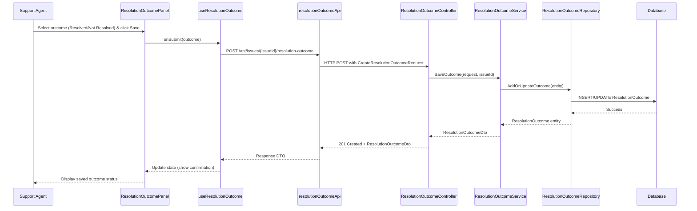

# LLD – SCRUM-33054 – Resolution Outcome Feedback Capture

a. Story Summary
- Implement a mechanism for support agents to record whether AI-generated remediation steps resolved a member issue. 
- Persist each outcome against the corresponding issue so the AI learning dataset can be updated.

b. Architecture Mapping (brief)
- Frontend (React)
  - `ResolutionOutcomePanel` (Component): Panel embedded in the diagnostic view to display outcome options (Resolved / Not Resolved) and submit feedback.
  - `useResolutionOutcome` (Custom Hook): Manages local state for selected outcome and orchestrates API calls.
  - `resolutionOutcomeApi` (API client module): Wraps REST calls for creating/updating resolution outcome feedback.
- Backend (C# / ASP.NET Core)
  - `ResolutionOutcomeController` (Controller): Exposes endpoints to save and retrieve resolution outcomes for an issue.
  - `ResolutionOutcomeService` (Service): Contains business logic for validating and processing outcome feedback and interacting with AI learning pipeline.
  - `ResolutionOutcomeRepository` (Repository): Handles CRUD operations for resolution outcome records via EF Core.
  - `ResolutionOutcome` (Entity): Persists outcome details mapped to a member issue.
  - `ResolutionOutcomeDto`, `CreateResolutionOutcomeRequest` (DTOs): Transport objects for input/output.
  - `ResolutionOutcomeValidator` (Validator): Ensures required fields (issueId, outcome) and valid values.
- Recommended Folder Structure
  - React `src/`: `components/ResolutionOutcomePanel/`, `hooks/useResolutionOutcome.ts`, `api/resolutionOutcomeApi.ts`.
  - .NET: `Controllers/ResolutionOutcomeController.cs`, `Services/ResolutionOutcomeService.cs`, `Repositories/ResolutionOutcomeRepository.cs`, `Models/Entities/ResolutionOutcome.cs`, `Models/DTOs/ResolutionOutcomeDto.cs`.

c. Component Specifications
| Name                          | Layer        | Artifact Type   | Responsibility                                                 | Key Dependencies                                      |
|-------------------------------|-------------|-----------------|----------------------------------------------------------------|------------------------------------------------------|
| ResolutionOutcomePanel        | React       | Component       | Render outcome options and submit button within diagnostic UI. | useResolutionOutcome, shared UI components           |
| useResolutionOutcome          | React       | Custom Hook     | Manage selection state, form submission, loading/error states. | resolutionOutcomeApi, React useState/useEffect       |
| resolutionOutcomeApi          | React       | API Client      | Abstract HTTP calls to resolution outcome endpoints.           | Axios/fetch wrapper, auth token provider             |
| ResolutionOutcomeController   | API         | Controller      | Handle HTTP requests for creating/updating outcomes.           | ResolutionOutcomeService, ASP.NET routing            |
| ResolutionOutcomeService      | Service     | Service Class   | Apply business rules and call repository/AI update hooks.      | ResolutionOutcomeRepository, AutoMapper, logger      |
| ResolutionOutcomeRepository   | Data        | Repository      | Persist and retrieve outcome records from DB.                  | DbContext, EF Core                                    |
| ResolutionOutcome             | Data        | Entity          | Represent outcome record linked to issue and agent.            | EF Core, DbContext                                   |
| ResolutionOutcomeDto          | Service/API | DTO             | Shape data returned to UI.                                     | AutoMapper, ResolutionOutcome entity                 |
| CreateResolutionOutcomeRequest| API         | DTO             | Capture incoming outcome feedback from UI.                     | Model binding, data annotations                      |
| ResolutionOutcomeValidator    | Service     | Validator       | Validate request DTO and value ranges.                         | FluentValidation/DataAnnotations                     |

d. API Contract
| Method | Route                                  | Request DTO                    | Response DTO          | Status Codes                 |
|--------|----------------------------------------|--------------------------------|-----------------------|------------------------------|
| POST   | /api/issues/{issueId}/resolution-outcome | CreateResolutionOutcomeRequest | ResolutionOutcomeDto  | 201 Created, 400, 401, 500   |
| GET    | /api/issues/{issueId}/resolution-outcome | n/a                            | ResolutionOutcomeDto  | 200 OK, 401, 404, 500        |
| PUT    | /api/issues/{issueId}/resolution-outcome | CreateResolutionOutcomeRequest | ResolutionOutcomeDto  | 200 OK, 400, 401, 404, 500   |

e. Data Model (brief)
- C# Entities/DTOs
  - `ResolutionOutcome` (Entity)
    - `Guid Id`
    - `string IssueId`
    - `string Outcome` ("Resolved", "NotResolved")
    - `string? Comments`
    - `string AgentId`
    - `DateTime CreatedAt`
    - `DateTime? UpdatedAt`
  - `ResolutionOutcomeDto`
    - `Guid Id`
    - `string IssueId`
    - `string Outcome`
    - `string? Comments`
    - `string AgentId`
    - `DateTime RecordedAt`
  - `CreateResolutionOutcomeRequest`
    - `string Outcome`
    - `string? Comments`

- TypeScript Interfaces
  - `ResolutionOutcome` (UI shape)
    - `id: string`
    - `issueId: string`
    - `outcome: 'Resolved' | 'NotResolved'`
    - `comments?: string`
    - `agentId: string`
    - `recordedAt: string`
  - `CreateResolutionOutcomeRequest`
    - `outcome: 'Resolved' | 'NotResolved'`
    - `comments?: string`

f. Data Flow (one paragraph)
Support agent selects an outcome in `ResolutionOutcomePanel`, which uses `useResolutionOutcome` to update local state and invoke `resolutionOutcomeApi` (POST/PUT) with the selected outcome; the API client sends the request to `ResolutionOutcomeController`, which passes the DTO to `ResolutionOutcomeService`, where validation occurs and the `ResolutionOutcomeRepository` saves or updates the `ResolutionOutcome` entity via EF Core; once persisted, the service may notify the AI learning subsystem and returns a `ResolutionOutcomeDto` to the controller, which sends a JSON response back to the frontend; `useResolutionOutcome` processes the response, updates UI state, and the panel reflects the saved outcome and optional confirmation message.

g. Primary Sequence Diagram

h. Implementation Notes (brief)
- Use React functional components with controlled inputs and `useState` in `useResolutionOutcome` for outcome selection and submission state.
- Implement a shared `apiClient` with interceptors for auth and error handling, used by `resolutionOutcomeApi`.
- In ASP.NET Core, register `ResolutionOutcomeService` and `ResolutionOutcomeRepository` via dependency injection and use async EF Core methods.
- Use AutoMapper to map between `ResolutionOutcome` entity and `ResolutionOutcomeDto`.
- Integrate server responses with a global toast/notification system to confirm save success or show errors.

i. Assumptions (brief)
- Each issue can have only one outcome record per agent that is updated on subsequent submissions.
- Integration with the AI learning dataset is handled asynchronously within the service or via an event, outside the scope of this story’s API contracts.
- Issue identifiers and agent context (AgentId) are already available in the diagnostic panel when this component is rendered.

j. Error Handling (ONE line)
- Use ASP.NET Core exception middleware returning ProblemDetails JSON and handle errors in React via a global error handler/toast mechanism.

k. Security Notes (ONE line)
- Standard input validation and secure API calls assumed, with JWT-based authentication enforcing that only authenticated support agents can submit outcomes.
