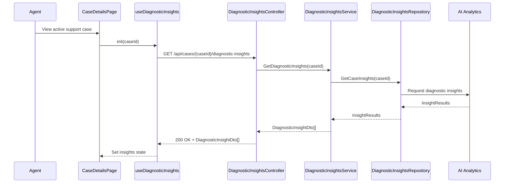

# a. Story Summary
Display real-time AI-generated diagnostic insights for a member’s active support case in a dedicated panel, helping agents quickly understand the issue while viewing the case.

# b. Architecture Mapping (brief)
- Frontend
  - CaseDetailsPage (Existing Page): Hosts the diagnostic insights panel.
  - DiagnosticInsightsPanel (Component): Renders list of AI-generated diagnostic insights for the active case.
  - DiagnosticInsightItem (Component): Displays a single insight with brief description and relevance.
  - useDiagnosticInsights (Custom Hook): Fetches diagnostic insights and optionally subscribes to refresh/real-time updates.
  - diagnosticInsightsApi (API client module): Wraps REST calls to retrieve current diagnostic insights for a case.
- Backend
  - DiagnosticInsightsController (Controller): Provides endpoint to retrieve real-time diagnostic insights for a case.
  - DiagnosticInsightsService (Service): Orchestrates analysis of current case data via AI/analytics engine.
  - DiagnosticInsightsRepository (Repository): Accesses case data and AI/analytics results (DB or external).
  - DiagnosticInsightDto (DTO): Represents a diagnostic insight for API communication.

- Recommended Folder Structure
  - React (src/)
    - src/components/case/DiagnosticInsightsPanel.tsx
    - src/components/case/DiagnosticInsightItem.tsx
    - src/hooks/useDiagnosticInsights.ts
    - src/api/diagnosticInsightsApi.ts
    - src/types/diagnosticInsights.ts
  - .NET
    - Controllers/DiagnosticInsightsController.cs
    - Services/DiagnosticInsightsService.cs
    - Repositories/DiagnosticInsightsRepository.cs
    - Models/DTOs/DiagnosticInsightDto.cs

# c. Component Specifications (table)
| Name                        | Layer    | Artifact Type  | Responsibility                                                      | Key Dependencies                       |
|-----------------------------|----------|----------------|----------------------------------------------------------------------|----------------------------------------|
| CaseDetailsPage             | React    | Page Component | Container hosting diagnostic insights for active cases               | useDiagnosticInsights, DiagnosticInsightsPanel |
| DiagnosticInsightsPanel     | React    | Component      | Display list of current diagnostic insights                          | DiagnosticInsightItem                  |
| DiagnosticInsightItem       | React    | Component      | Render single insight text and any key metadata                      | none (props only)                      |
| useDiagnosticInsights       | React    | Custom Hook    | Fetch and refresh diagnostic insights for an active case             | diagnosticInsightsApi                  |
| diagnosticInsightsApi       | React    | API Module     | Perform HTTP calls for diagnostic insights                          | fetch/axios, auth client               |
| DiagnosticInsightsController| API      | Controller     | Handle HTTP GET for current diagnostic insights                      | DiagnosticInsightsService              |
| DiagnosticInsightsService   | Service  | Service        | Analyze current case data and map AI insights to DTOs               | DiagnosticInsightsRepository           |
| DiagnosticInsightsRepository| Data     | Repository     | Retrieve necessary case data and call AI analytics                  | DbContext/HttpClient                   |
| DiagnosticInsightDto        | API      | DTO            | Shape diagnostic insight data for client                            | n/a                                    |

# d. API Contract (table)
| Method | Route                                    | Request DTO | Response DTO                | Status Codes      |
|--------|------------------------------------------|-------------|-----------------------------|-------------------|
| GET    | /api/cases/{caseId}/diagnostic-insights | n/a         | List<DiagnosticInsightDto> | 200, 400, 404     |

# e. Data Model (brief)
- C# DTOs
  - DiagnosticInsightDto
    - Id: Guid
    - CaseId: Guid
    - Title: string
    - Description: string
    - RelevanceScore: double (0.0 - 1.0)

- TypeScript Types
  - DiagnosticInsight
    - id: string
    - caseId: string
    - title: string
    - description: string
    - relevanceScore: number

# f. Data Flow (one paragraph)
When an agent views an active support case, CaseDetailsPage uses useDiagnosticInsights to call diagnosticInsightsApi.get(caseId); this invokes DiagnosticInsightsController, which calls DiagnosticInsightsService to pull latest case data from DiagnosticInsightsRepository and AI analytics, map results into DiagnosticInsightDto objects, and return them; the hook stores the list in state, and DiagnosticInsightsPanel renders DiagnosticInsightItem components, showing real-time insights relevant to the member’s issue.

# g. Primary Sequence Diagram (Mermaid)

# h. Implementation Notes (brief)
- useDiagnosticInsights can optionally poll or expose a refresh function for near real-time updates; initial implementation may be simple one-shot fetch.
- Use minimal loading indicators to avoid cluttering the case view while insights are loading.
- Implement DiagnosticInsightsService and Repository as async DI services; abstract AI/analytics calls to keep service testable.
- Consider ordering insights by RelevanceScore descending before returning to the client.
- Keep response payload small by limiting to key fields; additional fields can be added in future stories.

# i. Assumptions (brief)
- Real-time in this story means "current as of latest fetch" rather than push-based streaming.
- CaseDetailsPage already has access to caseId and can provide it to the hook.
- AI/analytics engine is available and returns insights within an acceptable latency.

# j. Error Handling (ONE line)
API errors result in ProblemDetails responses; the frontend shows a non-blocking inline message while leaving other case details accessible.

# k. Security Notes (ONE line)
Standard input validation and secure API calls assumed, with endpoints restricted to authenticated support users.
