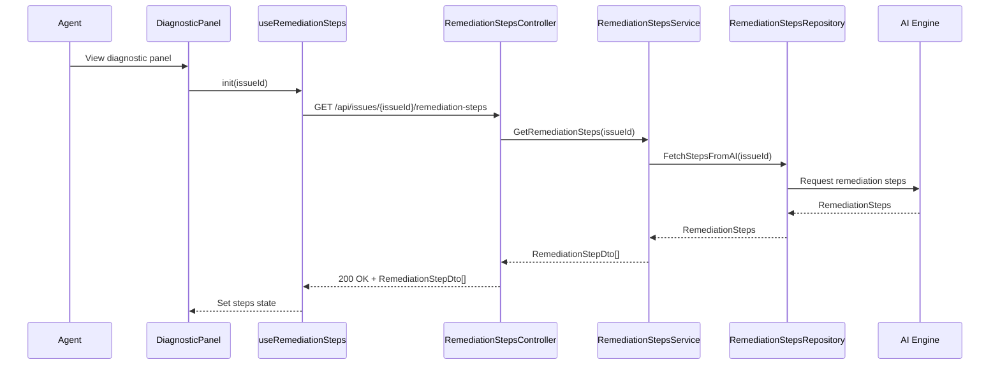

# a. Story Summary
Provide AI-generated step-by-step remediation instructions tailored to a member’s issue, displayed within the diagnostic panel so support agents can resolve issues more consistently and accurately.

# b. Architecture Mapping (brief)
- Frontend
  - DiagnosticPanel (Existing Page): Host area for remediation steps section within the diagnostic view.
  - RemediationStepsList (Component): Displays an ordered list of remediation steps.
  - RemediationStepItem (Component): Renders individual step content and any related metadata (e.g., type, duration).
  - useRemediationSteps (Custom Hook): Fetches remediation steps for a member issue and manages local state.
  - remediationStepsApi (API client module): Encapsulates HTTP calls to retrieve remediation steps.
- Backend
  - RemediationStepsController (Controller): Exposes endpoint to retrieve remediation steps for a diagnostic panel.
  - RemediationStepsService (Service): Integrates with AI engine and maps tailored remediation steps per issue.
  - RemediationStepsRepository (Repository): Handles persistence or retrieval from AI provider or DB.
  - RemediationStepDto (DTO): Data transfer object representing a remediation step.

- Recommended Folder Structure
  - React (src/)
    - src/components/diagnostic/RemediationStepsList.tsx
    - src/components/diagnostic/RemediationStepItem.tsx
    - src/hooks/useRemediationSteps.ts
    - src/api/remediationStepsApi.ts
    - src/types/remediationSteps.ts
  - .NET
    - Controllers/RemediationStepsController.cs
    - Services/RemediationStepsService.cs
    - Repositories/RemediationStepsRepository.cs
    - Models/DTOs/RemediationStepDto.cs

# c. Component Specifications (table)
| Name                        | Layer    | Artifact Type  | Responsibility                                                      | Key Dependencies                    |
|-----------------------------|----------|----------------|----------------------------------------------------------------------|-------------------------------------|
| DiagnosticPanel             | React    | Page Component | Container hosting remediation steps in the diagnostic view           | useRemediationSteps, RemediationStepsList |
| RemediationStepsList        | React    | Component      | Render ordered/remediation steps tailored to the member issue        | RemediationStepItem                 |
| RemediationStepItem         | React    | Component      | Display individual remediation step text and metadata                | none (props only)                   |
| useRemediationSteps         | React    | Custom Hook    | Fetch remediation steps and manage loading/error state               | remediationStepsApi                 |
| remediationStepsApi         | React    | API Module     | Perform HTTP GET for remediation steps                              | fetch/axios, auth client            |
| RemediationStepsController  | API      | Controller     | Handle HTTP requests for remediation steps                          | RemediationStepsService             |
| RemediationStepsService     | Service  | Service        | Call AI engine and map remediation instructions to DTOs             | RemediationStepsRepository          |
| RemediationStepsRepository  | Data     | Repository     | Retrieve remediation steps from AI engine or persistence            | HttpClient/DbContext                |
| RemediationStepDto          | API      | DTO            | Shape remediation step data for client                              | n/a                                 |

# d. API Contract (table)
| Method | Route                                        | Request DTO | Response DTO                | Status Codes      |
|--------|----------------------------------------------|-------------|-----------------------------|-------------------|
| GET    | /api/issues/{issueId}/remediation-steps      | n/a         | List<RemediationStepDto>   | 200, 400, 404     |

# e. Data Model (brief)
- C# DTOs
  - RemediationStepDto
    - Id: Guid
    - IssueId: Guid
    - StepOrder: int
    - Title: string
    - Description: string
    - Category: string?

- TypeScript Types
  - RemediationStep
    - id: string
    - issueId: string
    - stepOrder: number
    - title: string
    - description: string
    - category?: string

# f. Data Flow (one paragraph)
When a support agent views a member’s diagnostic panel, DiagnosticPanel uses useRemediationSteps to call remediationStepsApi.get(issueId); this triggers RemediationStepsController, which uses RemediationStepsService to fetch or compute tailored steps from RemediationStepsRepository and the AI engine, map them into ordered RemediationStepDto objects, and return them; the hook stores the list in state, RemediationStepsList renders them in order via RemediationStepItem, helping agents follow clear remediation instructions.

# g. Primary Sequence Diagram (Mermaid)

# h. Implementation Notes (brief)
- Implement useRemediationSteps using standard React hooks, with skeleton loaders or placeholders while data is fetched.
- Ensure steps are sorted by StepOrder before rendering; sort again client-side as a safeguard.
- Design RemediationStepsService as an async orchestration layer, isolating AI-specific logic in the repository or a separate AI client.
- Keep DTOs small and focused, avoiding over-exposing AI-specific metadata unless needed by UI.
- Consider reusing recommendations/recommended actions HTTP and error-handling utilities for consistency.

# i. Assumptions (brief)
- AI engine already supports generating step-by-step remediation for a given issueId.
- Diagnostic panel layout has space allocated for remediation steps.
- Remediation steps are read-only and not editable in this story.

# j. Error Handling (ONE line)
API failures return ProblemDetails JSON; React shows a concise inline error message or toast while leaving other diagnostic content intact.

# k. Security Notes (ONE line)
Standard input validation and secure API calls assumed, with remediation endpoints protected for authenticated support agents only.
