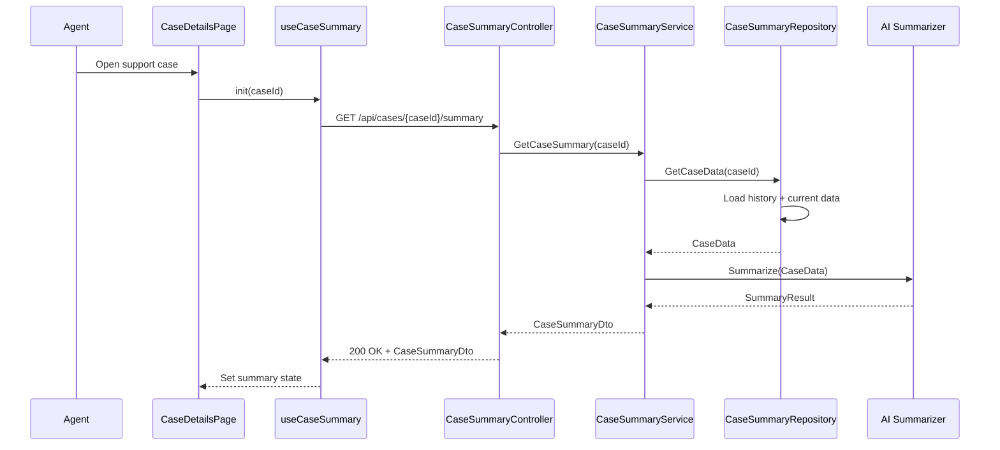

# a. Story Summary
Provide an AI-generated context-aware summary of a member’s support case, combining case history and current data into a concise summary that agents can quickly read when opening the case.

# b. Architecture Mapping (brief)
- Frontend
  - CaseDetailsPage (Existing Page): Displays case details and embeds the context-aware summary region.
  - CaseSummaryPanel (Component): Renders the AI-generated summary text and metadata (e.g., last updated).
  - useCaseSummary (Custom Hook): Fetches the context-aware summary for a case and manages loading/error states.
  - caseSummaryApi (API client module): Encapsulates REST calls to retrieve the summary.
- Backend
  - CaseSummaryController (Controller): Exposes endpoint to retrieve AI-generated case summaries.
  - CaseSummaryService (Service): Orchestrates retrieval of case history/current data, invokes AI summarization, and shapes response.
  - CaseSummaryRepository (Repository): Accesses case history and current data from data sources (DB or external services).
  - CaseSummaryDto (DTO): Represents the summary returned to clients.

- Recommended Folder Structure
  - React (src/)
    - src/components/case/CaseSummaryPanel.tsx
    - src/hooks/useCaseSummary.ts
    - src/api/caseSummaryApi.ts
    - src/types/caseSummary.ts
  - .NET
    - Controllers/CaseSummaryController.cs
    - Services/CaseSummaryService.cs
    - Repositories/CaseSummaryRepository.cs
    - Models/DTOs/CaseSummaryDto.cs

# c. Component Specifications (table)
| Name                     | Layer    | Artifact Type  | Responsibility                                                      | Key Dependencies                 |
|--------------------------|----------|----------------|----------------------------------------------------------------------|----------------------------------|
| CaseDetailsPage          | React    | Page Component | Container for case details and summary panel                         | useCaseSummary, CaseSummaryPanel |
| CaseSummaryPanel         | React    | Component      | Display AI-generated summary text and any relevant metadata          | none (props only)                |
| useCaseSummary           | React    | Custom Hook    | Fetch and store context-aware summary for a case                     | caseSummaryApi                   |
| caseSummaryApi           | React    | API Module     | Perform HTTP GET for case summary                                   | fetch/axios, auth client         |
| CaseSummaryController    | API      | Controller     | Handle HTTP GET requests for case summaries                          | CaseSummaryService               |
| CaseSummaryService       | Service  | Service        | Gather case data, call AI summarization, and map to DTO             | CaseSummaryRepository            |
| CaseSummaryRepository    | Data     | Repository     | Retrieve case history and current state from DB or external systems | DbContext/HttpClient             |
| CaseSummaryDto           | API      | DTO            | Shape summary data for client consumption                           | n/a                              |

# d. API Contract (table)
| Method | Route                               | Request DTO | Response DTO        | Status Codes      |
|--------|-------------------------------------|-------------|---------------------|-------------------|
| GET    | /api/cases/{caseId}/summary         | n/a         | CaseSummaryDto      | 200, 400, 404     |

# e. Data Model (brief)
- C# DTOs
  - CaseSummaryDto
    - CaseId: Guid
    - SummaryText: string
    - ImpactDescription: string?
    - LastUpdatedUtc: DateTime

- TypeScript Types
  - CaseSummary
    - caseId: string
    - summaryText: string
    - impactDescription?: string
    - lastUpdatedUtc: string // ISO timestamp

# f. Data Flow (one paragraph)
When an agent opens a member’s support case, CaseDetailsPage uses useCaseSummary to call caseSummaryApi.get(caseId); this triggers CaseSummaryController, which calls CaseSummaryService to gather case history and current data from CaseSummaryRepository, invoke an AI summarization routine, and map the result into CaseSummaryDto; the controller returns the DTO, the hook stores it in state, and CaseSummaryPanel renders the summary text and impact, enabling the agent to quickly understand the case context.

# g. Primary Sequence Diagram (Mermaid)

# h. Implementation Notes (brief)
- Implement useCaseSummary with standard React hooks, including loading and error states to show skeletons or placeholders while fetching.
- Keep the summary region read-only, with potential future enhancement to refresh or regenerate summary on demand.
- In ASP.NET Core, structure CaseSummaryService as an async orchestrator calling repository and AI client; inject dependencies via DI.
- Normalize AI output into a fixed CaseSummaryDto shape, truncating overly long text on the client if necessary.
- Log slow AI responses in the backend (but logging configuration details are out-of-scope for this document).

# i. Assumptions (brief)
- AI summarization capability is available via an internal library or external service.
- CaseDetailsPage already exists and is responsible for providing caseId to the hook.
- Impact description is optional and may be empty for some cases.

# j. Error Handling (ONE line)
Backend returns ProblemDetails JSON on failures; frontend displays a non-blocking inline error message in the summary area while leaving the rest of the case page usable.

# k. Security Notes (ONE line)
Standard input validation and secure API calls assumed, with endpoints protected by authenticated access only.
