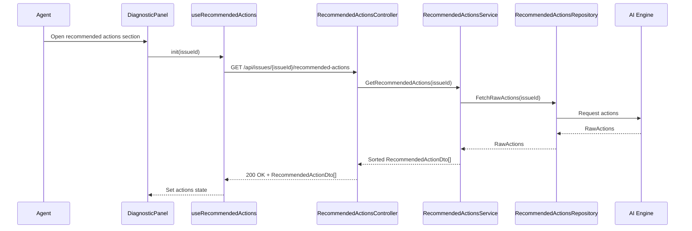

# a. Story Summary
Implement a prioritized list of AI-recommended actions for a member’s issue, clearly indicating the highest-impact steps so agents can focus on the most impactful actions first within the diagnostic panel.

# b. Architecture Mapping (brief)
- Frontend
  - DiagnosticPanel (Existing Page): Hosts the recommended actions section and displays prioritized actions.
  - RecommendedActionsList (Component): Renders ordered list of recommended actions sorted by impact/priority.
  - RecommendedActionItem (Component): Shows action details and visual priority indicator for high-impact steps.
  - useRecommendedActions (Custom Hook): Fetches and manages state for prioritized actions.
  - recommendedActionsApi (API client module): Wraps REST calls to fetch prioritized actions.
- Backend
  - RecommendedActionsController (Controller): Exposes endpoint to retrieve prioritized actions for a given issue.
  - RecommendedActionsService (Service): Applies prioritization logic based on impact and underlying AI scoring.
  - RecommendedActionsRepository (Repository): Retrieves actions from AI engine or database and persists if needed.
  - RecommendedActionDto (DTO): Represents a recommended action with priority/impact metadata.

- Recommended Folder Structure
  - React (src/)
    - src/components/diagnostic/RecommendedActionsList.tsx
    - src/components/diagnostic/RecommendedActionItem.tsx
    - src/hooks/useRecommendedActions.ts
    - src/api/reactionsApi.ts (or recommendedActionsApi.ts)
    - src/types/recommendedActions.ts
  - .NET
    - Controllers/RecommendedActionsController.cs
    - Services/RecommendedActionsService.cs
    - Repositories/RecommendedActionsRepository.cs
    - Models/DTOs/RecommendedActionDto.cs

# c. Component Specifications (table)
| Name                          | Layer    | Artifact Type  | Responsibility                                                       | Key Dependencies                         |
|-------------------------------|----------|----------------|-----------------------------------------------------------------------|-----------------------------------------|
| DiagnosticPanel               | React    | Page Component | Container hosting recommended actions section                         | useRecommendedActions, RecommendedActionsList |
| RecommendedActionsList        | React    | Component      | Render prioritized list of actions, sorted and grouped as needed      | RecommendedActionItem                   |
| RecommendedActionItem         | React    | Component      | Display single action details with high-impact marker                 | none (props only)                       |
| useRecommendedActions         | React    | Custom Hook    | Fetch and store prioritized actions, manage loading/error state       | recommendedActionsApi                   |
| recommendedActionsApi         | React    | API Module     | Perform HTTP GET for recommended actions                             | fetch/axios, auth client                |
| RecommendedActionsController  | API      | Controller     | Handle HTTP requests for prioritized recommended actions              | RecommendedActionsService               |
| RecommendedActionsService     | Service  | Service        | Apply prioritization logic and map data to DTOs                       | RecommendedActionsRepository            |
| RecommendedActionsRepository  | Data     | Repository     | Retrieve recommended actions from AI engine or persistence            | HttpClient/DbContext                    |
| RecommendedActionDto          | API      | DTO            | Shape recommended action and priority metadata                        | n/a                                     |

# d. API Contract (table)
| Method | Route                                      | Request DTO | Response DTO                    | Status Codes      |
|--------|--------------------------------------------|-------------|---------------------------------|-------------------|
| GET    | /api/issues/{issueId}/recommended-actions  | n/a         | List<RecommendedActionDto>     | 200, 400, 404     |

# e. Data Model (brief)
- C# DTOs
  - RecommendedActionDto
    - Id: Guid
    - IssueId: Guid
    - Title: string
    - Description: string?
    - PriorityRank: int // 1 = highest
    - ImpactScore: double // 0.0 - 1.0
    - IsHighImpact: bool

- TypeScript Types
  - RecommendedAction
    - id: string
    - issueId: string
    - title: string
    - description?: string
    - priorityRank: number
    - impactScore: number
    - isHighImpact: boolean

# f. Data Flow (one paragraph)
When an agent opens the recommended actions section in the diagnostic panel for an analyzed issue, DiagnosticPanel invokes useRecommendedActions, which calls recommendedActionsApi.get(issueId); this hits RecommendedActionsController, which delegates to RecommendedActionsService to fetch raw action suggestions from RecommendedActionsRepository, apply business rules or AI-supplied metrics to compute PriorityRank and IsHighImpact, then return a sorted list of RecommendedActionDto; the hook stores the list in state, RecommendedActionsList renders actions in priority order, and RecommendedActionItem highlights high-impact steps so agents can focus on them first.

# g. Primary Sequence Diagram (Mermaid)

# h. Implementation Notes (brief)
- Use React hooks (useEffect/useState) in useRecommendedActions, sorting by PriorityRank client-side as a fallback if server ordering is not guaranteed.
- Use simple visual cues like badges or icons to indicate IsHighImpact for RecommendedActionItem.
- Implement RecommendedActionsService and Repository as async DI services, isolating any AI engine-specific integration in the repository.
- Ensure deterministic ordering based on PriorityRank and ImpactScore to avoid UI flicker when new data arrives.
- Reuse shared HTTP client and error-handling utilities from existing diagnostic APIs.

# i. Assumptions (brief)
- AI engine or backend logic can supply necessary metrics (ImpactScore) to determine priority ordering.
- Recommended actions are read-only and not editable/dismissible in this story.
- Diagnostic panel already exists and only needs an embedded recommended actions section.

# j. Error Handling (ONE line)
API errors return ProblemDetails and are surfaced by the hook as an inline error or toast within the diagnostic panel without blocking other content.

# k. Security Notes (ONE line)
Standard input validation and secure API calls assumed, with endpoints protected by JWT-based authentication for support agents.
