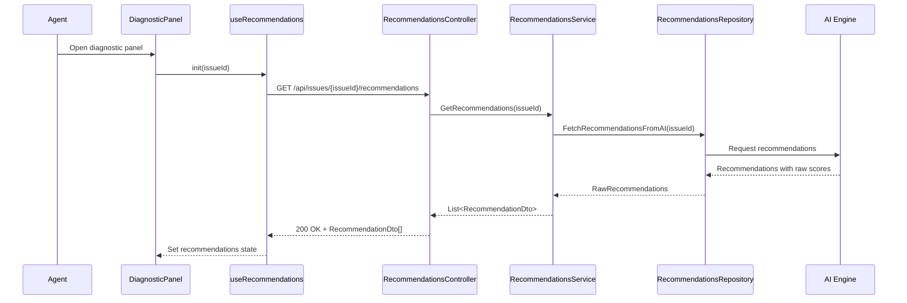

# a. Story Summary
Implement confidence scoring on AI-generated recommendations in the diagnostic panel so that each recommendation includes a visible confidence indicator, allowing agents to gauge reliability and prioritize actions.

# b. Architecture Mapping (brief)
- Frontend
  - DiagnosticPanel (Existing Page): Hosts AI recommendation list and integrates confidence indicators.
  - RecommendationsList (Component): Displays list of AI recommendations with confidence values and visual indicators.
  - RecommendationItem (Component): Renders a single recommendation, including confidence label/bar and styling.
  - useRecommendations (Custom Hook): Fetches AI recommendations, including confidence scores, and manages local state.
  - recommendationsApi (API client module): Wraps REST calls to retrieve AI recommendations with confidence.
- Backend
  - RecommendationsController (Controller): Provides endpoint to fetch AI recommendations with confidence scores for an issue.
  - RecommendationsService (Service): Integrates with AI engine or scoring component to compute confidence per recommendation.
  - RecommendationsRepository (Repository): Optional persistence for recommendations (if caching/storing); for now, acts as data access to AI provider or DB.
  - RecommendationDto (DTO): Represents a recommendation including confidence score.

- Recommended Folder Structure
  - React (src/)
    - src/components/diagnostic/RecommendationsList.tsx
    - src/components/diagnostic/RecommendationItem.tsx
    - src/hooks/useRecommendations.ts
    - src/api/recommendationsApi.ts
    - src/types/recommendations.ts
  - .NET
    - Controllers/RecommendationsController.cs
    - Services/RecommendationsService.cs
    - Repositories/RecommendationsRepository.cs
    - Models/DTOs/RecommendationDto.cs

# c. Component Specifications (table)
| Name                       | Layer    | Artifact Type  | Responsibility                                                     | Key Dependencies                      |
|----------------------------|----------|----------------|---------------------------------------------------------------------|--------------------------------------|
| DiagnosticPanel            | React    | Page Component | Container for diagnostic information and recommendations section    | useRecommendations, RecommendationsList |
| RecommendationsList        | React    | Component      | Render list of recommendations with confidence indicators           | RecommendationItem                   |
| RecommendationItem         | React    | Component      | Display individual recommendation text and confidence visualization | none (props only)                    |
| useRecommendations         | React    | Custom Hook    | Fetch and store recommendations including confidence scores         | recommendationsApi                   |
| recommendationsApi         | React    | API Module     | Perform HTTP calls to get recommendations                          | fetch/axios, auth client             |
| RecommendationsController  | API      | Controller     | Handle HTTP GET for AI recommendations with confidence              | RecommendationsService               |
| RecommendationsService     | Service  | Service        | Call AI provider and calculate/normalize confidence scores          | RecommendationsRepository            |
| RecommendationsRepository  | Data     | Repository     | Retrieve recommendations from AI engine or cache                    | HttpClient/DbContext                 |
| RecommendationDto          | API      | DTO            | Shape recommendation data (including confidence) for client         | n/a                                  |

# d. API Contract (table)
| Method | Route                                   | Request DTO | Response DTO                  | Status Codes      |
|--------|-----------------------------------------|-------------|-------------------------------|-------------------|
| GET    | /api/issues/{issueId}/recommendations   | n/a         | List<RecommendationDto>      | 200, 400, 404     |

# e. Data Model (brief)
- C# DTOs
  - RecommendationDto
    - Id: Guid
    - IssueId: Guid
    - Text: string
    - ConfidenceScore: double (0.0 - 1.0)
    - Source: string?

- TypeScript Types
  - Recommendation
    - id: string
    - issueId: string
    - text: string
    - confidenceScore: number // 0 - 1
    - source?: string

# f. Data Flow (one paragraph)
When the agent opens the diagnostic panel for a member issue, DiagnosticPanel uses useRecommendations to call recommendationsApi.get(issueId); this invokes RecommendationsController, which calls RecommendationsService to request AI-generated recommendations from RecommendationsRepository or an external AI provider, computes or normalizes a confidence score for each, and returns a list of RecommendationDto objects; the hook stores the list in state and RecommendationsList renders each RecommendationItem with a visual confidence indicator, enabling the agent to interpret the reliability of each recommendation.

# g. Primary Sequence Diagram (Mermaid)

# h. Implementation Notes (brief)
- Use React hooks for data fetching and state (useEffect/useState) in useRecommendations, with loading/error state flags.
- Visualize confidence via a progress bar, badge, or color scale derived from ConfidenceScore thresholds.
- Implement RecommendationsService and Repository as async services using HttpClient or EF Core, injected via DI.
- Keep DTOs decoupled from AI provider-specific shapes, mapping raw AI output to RecommendationDto.
- Cache recommendations per issue in-memory or via repository to avoid repeated AI calls where appropriate.

# i. Assumptions (brief)
- Confidence scores are provided by the AI engine or are derivable from AI output as values between 0 and 1.
- Recommendations are read-only for this story (no manual editing or dismissing in this scope).
- Diagnostic panel already exists and has an area reserved to display recommendations.

# j. Error Handling (ONE line)
Global exception middleware returns ProblemDetails JSON for API failures; React hook surfaces errors to DiagnosticPanel which shows a non-blocking toast or inline error.

# k. Security Notes (ONE line)
Standard JWT-protected API with secure HTTPS; no additional role restrictions beyond authenticated support agents.
