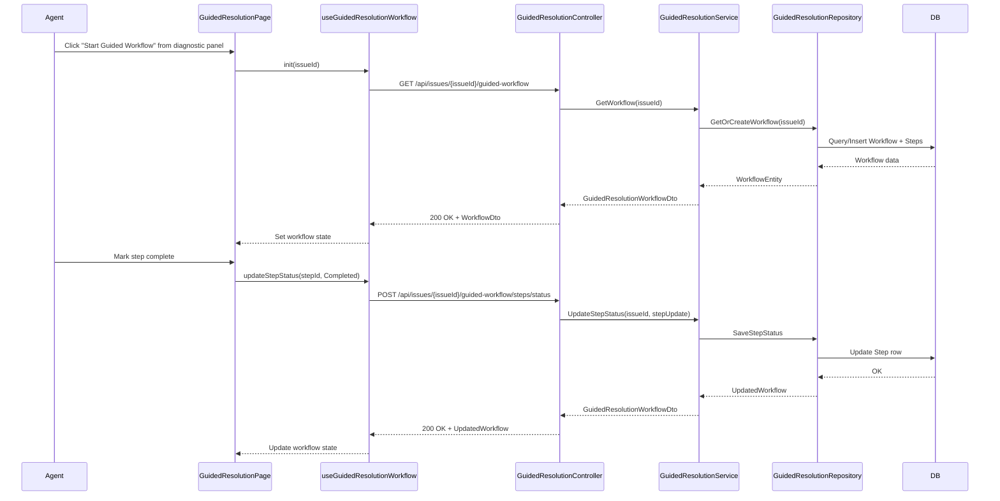

# a. Story Summary
Implement a guided resolution workflow that walks support agents through a structured series of resolution steps for a member issue, allowing them to start from the diagnostic panel and mark each step as complete.

# b. Architecture Mapping (brief)
- Frontend
  - GuidedResolutionPage (Page): Hosts the guided resolution workflow UI launched from the diagnostic panel.
  - GuidedResolutionStepsList (Component): Displays the ordered list of workflow steps with status (pending/completed/escalated).
  - GuidedResolutionStepItem (Component): Renders individual step, completion control, and optional escalation marker.
  - useGuidedResolutionWorkflow (Custom Hook): Encapsulates fetching workflow steps, updating step statuses, and local state.
  - guidedResolutionApi (API client module): Wraps REST calls for workflow retrieval and step status updates.
- Backend
  - GuidedResolutionController (Controller): Exposes endpoints to get workflow steps and update step status for a member issue.
  - GuidedResolutionService (Service): Encapsulates business logic for building the workflow sequence and validating step transitions.
  - GuidedResolutionRepository (Repository): Manages persistence of workflow definitions and per-issue step status.
  - GuidedResolutionWorkflowEntity (Entity): Represents a workflow instance associated with a member issue.
  - GuidedResolutionStepEntity (Entity): Represents individual steps and their status.
  - GuidedResolutionWorkflowDto / StepDto (DTOs): Data transfer objects for API responses/requests.

- Recommended Folder Structure
  - React (src/)
    - src/pages/GuidedResolutionPage.tsx
    - src/components/guided-resolution/GuidedResolutionStepsList.tsx
    - src/components/guided-resolution/GuidedResolutionStepItem.tsx
    - src/hooks/useGuidedResolutionWorkflow.ts
    - src/api/guidedResolutionApi.ts
    - src/types/guidedResolution.ts
  - .NET
    - Controllers/GuidedResolutionController.cs
    - Services/GuidedResolutionService.cs
    - Repositories/GuidedResolutionRepository.cs
    - Models/Entities/GuidedResolutionWorkflowEntity.cs
    - Models/Entities/GuidedResolutionStepEntity.cs
    - Models/DTOs/GuidedResolutionDtos.cs

# c. Component Specifications (table)
| Name                              | Layer    | Artifact Type  | Responsibility                                                     | Key Dependencies                                      |
|-----------------------------------|----------|----------------|---------------------------------------------------------------------|------------------------------------------------------|
| GuidedResolutionPage              | React    | Page Component | Container page for the guided workflow, launched from diagnostics   | useGuidedResolutionWorkflow, GuidedResolutionStepsList |
| GuidedResolutionStepsList         | React    | Component      | Render ordered list of workflow steps with current statuses         | GuidedResolutionStepItem                             |
| GuidedResolutionStepItem          | React    | Component      | Display a single step with controls to mark complete or escalate    | none (props only)                                    |
| useGuidedResolutionWorkflow       | React    | Custom Hook    | Manage workflow state, call API to load/update steps                | guidedResolutionApi                                  |
| guidedResolutionApi               | React    | API Module     | Perform HTTP calls for workflow retrieval and step updates          | fetch/axios, auth client                             |
| GuidedResolutionController        | API      | Controller     | Handle HTTP requests for workflow retrieval and step updates        | GuidedResolutionService                              |
| GuidedResolutionService           | Service  | Service        | Build workflows and enforce rules for step completion/escalation    | GuidedResolutionRepository                           |
| GuidedResolutionRepository        | Data     | Repository     | Persist and retrieve workflows and step status from DB              | DbContext (EF Core)                                  |
| GuidedResolutionWorkflowEntity    | Data     | Entity         | Represent workflow instance linked to member issue                  | EF Core                                              |
| GuidedResolutionStepEntity        | Data     | Entity         | Represent individual step and status in a workflow                  | EF Core                                              |
| GuidedResolutionWorkflowDto       | API      | DTO            | Shape workflow data for client consumption                         | n/a                                                  |
| GuidedResolutionStepDto           | API      | DTO            | Shape step data and updates for client                             | n/a                                                  |

# d. API Contract (table)
| Method | Route                                               | Request DTO                        | Response DTO                     | Status Codes                  |
|--------|-----------------------------------------------------|------------------------------------|----------------------------------|-------------------------------|
| GET    | /api/issues/{issueId}/guided-workflow               | n/a                                | GuidedResolutionWorkflowDto     | 200, 404                      |
| POST   | /api/issues/{issueId}/guided-workflow/steps/status  | GuidedResolutionStepStatusUpdateDto | GuidedResolutionWorkflowDto     | 200, 400, 404                 |

# e. Data Model (brief)
- C# Entities
  - GuidedResolutionWorkflowEntity
    - Id: Guid
    - IssueId: Guid
    - Name: string
    - CreatedAt: DateTime
    - Status: string (e.g., "InProgress", "Completed", "Escalated")
    - Steps: ICollection<GuidedResolutionStepEntity>
  - GuidedResolutionStepEntity
    - Id: Guid
    - WorkflowId: Guid
    - Order: int
    - Title: string
    - Description: string?
    - Status: string (e.g., "Pending", "Completed", "Escalated")
    - CompletedAt: DateTime?
- DTOs
  - GuidedResolutionWorkflowDto
    - IssueId: string
    - Status: string
    - Steps: List<GuidedResolutionStepDto>
  - GuidedResolutionStepDto
    - Id: string
    - Order: number
    - Title: string
    - Description: string
    - Status: string
  - GuidedResolutionStepStatusUpdateDto
    - StepId: string
    - NewStatus: string

- TypeScript Types
  - GuidedResolutionWorkflow
    - issueId: string
    - status: "InProgress" | "Completed" | "Escalated"
    - steps: GuidedResolutionStep[]
  - GuidedResolutionStep
    - id: string
    - order: number
    - title: string
    - description?: string
    - status: "Pending" | "Completed" | "Escalated"

# f. Data Flow (one paragraph)
When the agent starts the guided resolution workflow from the diagnostic panel, the Diagnostic panel routes to GuidedResolutionPage, which uses useGuidedResolutionWorkflow to call guidedResolutionApi.getWorkflow(issueId); this invokes GuidedResolutionController GET, which calls GuidedResolutionService to load or build the workflow from GuidedResolutionRepository and return a GuidedResolutionWorkflowDto; the hook updates React state to render GuidedResolutionStepsList and items; when the agent marks a step complete, the hook calls guidedResolutionApi.updateStepStatus, triggering the POST endpoint, where the controller validates and delegates to the service to update the step status via the repository and EF Core; the updated workflow is returned in the response and the hook refreshes state, causing the UI to reflect completion and eventually show the issue resolved or escalated.

# g. Primary Sequence Diagram (Mermaid)

# h. Implementation Notes (brief)
- Use React functional components with useState/useEffect in useGuidedResolutionWorkflow to manage workflow loading and step updates.
- Handle API calls via a centralized guidedResolutionApi using fetch/axios with interceptors for auth and error handling.
- In ASP.NET Core, register GuidedResolutionService and GuidedResolutionRepository via dependency injection and use async/await for all EF Core operations.
- Map between entities and DTOs using a lightweight mapper (manual or AutoMapper) to keep API contracts isolated from persistence.
- Consider optimistic UI updates when marking steps complete, with rollback on API failure.

# i. Assumptions (brief)
- Each member issue has at most one active guided workflow instance at a time.
- Workflow step definitions are predefined and do not require authoring in this story.
- Escalation handling is limited to marking workflow status as "Escalated" without implementing full escalation routing.

# j. Error Handling (ONE line)
Global ASP.NET Core exception middleware returns ProblemDetails JSON; React displays errors via a toast notification component when workflow load/update fails.

# k. Security Notes (ONE line)
JWT bearer authentication with role-based [Authorize] on guided workflow endpoints, with secure HTTPS calls from the SPA.