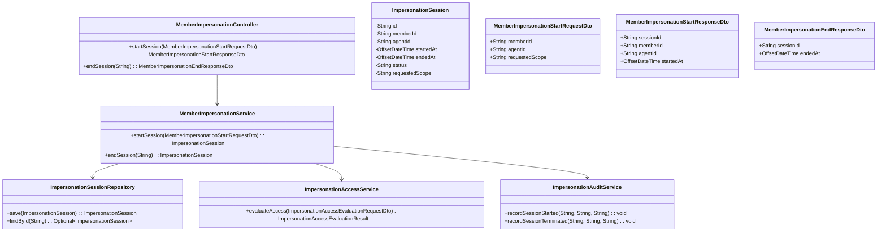
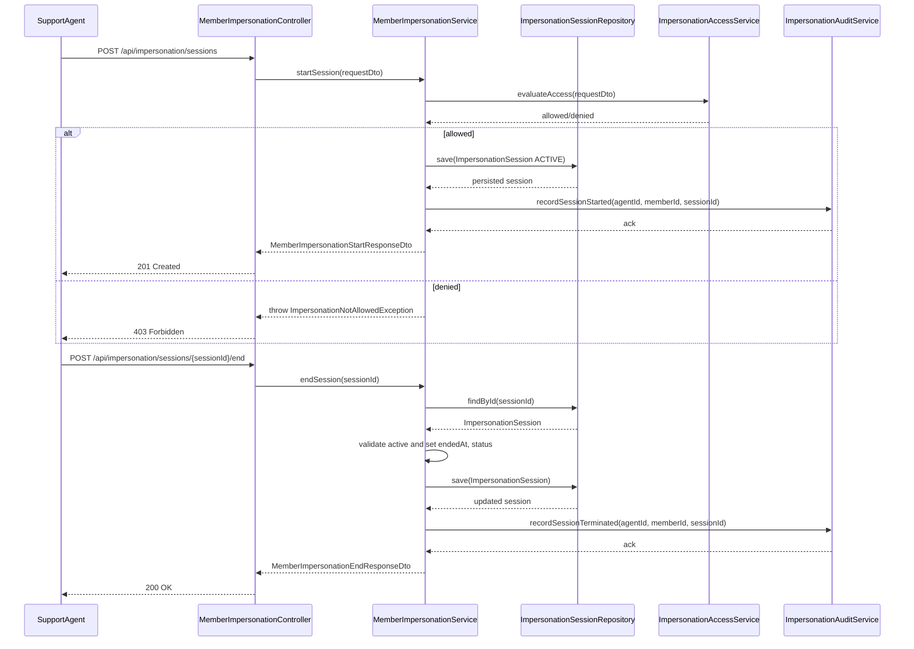
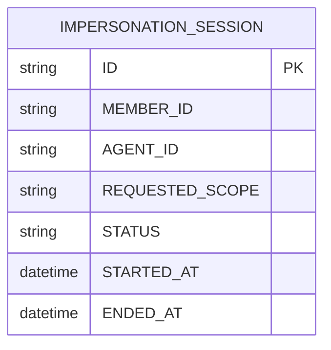

# Repository: APB_Demo
# Branch: epictesting1
# Folder: LLD

1. Objective
The objective is to allow authorized support agents to impersonate member accounts for troubleshooting. The solution must provide a controlled impersonation session without exposing member credentials. It should integrate with access control and auditing mechanisms.

2. Backend Spring Boot API Details
2.1. API Model
2.1.1. Common Components/Services
- MemberImpersonationController: REST controller exposing endpoints for initiating and ending member impersonation sessions.
- MemberImpersonationService: Service encapsulating the core impersonation session logic.
- ImpersonationSessionRepository: Spring Data JPA repository for storing impersonation sessions.
- ImpersonationAccessService: Service used to evaluate whether an agent is allowed to impersonate a member.
- ImpersonationAuditService: Service recording impersonation session start and end events.

2.1.2. API Details
| Operation | REST Method | Type | URL | Request JSON | Response JSON |
|-----------|------------|------|-----|--------------|---------------|
| Initiate impersonation session | POST | New | /api/impersonation/sessions | {"memberId":"string","agentId":"string","requestedScope":"string"} | {"sessionId":"string","memberId":"string","agentId":"string","startedAt":"ISO_DATE_TIME"} |
| End impersonation session | POST | New | /api/impersonation/sessions/{sessionId}/end | N/A | {"sessionId":"string","endedAt":"ISO_DATE_TIME"} |

2.1.3. Exceptions
- ImpersonationNotAllowedException: Thrown when access control denies impersonation.
- ImpersonationSessionNotFoundException: Thrown when a sessionId is unknown.
- ImpersonationSessionAlreadyEndedException: Thrown when attempting to end a session that is already closed.

2.2. Functional Design
2.2.1. Class Diagram

2.2.2. UML Sequence Diagram

2.2.3. Components
| Component Name | Description | Existing/New |
|----------------|-------------|--------------|
| MemberImpersonationController | Exposes endpoints for starting and ending impersonation sessions. | New |
| MemberImpersonationService | Implements core impersonation session workflow. | New |
| ImpersonationSessionRepository | Persists impersonation session records. | New |
| ImpersonationAccessService | Evaluates whether impersonation is allowed for a given agent and member. | New |
| ImpersonationAuditService | Records session start and end events. | New |

2.3. Service Layer Business Logic
MemberImpersonationService uses constructor injection for ImpersonationSessionRepository, ImpersonationAccessService, and ImpersonationAuditService. startSession calls ImpersonationAccessService to check authorization; if allowed, it creates an ImpersonationSession entity with status ACTIVE and current timestamp, saves it, and calls ImpersonationAuditService.recordSessionStarted. endSession loads the session, validates that it is active, sets endedAt and status to ENDED, saves it, and records termination. No caching is used to avoid stale session state.

Validation rules
| Field Name | Validation | Error Message | Class Used |
|-----------|-----------|---------------|------------|
| memberId | Not null, not blank | "memberId is required" | MemberImpersonationStartRequestDto |
| agentId | Not null, not blank | "agentId is required" | MemberImpersonationStartRequestDto |
| requestedScope | Not null, not blank | "requestedScope is required" | MemberImpersonationStartRequestDto |
| sessionId | Not null, not blank | "sessionId is required" | MemberImpersonationController |

2.4. Service Integrations
| System | Integrated For | Integration Type |
|--------|----------------|------------------|
| Access Control Service | Evaluating impersonation permissions | Internal Spring bean (ImpersonationAccessService) |
| Audit Logging Store | Recording session lifecycle events | Internal Spring bean (ImpersonationAuditService) |

3. Front End React Details
3.1. UI Component Architecture
AgentImpersonationPage will enable support agents to initiate and end impersonation sessions. A container component AgentImpersonationContainer will manage form inputs and session state, while AgentImpersonationView will render UI elements. State will be managed with useState and useEffect, and a custom hook useAgentImpersonationApi will abstract HTTP calls. Routing path "/support/impersonation" will render AgentImpersonationPage.

3.2. UI Specifications
The page will allow the agent to select or input a member identifier and requestedScope from a predefined list, then click a Start Impersonation button. Once a session is active, the UI will display session details and an End Session button. The layout will be responsive with form fields stacked on small screens and arranged in two columns on wider screens.

3.3. API Integration
useAgentImpersonationApi will call POST /api/impersonation/sessions to start a session and POST /api/impersonation/sessions/{sessionId}/end to end a session. The hook will manage loading and error states, exposing startSession and endSession functions to the container. Errors will be displayed via inline messages near the form and global notifications for critical failures.

4. Database Details
4.1. ER Model

4.2. Database Validations
- MEMBER_ID and AGENT_ID are NOT NULL.
- STATUS is constrained to ACTIVE or ENDED.
- STARTED_AT is mandatory, ENDED_AT is optional until session ends.

5. Non-Functional Requirements
5.1. Performance
- Session initiation should complete within 500 ms under normal load.

5.2. Security (Authentication & Authorization)
- Only authenticated support agents with impersonation permissions may call these endpoints.
- Sessions are tied to an agent identity and may not be transferred.

5.3. Logging (Application, Audit, Monitoring)
- All session initiation and termination events must be logged at INFO level with correlation IDs.

6. Dependencies
- Spring Boot Web, Spring Data JPA, React with a shared HTTP client, and existing access control/audit services.

7. Assumptions
- Agent identity is derived from authentication context and duplicated in the request for traceability.
- Session tokens or technical impersonation mechanisms are handled by an existing authentication infrastructure.
- requestedScope is a simple string describing allowed operations for the session.
