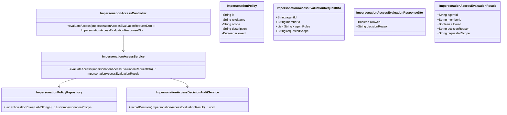
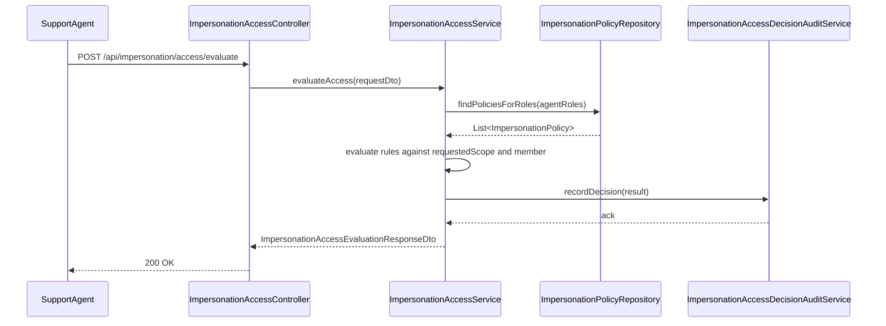
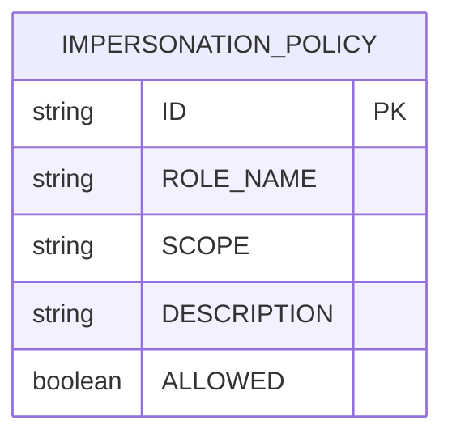

# Repository: APB_Demo
# Branch: epictesting1
# Folder: LLD

1. Objective
The objective is to enforce fine-grained access control over impersonation actions. The system must ensure only eligible agents can initiate impersonation of member accounts. All allow/deny decisions should be logged for traceability.

2. Backend Spring Boot API Details
2.1. API Model
2.1.1. Common Components/Services
- ImpersonationAccessController: REST controller to evaluate and enforce impersonation access control.
- ImpersonationAccessService: Service containing business rules for impersonation authorization.
- ImpersonationPolicyRepository: Repository-like abstraction to read configured impersonation rules and roles (implemented as in-memory configuration or database-backed).
- ImpersonationAccessDecisionAuditService: Service to log access decisions.

2.1.2. API Details
| Operation | REST Method | Type | URL | Request JSON | Response JSON |
|-----------|------------|------|-----|--------------|---------------|
| Evaluate impersonation access | POST | New | /api/impersonation/access/evaluate | {"agentId":"string","memberId":"string","agentRoles":["string"],"requestedScope":"string"} | {"allowed":true,"decisionReason":"string"} |

2.1.3. Exceptions
- ImpersonationAccessDeniedException: Thrown when impersonation is not allowed under policy.
- ImpersonationPolicyNotFoundException: Thrown when no applicable policy is configured.

2.2. Functional Design
2.2.1. Class Diagram

2.2.2. UML Sequence Diagram

2.2.3. Components
| Component Name | Description | Existing/New |
|----------------|-------------|--------------|
| ImpersonationAccessController | Exposes impersonation access evaluation endpoint. | New |
| ImpersonationAccessService | Contains authorization logic for impersonation. | New |
| ImpersonationPolicyRepository | Provides access to impersonation policy definitions. | New |
| ImpersonationAccessDecisionAuditService | Logs allow/deny decisions. | New |

2.3. Service Layer Business Logic
ImpersonationAccessService takes ImpersonationPolicyRepository and ImpersonationAccessDecisionAuditService via constructor injection. evaluateAccess resolves policies applicable to the agent’s roles, determines if the requestedScope is permitted, and returns an allowed flag with a decisionReason summarizing why. The service logs every decision via ImpersonationAccessDecisionAuditService. No caching is initially used; policies are assumed to be few and read quickly.

Validation rules
| Field Name | Validation | Error Message | Class Used |
|-----------|-----------|---------------|------------|
| agentId | Not null, not blank | "agentId is required" | ImpersonationAccessEvaluationRequestDto |
| memberId | Not null, not blank | "memberId is required" | ImpersonationAccessEvaluationRequestDto |
| agentRoles | Not null, minimum size 1 | "agentRoles is required" | ImpersonationAccessEvaluationRequestDto |
| requestedScope | Not null, not blank | "requestedScope is required" | ImpersonationAccessEvaluationRequestDto |

2.4. Service Integrations
| System | Integrated For | Integration Type |
|--------|----------------|------------------|
| Policy Store | Loading impersonation policies | In-memory or database-backed repository |
| Audit Logging Store | Recording access decisions | Asynchronous service call (internal Spring bean) |

3. Front End React Details
3.1. UI Component Architecture
This story focuses on backend enforcement; no member-facing UI is required. An optional admin page ImpersonationPolicyAdminPage may be considered later to manage policies but is out of scope for this LLD.

3.2. UI Specifications
No UI is defined for this story.

3.3. API Integration
No frontend API integration is defined for this story.

4. Database Details
4.1. ER Model

4.2. Database Validations
- ROLE_NAME, SCOPE, and ALLOWED are mandatory.
- Combination of ROLE_NAME and SCOPE should be unique.

5. Non-Functional Requirements
5.1. Performance
- Access evaluation must complete within 100 ms under normal load.

5.2. Security (Authentication & Authorization)
- Endpoint may only be called by internal services or authenticated support flows.
- Policies must be protected from unauthorized modification.

5.3. Logging (Application, Audit, Monitoring)
- Every access evaluation decision must be logged with agentId, memberId, requestedScope, and allowed flag.

6. Dependencies
- Spring Boot Web, configuration or database access libraries for policy storage.

7. Assumptions
- Policies are relatively static and changed infrequently.
- Agent roles are provided as part of the calling context and are trusted.
- A separate administrative process manages policy lifecycle.
