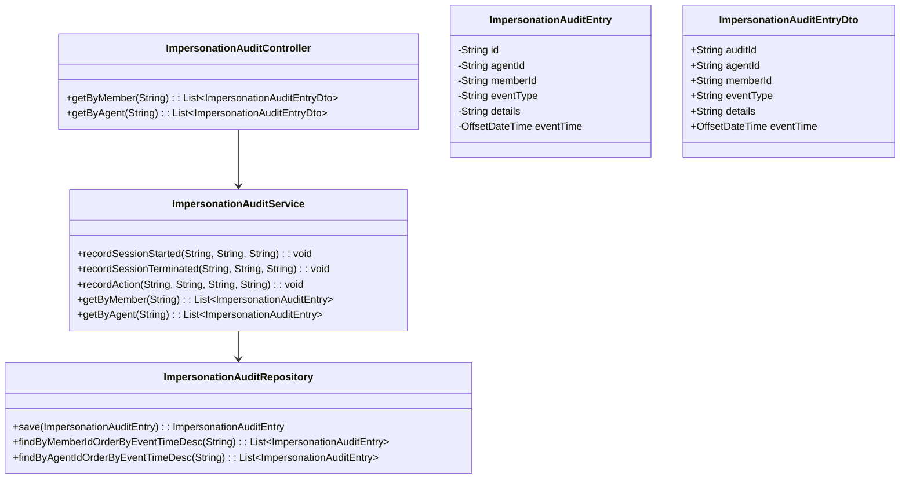
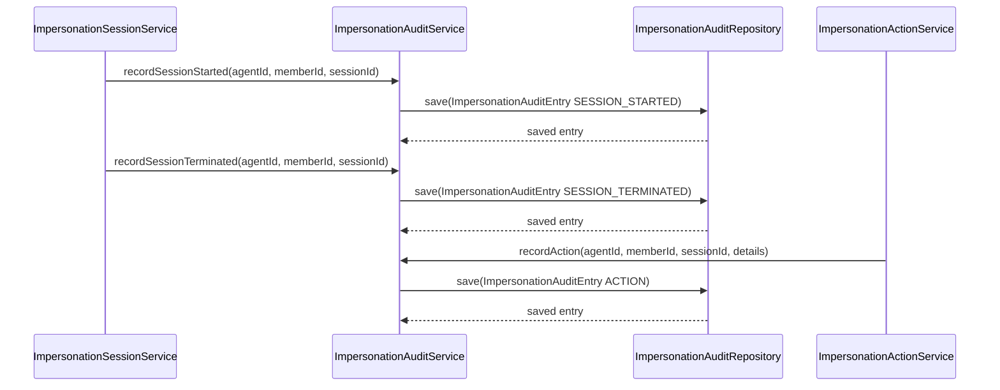
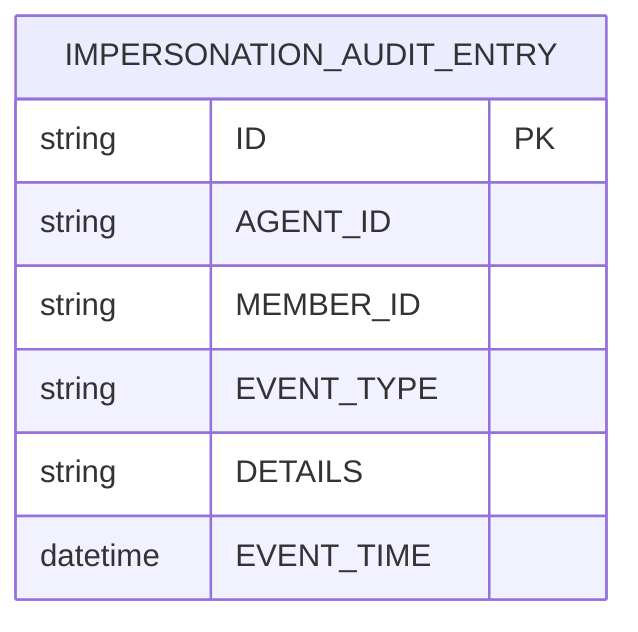

# Repository: APB_Demo
# Branch: epictesting1
# Folder: LLD

1. Objective
The objective is to ensure all impersonation activity is fully captured in audit trails. The system must record who accessed which member accounts, when sessions occurred, and key actions performed during impersonation. Audit records must be suitable for compliance review and immutable at the application level.

2. Backend Spring Boot API Details
2.1. API Model
2.1.1. Common Components/Services
- ImpersonationAuditController: REST controller providing read-only access to impersonation audit data for authorized users.
- ImpersonationAuditService: Service responsible for writing and retrieving impersonation audit entries.
- ImpersonationAuditRepository: Spring Data JPA repository for audit entities.

2.1.2. API Details
| Operation | REST Method | Type | URL | Request JSON | Response JSON |
|-----------|------------|------|-----|--------------|---------------|
| Get impersonation audit entries by member | GET | New | /api/audit/impersonation/members/{memberId} | N/A | [{"auditId":"string","agentId":"string","memberId":"string","eventType":"SESSION_STARTED|SESSION_TERMINATED|ACTION","eventTime":"ISO_DATE_TIME","details":"string"}] |
| Get impersonation audit entries by agent | GET | New | /api/audit/impersonation/agents/{agentId} | N/A | [{"auditId":"string","agentId":"string","memberId":"string","eventType":"SESSION_STARTED|SESSION_TERMINATED|ACTION","eventTime":"ISO_DATE_TIME","details":"string"}] |

2.1.3. Exceptions
- ImpersonationAuditAccessDeniedException: Thrown when an unauthorized user attempts to access audit data.

2.2. Functional Design
2.2.1. Class Diagram

2.2.2. UML Sequence Diagram

2.2.3. Components
| Component Name | Description | Existing/New |
|----------------|-------------|--------------|
| ImpersonationAuditController | Exposes read-only audit endpoints. | New |
| ImpersonationAuditService | Writes and retrieves impersonation audit entries. | New |
| ImpersonationAuditRepository | Provides persistence for audit entries. | New |

2.3. Service Layer Business Logic
ImpersonationAuditService uses constructor injection for ImpersonationAuditRepository. recordSessionStarted and recordSessionTerminated create audit entries with eventType SESSION_STARTED or SESSION_TERMINATED respectively and store details such as sessionId. recordAction logs significant actions taken during impersonation with a generic details field. Retrieval methods getByMember and getByAgent fetch entries ordered by eventTime. No caching is used because data volumes are expected to be moderate and must reflect real-time updates.

Validation rules
| Field Name | Validation | Error Message | Class Used |
|-----------|-----------|---------------|------------|
| agentId | Not null, not blank | "agentId is required" | ImpersonationAuditService |
| memberId | Not null, not blank | "memberId is required" | ImpersonationAuditService |
| eventType | Must be one of SESSION_STARTED, SESSION_TERMINATED, ACTION | "eventType is invalid" | ImpersonationAuditEntry |
| details | Optional, length ≤ 1000 | "details must be at most 1000 characters" | ImpersonationAuditEntry |

2.4. Service Integrations
| System | Integrated For | Integration Type |
|--------|----------------|------------------|
| Primary Relational Database | Storing impersonation audit entries | JPA repository |

3. Front End React Details
3.1. UI Component Architecture
ImpersonationAuditPage will be a restricted-access page for compliance officers. A container component ImpersonationAuditContainer will manage search filters (e.g., by memberId or agentId) and retrieve audit data, while ImpersonationAuditView will display results. State management will rely on useState and useEffect hooks. A custom hook useImpersonationAuditApi will encapsulate HTTP requests.

3.2. UI Specifications
The page will provide filter inputs for memberId and agentId, with a search button triggering retrieval. Results will be displayed in a paginated table showing eventTime, agentId, memberId, eventType, and details. Layout will adjust to smaller screens by converting the table into stacked cards. No editing is allowed; this is a view-only interface.

3.3. API Integration
useImpersonationAuditApi will call the audit endpoints based on filters: GET /api/audit/impersonation/members/{memberId} and GET /api/audit/impersonation/agents/{agentId}. HTTP errors will be surfaced via error banners and logged for diagnostics. Loading indicators will appear while fetching, and empty states will be shown when no records are found.

4. Database Details
4.1. ER Model

4.2. Database Validations
- AGENT_ID and MEMBER_ID are mandatory.
- EVENT_TYPE is constrained to SESSION_STARTED, SESSION_TERMINATED, or ACTION.
- EVENT_TIME is mandatory and defaults to the current timestamp.

5. Non-Functional Requirements
5.1. Performance
- Retrieval queries should complete within 1 second for typical result sizes.
- Database indexes on MEMBER_ID and AGENT_ID will support efficient filtering.

5.2. Security (Authentication & Authorization)
- Only users with a compliance or audit role may access audit endpoints.
- Audit records are read-only via the API.

5.3. Logging (Application, Audit, Monitoring)
- Application logs will record access to audit endpoints with requester identity.
- Any failure to write audit entries must be logged as an error with sufficient context.

6. Dependencies
- Spring Boot Web, Spring Data JPA on the backend, and React with a shared HTTP client on the frontend.

7. Assumptions
- Audit data is stored in the same primary database as other application data.
- Other services (e.g., session management) will call ImpersonationAuditService to record events.
- Compliance officers use this interface primarily for investigative queries, not continuous monitoring.
