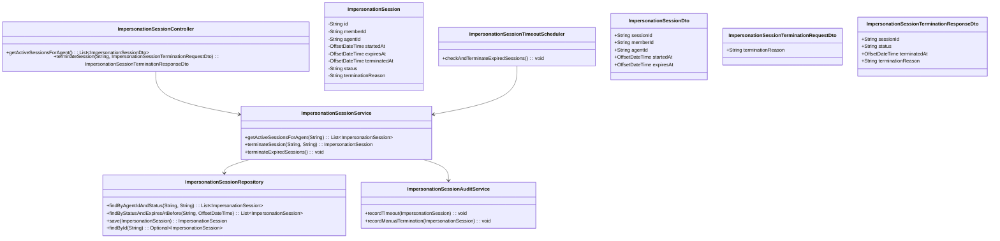
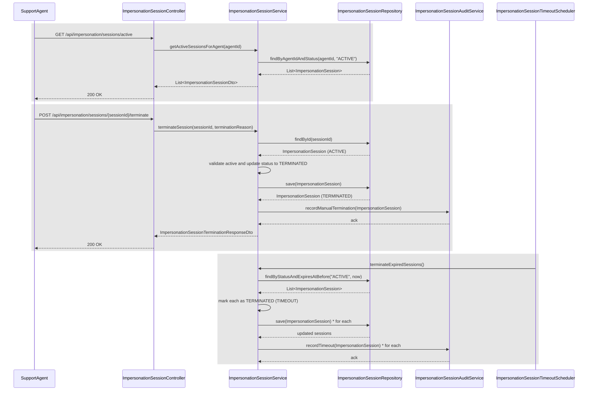
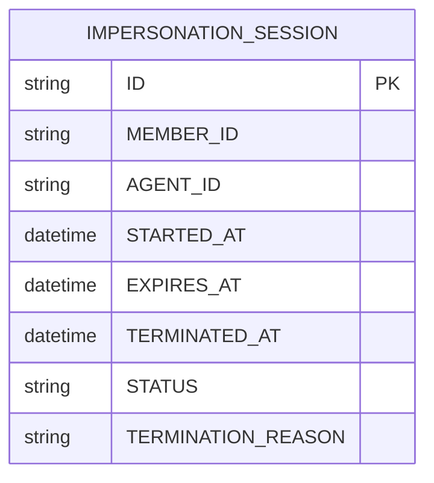

# Repository: APB_Demo
# Branch: epictesting1
# Folder: LLD

1. Objective
The objective is to ensure impersonation sessions are strictly time-bound. The system must automatically terminate sessions when the configured duration limit is reached. All automatic terminations should be logged for auditing.

2. Backend Spring Boot API Details
2.1. API Model
2.1.1. Common Components/Services
- ImpersonationSessionController: REST controller exposing endpoints related to impersonation sessions.
- ImpersonationSessionService: Service managing lifecycle of impersonation sessions, including timeouts.
- ImpersonationSessionRepository: Spring Data JPA repository for impersonation session persistence.
- ImpersonationSessionTimeoutScheduler: Component responsible for identifying and terminating expired sessions on a scheduled basis.
- ImpersonationSessionAuditService: Service to record timeout events in an audit trail.

2.1.2. API Details
| Operation | REST Method | Type | URL | Request JSON | Response JSON |
|-----------|------------|------|-----|--------------|---------------|
| Get active impersonation sessions for agent | GET | New | /api/impersonation/sessions/active | N/A | [{"sessionId":"string","memberId":"string","agentId":"string","startedAt":"ISO_DATE_TIME","expiresAt":"ISO_DATE_TIME"}] |
| Terminate impersonation session (manual) | POST | New | /api/impersonation/sessions/{sessionId}/terminate | {"terminationReason":"string"} | {"sessionId":"string","status":"TERMINATED","terminatedAt":"ISO_DATE_TIME","terminationReason":"string"} |

2.1.3. Exceptions
- ImpersonationSessionNotFoundException: Thrown when a sessionId is not found.
- InvalidSessionStateException: Thrown when terminating a session that is not active.

2.2. Functional Design
2.2.1. Class Diagram

2.2.2. UML Sequence Diagram

2.2.3. Components
| Component Name | Description | Existing/New |
|----------------|-------------|--------------|
| ImpersonationSessionController | Exposes REST endpoints for impersonation sessions. | New |
| ImpersonationSessionService | Manages session lifecycle and automatic timeouts. | New |
| ImpersonationSessionRepository | Provides persistence operations for sessions. | New |
| ImpersonationSessionTimeoutScheduler | Periodically checks and terminates expired sessions. | New |
| ImpersonationSessionAuditService | Records timeout and termination events in audit logs. | New |

2.3. Service Layer Business Logic
ImpersonationSessionService uses constructor injection to obtain ImpersonationSessionRepository and ImpersonationSessionAuditService. getActiveSessionsForAgent retrieves sessions filtered by agentId and ACTIVE status. terminateSession validates that the session is ACTIVE, sets terminatedAt and status to TERMINATED, and records a manual termination event. terminateExpiredSessions is invoked by ImpersonationSessionTimeoutScheduler at a fixed interval (e.g., every minute) to find active sessions whose expiresAt is before now and mark them as terminated with a standard timeout reason. No caching is used; correctness and real-time enforcement are prioritized.

Validation rules
| Field Name | Validation | Error Message | Class Used |
|-----------|-----------|---------------|------------|
| sessionId | Not null, not blank | "sessionId is required" | ImpersonationSessionController |
| terminationReason | Optional, length ≤ 250 | "terminationReason must be at most 250 characters" | ImpersonationSessionTerminationRequestDto |

2.4. Service Integrations
| System | Integrated For | Integration Type |
|--------|----------------|------------------|
| Audit Logging Store | Recording timeout and manual termination events | Asynchronous service call (internal Spring bean) |
| Scheduler Subsystem | Invoking periodic timeout checks | Spring @Scheduled-based component |

3. Front End React Details
3.1. UI Component Architecture
ImpersonationSessionsPage will show active impersonation sessions for a support agent. A container component ImpersonationSessionsContainer will fetch active sessions and handle termination actions, while a presentational component ImpersonationSessionsView will display a table/card layout. State management will use useState and useEffect hooks, and a custom hook useImpersonationSessionsApi encapsulates backend calls. Routing will expose "/impersonation/sessions" mapped to ImpersonationSessionsPage.

3.2. UI Specifications
The page will list active sessions with memberId, startedAt, and expiresAt, along with an action button to terminate a session. A confirm dialog appears before termination to prevent accidental actions. The layout will be responsive: single-column cards on narrow screens (≤768px) and a table layout on wider screens. Loading and empty states will be clearly indicated.

3.3. API Integration
useImpersonationSessionsApi will use a shared HTTP client to call GET /api/impersonation/sessions/active and POST /api/impersonation/sessions/{sessionId}/terminate. Errors will be handled via try/catch, with error messages displayed using a global notification/toast system. Loading flags will drive spinners and button disabled states. Date strings from the backend will be formatted for display.

4. Database Details
4.1. ER Model

4.2. Database Validations
- STATUS is constrained to ACTIVE or TERMINATED.
- STARTED_AT and EXPIRES_AT are mandatory.
- EXPIRES_AT must be greater than STARTED_AT at the application level.

5. Non-Functional Requirements
5.1. Performance
- Timeout scheduler must process expired sessions within one minute of expiry under normal load.
- Queries for active sessions must respond within 500 ms under normal conditions.

5.2. Security (Authentication & Authorization)
- Only authenticated support agents may access their active sessions and request termination.
- Termination endpoints must validate that the session belongs to the requesting agent or an authorized role.

5.3. Logging (Application, Audit, Monitoring)
- Application logs will record scheduler executions and summary counts of terminated sessions.
- Audit logs capture per-session termination details, including timeout reason and timestamps.

6. Dependencies
- Spring Boot Web, Spring Data JPA, Spring Scheduling, and React with a shared HTTP client.

7. Assumptions
- Session start and expiry times are calculated by another part of the system when sessions are created.
- Scheduler frequency and timeout duration are configured via external configuration.
- Timekeeping uses a consistent timezone (e.g., UTC) across components.
