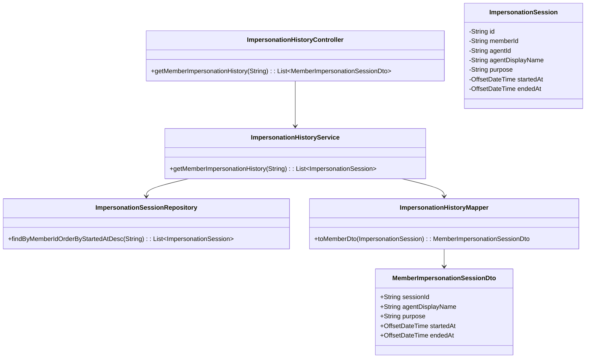
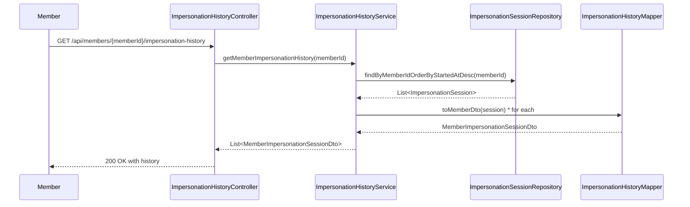
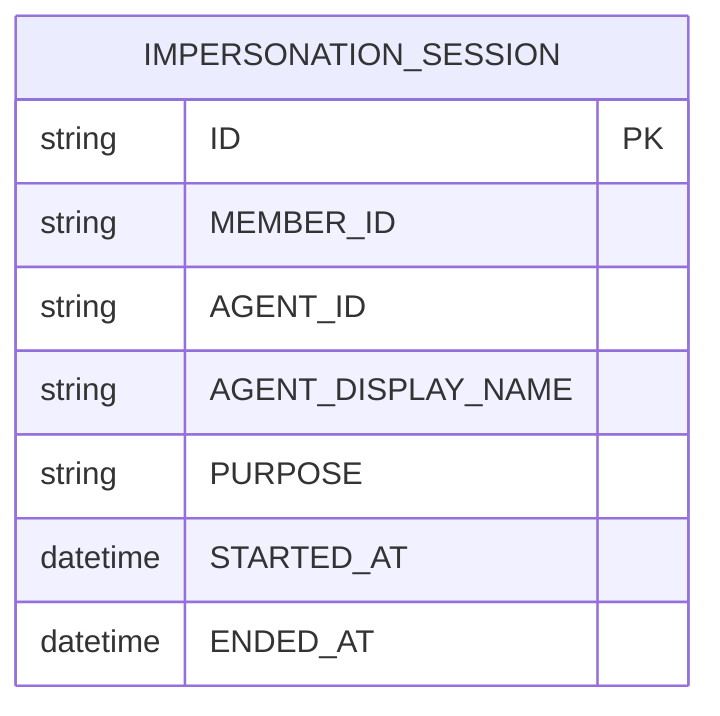

# Repository: APB_Demo
# Branch: epictesting1
# Folder: LLD

1. Objective
The objective is to provide members with visibility into historical impersonation activity on their accounts. The solution must expose impersonation sessions, including agent identity, timestamps, and purpose descriptions. Internal system details should be hidden while ensuring information is sufficient for member verification.

2. Backend Spring Boot API Details
2.1. API Model
2.1.1. Common Components/Services
- ImpersonationHistoryController: REST controller exposing endpoints for member impersonation history.
- ImpersonationHistoryService: Service encapsulating retrieval logic for impersonation events.
- ImpersonationSessionRepository: Spring Data JPA repository for impersonation session entities.
- ImpersonationHistoryMapper: Component converting entities into member-facing DTOs.

2.1.2. API Details
| Operation | REST Method | Type | URL | Request JSON | Response JSON |
|-----------|------------|------|-----|--------------|---------------|
| Get member impersonation history | GET | New | /api/members/{memberId}/impersonation-history | N/A | [{"sessionId":"string","agentDisplayName":"string","startedAt":"ISO_DATE_TIME","endedAt":"ISO_DATE_TIME","purpose":"string"}] |

2.1.3. Exceptions
- MemberImpersonationHistoryNotFoundException: Thrown when no impersonation history is found for a member (optional, can still return empty list).
- UnauthorizedMemberHistoryAccessException: Thrown when a user attempts to access history for another member without proper authorization.

2.2. Functional Design
2.2.1. Class Diagram

2.2.2. UML Sequence Diagram

2.2.3. Components
| Component Name | Description | Existing/New |
|----------------|-------------|--------------|
| ImpersonationHistoryController | Exposes member impersonation history endpoints. | New |
| ImpersonationHistoryService | Retrieves and filters impersonation session data for members. | New |
| ImpersonationSessionRepository | Provides data access for impersonation sessions. | New |
| ImpersonationHistoryMapper | Maps internal session entities to member-facing DTOs. | New |

2.3. Service Layer Business Logic
ImpersonationHistoryService is injected with ImpersonationSessionRepository and ImpersonationHistoryMapper via constructor injection. The service validates that the requesting user is either the member themselves or otherwise authorized to view the history. It then queries impersonation sessions ordered by most recent, filters out internal-only fields, and maps them via ImpersonationHistoryMapper. No caching is used to ensure history remains accurate and up-to-date. Basic input validation for memberId is enforced.

Validation rules
| Field Name | Validation | Error Message | Class Used |
|-----------|-----------|---------------|------------|
| memberId | Not null, not blank | "memberId is required" | ImpersonationHistoryController (request path validation) |

2.4. Service Integrations
| System | Integrated For | Integration Type |
|--------|----------------|------------------|
| Primary Relational Database | Reading impersonation session history | Direct JPA repository access |

3. Front End React Details
3.1. UI Component Architecture
MemberImpersonationHistoryPage will present impersonation history to the logged-in member. It will use a container component MemberImpersonationHistoryContainer to manage data fetching, and a presentational component MemberImpersonationHistoryView to render a list or table. State is managed via useState and useEffect, and a custom hook useMemberImpersonationHistoryApi encapsulates HTTP calls. Routing will expose the path "/account/security/impersonation-history" mapping to MemberImpersonationHistoryPage.

3.2. UI Specifications
The page will show a list of impersonation sessions with agentDisplayName, startedAt, endedAt, and purpose. On small screens, each session is shown as a stacked card; on larger screens, a table layout is used. A simple filter (e.g., last 30 days vs all history) may be provided via dropdown. No editable forms are needed; interactions are limited to viewing and basic filtering.

3.3. API Integration
useMemberImpersonationHistoryApi will call GET /api/members/{memberId}/impersonation-history using a shared HTTP client. It will derive memberId from the logged-in user context rather than user input. Error handling will show a generic error banner while logging details to the console for debugging in non-production environments. Loading states will be indicated via a spinner on initial load and skeleton placeholders for the history list.

4. Database Details
4.1. ER Model

4.2. Database Validations
- MEMBER_ID and AGENT_ID are mandatory (NOT NULL).
- STARTED_AT is mandatory; ENDED_AT may be null for in-progress sessions.
- PURPOSE has a maximum length enforced at the database level (e.g., 500 characters).

5. Non-Functional Requirements
5.1. Performance
- History retrieval for a member should return within 500 ms under normal load.
- Server-side pagination may be added later; for now, all sessions for a member are returned.

5.2. Security (Authentication & Authorization)
- Endpoint access is restricted to authenticated members retrieving their own history or authorized support/compliance roles.
- Sensitive internal identifiers (e.g., internal agent IDs) are not returned; only agentDisplayName is exposed.

5.3. Logging (Application, Audit, Monitoring)
- Access to impersonation history is logged with memberId and requester identity for audit purposes.
- Application logs capture error conditions and unexpected empty results.

6. Dependencies
- Spring Boot Web, Spring Data JPA for backend, and React with a shared HTTP client for frontend.

7. Assumptions
- Impersonation sessions are already recorded by another part of the system.
- Agent display names are derived from existing user directory data and stored with the sessions.
- Member identity is resolved from the authentication context rather than free-form input.
