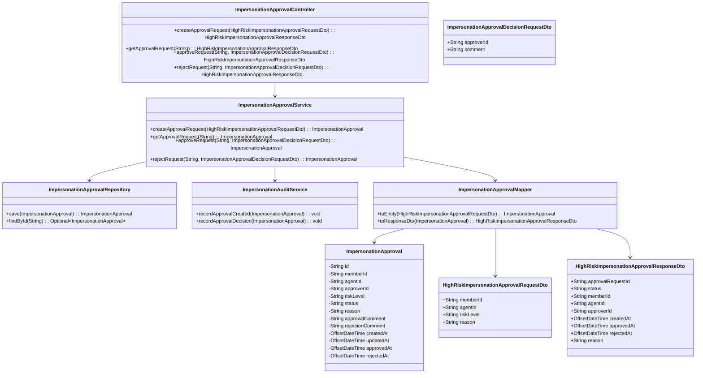
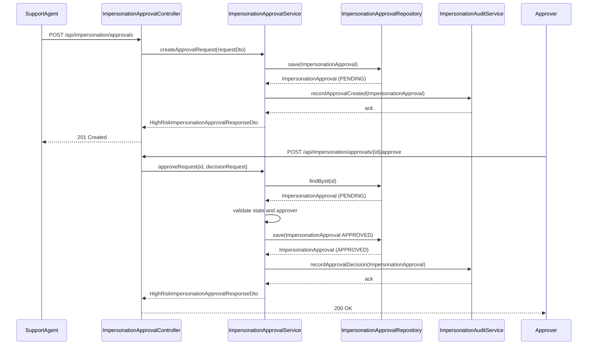
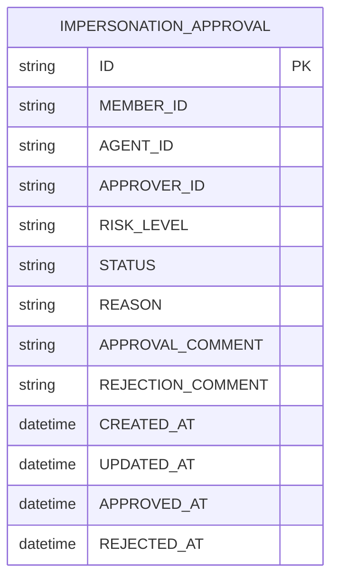

# Repository: APB_Demo
# Branch: epictesting1
# Folder: LLD

1. Objective
The objective is to design an approval workflow for high-risk impersonation requests. The solution ensures that impersonation of high-risk members is gated by an approver decision. All approvals and their outcomes must be captured in an extensible audit trail.

2. Backend Spring Boot API Details
2.1. API Model
2.1.1. Common Components/Services
- ImpersonationApprovalController: REST controller exposing endpoints for creating and approving high-risk impersonation requests.
- ImpersonationApprovalService: Service handling business logic for approval workflows, including validation and state transitions.
- ImpersonationApprovalRepository: Spring Data JPA repository for persistence of impersonation approval requests.
- ImpersonationAuditService: Service responsible for recording impersonation approval-related audit events.
- ImpersonationApprovalMapper: Component to convert between entities and DTOs.

2.1.2. API Details
| Operation | REST Method | Type | URL | Request JSON | Response JSON |
|-----------|------------|------|-----|--------------|---------------|
| Create high-risk impersonation approval request | POST | New | /api/impersonation/approvals | {"memberId":"string","agentId":"string","riskLevel":"HIGH","reason":"string"} | {"approvalRequestId":"string","status":"PENDING","memberId":"string","agentId":"string","createdAt":"ISO_DATE_TIME"} |
| Get approval request details | GET | New | /api/impersonation/approvals/{approvalRequestId} | N/A | {"approvalRequestId":"string","status":"PENDING|APPROVED|REJECTED","memberId":"string","agentId":"string","approverId":"string","approvedAt":"ISO_DATE_TIME","reason":"string"} |
| Approve high-risk impersonation request | POST | New | /api/impersonation/approvals/{approvalRequestId}/approve | {"approverId":"string","approvalComment":"string"} | {"approvalRequestId":"string","status":"APPROVED","memberId":"string","agentId":"string","approverId":"string","approvedAt":"ISO_DATE_TIME"} |
| Reject high-risk impersonation request | POST | New | /api/impersonation/approvals/{approvalRequestId}/reject | {"approverId":"string","rejectionComment":"string"} | {"approvalRequestId":"string","status":"REJECTED","memberId":"string","agentId":"string","approverId":"string","rejectedAt":"ISO_DATE_TIME"} |

2.1.3. Exceptions
- ImpersonationApprovalNotFoundException: Thrown when an approval request ID does not exist.
- InvalidApprovalStateException: Thrown when an approval action is attempted in an invalid state (e.g., approving an already approved request).
- UnauthorizedApprovalActionException: Thrown when the approver is not authorized to approve the request.

2.2. Functional Design
2.2.1. Class Diagram

2.2.2. UML Sequence Diagram

2.2.3. Components
| Component Name | Description | Existing/New |
|----------------|-------------|--------------|
| ImpersonationApprovalController | Exposes REST endpoints for high-risk impersonation approvals. | New |
| ImpersonationApprovalService | Encapsulates business logic for approval creation and decisions. | New |
| ImpersonationApprovalRepository | Persists impersonation approval entities. | New |
| ImpersonationAuditService | Records approval-related audit trail entries. | New |
| ImpersonationApprovalMapper | Maps between DTOs and entities. | New |

2.3. Service Layer Business Logic
ImpersonationApprovalService is injected with ImpersonationApprovalRepository, ImpersonationAuditService, and ImpersonationApprovalMapper using constructor-based dependency injection. On createApprovalRequest, the service validates that the risk level is HIGH, initializes status as PENDING, and persists the entity before calling ImpersonationAuditService.recordApprovalCreated. On approveRequest or rejectRequest, the service validates current status is PENDING, checks that the approver is authorized via a simple approverId presence check, updates status to APPROVED or REJECTED, timestamps, and calls ImpersonationAuditService.recordApprovalDecision. No caching is applied because approvals are infrequently accessed and must be strongly consistent. Validation is performed using Bean Validation annotations on DTOs and explicit checks in the service.

Validation rules
| Field Name | Validation | Error Message | Class Used |
|-----------|-----------|---------------|------------|
| memberId | Not null, not blank | "memberId is required" | HighRiskImpersonationApprovalRequestDto |
| agentId | Not null, not blank | "agentId is required" | HighRiskImpersonationApprovalRequestDto |
| riskLevel | Must equal "HIGH" | "riskLevel must be HIGH for this workflow" | HighRiskImpersonationApprovalRequestDto |
| reason | Not null, length ≤ 500 | "reason is required and must be at most 500 characters" | HighRiskImpersonationApprovalRequestDto |
| approverId | Not null, not blank | "approverId is required" | ImpersonationApprovalDecisionRequestDto |
| comment | Optional, length ≤ 500 | "comment must be at most 500 characters" | ImpersonationApprovalDecisionRequestDto |

2.4. Service Integrations
| System | Integrated For | Integration Type |
|--------|----------------|------------------|
| Audit Logging Store | Recording approval creation and decision events | Asynchronous service call (internal Spring bean) |

3. Front End React Details
3.1. UI Component Architecture
A dedicated React page HighRiskImpersonationApprovalPage will allow approvers to view and act on pending high-risk impersonation requests. The page will use a container component HighRiskImpersonationApprovalContainer that manages data fetching and state, and a presentational component HighRiskImpersonationApprovalView for rendering. State will be managed with React hooks using useState and useEffect, and API interactions will be wrapped in a custom hook useHighRiskImpersonationApprovalApi. Routing will register the path "/impersonation/high-risk/approvals" to HighRiskImpersonationApprovalPage.

3.2. UI Specifications
HighRiskImpersonationApprovalPage displays a table of pending requests with columns for member, agent, reason, createdAt, and actions (Approve, Reject). When a row action is clicked, a side panel or modal shows full details and a comment field. Breakpoints will follow a simple mobile-first approach: single-column stacking under 768px and a multi-column table layout above 768px. Forms will validate required fields (e.g., approval comment optional, approverId taken from current user context) and disable action buttons while API calls are in progress.

3.3. API Integration
useHighRiskImpersonationApprovalApi will use a shared HTTP client (configured axios instance) to call the backend endpoints. It will expose functions createApprovalRequest, getApprovalRequestById, approveApprovalRequest, and rejectApprovalRequest. Calls will use async/await with try/catch to handle errors; failures will surface user-friendly messages and a generic fallback. Loading states will be represented via local component state flags (isLoading, isSubmitting) and used to show spinners and disable buttons. Data transformation will map backend DTO fields (e.g., createdAt ISO strings) into JavaScript Date objects or formatted strings for display.

4. Database Details
4.1. ER Model

4.2. Database Validations
- ID is the primary key and must be globally unique.
- STATUS is constrained to PENDING, APPROVED, or REJECTED via an enum or check constraint.
- RISK_LEVEL is constrained to HIGH for this workflow.
- MEMBER_ID and AGENT_ID are mandatory (NOT NULL).

5. Non-Functional Requirements
5.1. Performance
- Approval creation and decision endpoints should respond within 500 ms under normal load.
- Queries are by primary key only; no additional indexing beyond primary key is required.

5.2. Security (Authentication & Authorization)
- All endpoints must require authenticated users with a role that includes impersonation-approval capability.
- Approve/reject actions must ensure the approver has authorization to act on high-risk impersonation requests.

5.3. Logging (Application, Audit, Monitoring)
- Application logs must capture failures in approval creation or decision processing with request IDs.
- ImpersonationAuditService will record structured audit entries containing approval ID, agent, member, approver, timestamps, and decision.

6. Dependencies
- Spring Boot Web, Spring Data JPA, Bean Validation (Jakarta Validation), and a common HTTP client library on the frontend (axios).

7. Assumptions
- Only high-risk impersonation requests use this approval workflow.
- Approver identity is included in the request body and validated against existing authentication context.
- Audit log persistence is handled by an existing audit logging infrastructure.
