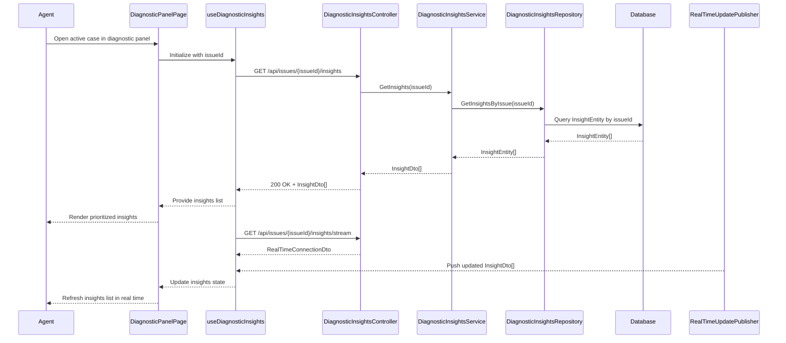

# LLD - SCRUM-33090 - Real-Time Diagnostic Insights

a. Story Summary (2-3 lines)
- Provide real-time diagnostic insights for a member’s active case in the diagnostic panel.
- When the system analyzes the member’s current context and history, it should display a clear, prioritized list of insights to the agent.

b. Architecture Mapping (brief)
- Frontend:
  - DiagnosticPanelPage (React Page): Host the diagnostic insights section for an active case.
  - DiagnosticInsightsList (Component): Render a prioritized list of diagnostic insights.
  - useDiagnosticInsights (Custom Hook): Fetch and subscribe to real-time diagnostic insights for a case.
  - api/diagnosticsClient (API client module): Encapsulate REST and real-time negotiation calls for diagnostic insights.
- Backend:
  - DiagnosticInsightsController (Controller): Expose REST endpoints for retrieving and streaming insights for a case.
  - DiagnosticInsightsService (Service): Combine current context and history to generate or retrieve insights and prioritize them.
  - DiagnosticInsightsRepository (Repository): Persist diagnostic insight records.
  - InsightEntity (Entity): Represent diagnostic insights in storage.
  - InsightDto (DTO): Provide insight data to the frontend.
  - RealTimeUpdatePublisher (Service/Helper): Push real-time insight updates to clients.
- Recommended Folder Structure
  - React src/: `src/pages/DiagnosticPanelPage.tsx`, `src/components/DiagnosticInsightsList.tsx`, `src/hooks/useDiagnosticInsights.ts`, `src/api/diagnosticsClient.ts`.
  - .NET: `Controllers/DiagnosticInsightsController.cs`, `Services/DiagnosticInsightsService.cs`, `Repositories/DiagnosticInsightsRepository.cs`, `Models/Entities/InsightEntity.cs`, `Models/Dtos/InsightDto.cs`, `RealTime/RealTimeUpdatePublisher.cs`.

c. Component Specifications (table format)
| Name                          | Layer      | Artifact Type        | Responsibility                                                                  | Key Dependencies                                      |
|-------------------------------|-----------|----------------------|---------------------------------------------------------------------------------|-------------------------------------------------------|
| DiagnosticPanelPage           | React     | Page Component       | Display real-time diagnostic insights for an active member case.               | useDiagnosticInsights, DiagnosticInsightsList         |
| DiagnosticInsightsList        | React     | Presentational Comp. | Render insights sorted by priority with summary, details, and metadata.        | Insight props, CSS modules                            |
| useDiagnosticInsights         | React     | Custom Hook          | Fetch initial insights and maintain real-time subscription for updates.        | diagnosticsClient, SignalR/WebSocket client           |
| diagnosticsClient             | React     | API Client Module    | Call REST endpoints and negotiate real-time connections for insights.         | Axios/fetch, insights API, SignalR client             |
| DiagnosticInsightsController  | API       | Controller           | Provide endpoints for retrieving and streaming insights for a case.            | DiagnosticInsightsService, RealTimeUpdatePublisher    |
| DiagnosticInsightsService     | Service   | C# Service Class     | Generate or retrieve and prioritize insights based on context and history.     | DiagnosticInsightsRepository                          |
| DiagnosticInsightsRepository  | Data      | Repository           | Persist and query InsightEntity data.                                           | DbContext, InsightEntity                              |
| InsightEntity                 | Data      | EF Core Entity       | Represent stored diagnostic insight including priority and content.            | EF Core DbContext                                     |
| InsightDto                    | API       | DTO                  | Represent diagnostic insight data returned to the frontend.                    | Mapping from InsightEntity                            |
| RealTimeUpdatePublisher       | Service   | Helper/Publisher     | Broadcast insight updates to subscribed clients in real time.                  | SignalR Hub or equivalent                             |

d. API Contract (table format)
| Method | Route                                   | Request DTO       | Response DTO        | Status Codes                |
|--------|-----------------------------------------|-------------------|---------------------|----------------------------|
| GET    | /api/issues/{issueId}/insights          | None              | InsightDto[]        | 200, 400, 404, 500         |
| GET    | /api/issues/{issueId}/insights/stream   | None (negotiation)| RealTimeConnectionDto | 200, 400, 404, 500      |

e. Data Model (brief)
- C# Entities/DTOs
  - `InsightEntity`: `Id: Guid`, `IssueId: Guid`, `Title: string`, `Summary: string`, `Details: string`, `Priority: int`, `CreatedAt: DateTime`, `Source: string`.
  - `InsightDto`: `id: Guid`, `issueId: Guid`, `title: string`, `summary: string`, `details: string`, `priority: number`, `createdAt: DateTime`, `source: string`.
  - `RealTimeConnectionDto`: `connectionUrl: string`, `accessToken: string`, `hubName: string`.
- TypeScript Shapes
  - `Insight`: `{ id: string; issueId: string; title: string; summary: string; details: string; priority: number; createdAt: string; source: string; }`.
  - `RealTimeConnection`: `{ connectionUrl: string; accessToken: string; hubName: string; }`.

f. Data Flow (one paragraph)
When an agent views an active member case, DiagnosticPanelPage uses useDiagnosticInsights to call diagnosticsClient, which sends a GET request to DiagnosticInsightsController for the issueId; the controller calls DiagnosticInsightsService, which uses DiagnosticInsightsRepository to retrieve or generate prioritized InsightEntity records based on the member’s context and history, maps them to InsightDto, and returns them; the hook stores the insights in state and passes them to DiagnosticInsightsList for rendering; in parallel, useDiagnosticInsights negotiates a real-time connection using the stream endpoint, subscribes to updates from RealTimeUpdatePublisher, and updates state whenever new or changed InsightDto data is received, causing the UI list to refresh.

g. Primary Sequence Diagram (ONE only)

h. Implementation Notes (brief)
- Centralize priority calculation in the service layer to ensure consistent sorting across consumers.
- Implement React hook to handle subscription lifecycle and avoid memory leaks when panel unmounts.
- Use async EF Core calls and dependency injection throughout backend layers.
- Normalize timestamps and sort insights client-side by priority and createdAt.
- Ensure real-time events are scoped by issueId/connection group to avoid cross-case leakage.

i. Assumptions (brief)
- Insight generation is handled by upstream services; this story focuses on retrieval and presentation.
- Prioritization uses a numeric ascending or descending scale agreed across the platform.
- Real-time updates share the same SignalR infrastructure as other diagnostic panel features.

j. Error Handling (ONE line)
- Use global exception middleware with ProblemDetails and show insight load/stream errors via non-blocking notifications in the UI.

k. Security Notes (ONE line)
- Standard input validation and secure API calls assumed.
