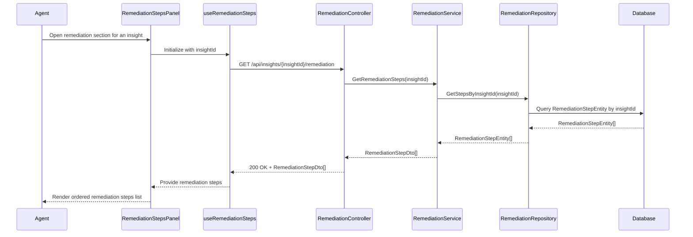

# LLD - SCRUM-33091 - AI-Generated Remediation Steps

a. Story Summary (2-3 lines)
- Provide AI-generated, step-by-step remediation instructions associated with each diagnostic insight.
- When an agent opens the remediation section for an insight, they see a structured list of recommended actions to resolve the issue.

b. Architecture Mapping (brief)
- Frontend:
  - RemediationStepsPanel (React Component): Display remediation steps for a selected insight.
  - RemediationStepItem (Component): Render individual step description in ordered list.
  - useRemediationSteps (Custom Hook): Fetch remediation steps for a selected insight and manage loading/error state.
  - api/remediationClient (API client module): Wrap REST calls for remediation instructions.
- Backend:
  - RemediationController (Controller): Provide endpoints to retrieve remediation steps for an insight.
  - RemediationService (Service): Fetch or generate remediation steps for an insight and standardize ordering.
  - RemediationRepository (Repository): Persist and retrieve remediation step data.
  - RemediationStepEntity (Entity): Represent remediation steps in persistence.
  - RemediationStepDto (DTO): Expose remediation step data to clients.
- Recommended Folder Structure
  - React src/: `src/components/RemediationStepsPanel.tsx`, `src/components/RemediationStepItem.tsx`, `src/hooks/useRemediationSteps.ts`, `src/api/remediationClient.ts`.
  - .NET: `Controllers/RemediationController.cs`, `Services/RemediationService.cs`, `Repositories/RemediationRepository.cs`, `Models/Entities/RemediationStepEntity.cs`, `Models/Dtos/RemediationStepDto.cs`.

c. Component Specifications (table format)
| Name                     | Layer      | Artifact Type        | Responsibility                                                           | Key Dependencies                                   |
|--------------------------|-----------|----------------------|-------------------------------------------------------------------------|----------------------------------------------------|
| RemediationStepsPanel    | React     | Container Component  | Display ordered list of remediation steps for the selected insight.     | useRemediationSteps, RemediationStepItem           |
| RemediationStepItem      | React     | Presentational Comp. | Render single remediation step with text and order index.               | Props (step), CSS modules                           |
| useRemediationSteps      | React     | Custom Hook          | Fetch remediation steps for an insight and manage loading/error state.  | remediationClient, useState/useEffect              |
| remediationClient        | React     | API Client Module    | Call backend to retrieve remediation steps for an insight.              | Axios/fetch, remediation API endpoints             |
| RemediationController    | API       | Controller           | REST endpoint to return remediation steps for a given insight.          | RemediationService                                 |
| RemediationService       | Service   | C# Service Class     | Generate or retrieve ordered remediation steps for an insight.          | RemediationRepository                              |
| RemediationRepository    | Data      | Repository           | Persist and query remediation step entities.                            | DbContext, RemediationStepEntity                   |
| RemediationStepEntity    | Data      | EF Core Entity       | Represent remediation steps with order and description.                 | EF Core DbContext                                   |
| RemediationStepDto       | API       | DTO                  | Represent remediation steps sent to clients.                            | Mapping from RemediationStepEntity                  |

d. API Contract (table format)
| Method | Route                                   | Request DTO | Response DTO          | Status Codes              |
|--------|-----------------------------------------|------------|-----------------------|---------------------------|
| GET    | /api/insights/{insightId}/remediation   | None       | RemediationStepDto[]  | 200, 400, 404, 500        |

e. Data Model (brief)
- C# Entities/DTOs
  - `RemediationStepEntity`: `Id: Guid`, `InsightId: Guid`, `Order: int`, `Title: string`, `Description: string`, `CreatedAt: DateTime`.
  - `RemediationStepDto`: `id: Guid`, `insightId: Guid`, `order: number`, `title: string`, `description: string`.
- TypeScript Shapes
  - `RemediationStep`: `{ id: string; insightId: string; order: number; title: string; description: string; }`.

f. Data Flow (one paragraph)
When an agent opens the remediation section for an insight, RemediationStepsPanel uses useRemediationSteps to call remediationClient, which sends a GET request to RemediationController for the specified insightId; the controller delegates to RemediationService, which queries RemediationStepEntity records via RemediationRepository, sorts them by order, maps them to RemediationStepDto, and returns them; the hook stores the steps in state and passes them to RemediationStepsPanel, which renders an ordered list of RemediationStepItem components for the agent.

g. Primary Sequence Diagram (ONE only)

h. Implementation Notes (brief)
- Ensure steps are always rendered in ascending order by `order` field on the frontend for consistency.
- Use async EF Core calls and ensure mapping is centralized in the service or using a mapper.
- Allow for future extension where steps may include links or actions without breaking the DTO shape.
- Use loading spinners or skeletons while remediation steps are being fetched.
- Log and handle missing or empty remediation sets gracefully on both backend and frontend.

i. Assumptions (brief)
- Remediation steps are pre-generated and stored when insights are created by upstream AI services.
- Each insight has zero or more remediation steps associated by `InsightId`.
- Steps are textual instructions; no executable automation is triggered by this story.

j. Error Handling (ONE line)
- Use centralized API error handling with ProblemDetails and show remediation fetch failures via non-blocking UI alerts.

k. Security Notes (ONE line)
- Standard input validation and secure API calls assumed.
