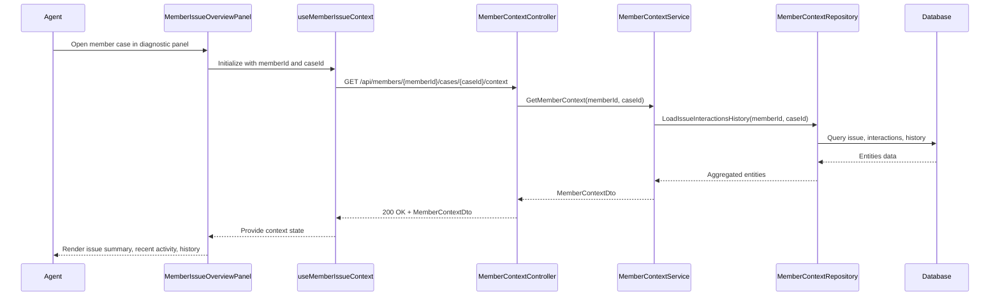

# LLD - SCRUM-33092 - Contextual Member Issue Overview

a. Story Summary (2-3 lines)
- Provide a consolidated overview of a member’s issue context in the diagnostic panel when an agent opens a member case.
- The panel must show summarized key context including issue description, recent activity, and relevant history.

b. Architecture Mapping (brief)
- Frontend:
  - MemberIssueOverviewPanel (React Component): Display member issue context summary within the diagnostic panel.
  - ActivityTimeline (Component): Show recent interactions and activities in chronological order.
  - HistorySummary (Component): Present relevant historical information such as prior cases or resolutions.
  - useMemberIssueContext (Custom Hook): Fetch and manage member context data for the opened case.
  - api/memberContextClient (API client module): Encapsulate REST calls for member context retrieval.
- Backend:
  - MemberContextController (Controller): Provide endpoints to fetch consolidated member issue context.
  - MemberContextService (Service): Aggregate current and recent interactions and relevant history into a summary model.
  - MemberContextRepository (Repository): Query member cases, interactions, and historical data from persistence.
  - MemberIssueEntity, MemberInteractionEntity, MemberHistoryEntity (Entities): Represent issue and related interaction data.
  - MemberContextDto, InteractionDto, HistoryItemDto (DTOs): Provide serialized context to the frontend.
- Recommended Folder Structure
  - React src/: `src/components/MemberIssueOverviewPanel.tsx`, `src/components/ActivityTimeline.tsx`, `src/components/HistorySummary.tsx`, `src/hooks/useMemberIssueContext.ts`, `src/api/memberContextClient.ts`.
  - .NET: `Controllers/MemberContextController.cs`, `Services/MemberContextService.cs`, `Repositories/MemberContextRepository.cs`, `Models/Entities/MemberIssueEntity.cs`, `Models/Entities/MemberInteractionEntity.cs`, `Models/Entities/MemberHistoryEntity.cs`, `Models/Dtos/MemberContextDto.cs`.

c. Component Specifications (table format)
| Name                      | Layer      | Artifact Type        | Responsibility                                                                 | Key Dependencies                                          |
|---------------------------|-----------|----------------------|-------------------------------------------------------------------------------|-----------------------------------------------------------|
| MemberIssueOverviewPanel  | React     | Container Component  | Display consolidated member context including issue summary, activity, history. | useMemberIssueContext, ActivityTimeline, HistorySummary |
| ActivityTimeline          | React     | Presentational Comp. | Render list of recent interactions in chronological order.                    | Interaction data props, CSS modules                      |
| HistorySummary            | React     | Presentational Comp. | Show summarized prior cases/resolutions relevant to the current issue.       | History data props, CSS modules                          |
| useMemberIssueContext     | React     | Custom Hook          | Fetch and maintain member context state for a given case.                    | memberContextClient, useState/useEffect                  |
| memberContextClient       | React     | API Client Module    | Call backend to retrieve member context summary.                             | Axios/fetch, member context API endpoints                |
| MemberContextController   | API       | Controller           | REST endpoint to return consolidated member context.                         | MemberContextService                                     |
| MemberContextService      | Service   | C# Service Class     | Aggregate issue, interaction, and history data into summary DTO.             | MemberContextRepository                                  |
| MemberContextRepository   | Data      | Repository           | Query data sources for member issues, interactions, and history.             | DbContext, entities                                      |
| MemberIssueEntity         | Data      | EF Core Entity       | Represent current member issue/case.                                         | EF Core DbContext                                        |
| MemberInteractionEntity   | Data      | EF Core Entity       | Represent recent member interactions.                                        | EF Core DbContext                                        |
| MemberHistoryEntity       | Data      | EF Core Entity       | Represent historical cases or events relevant to the member.                 | EF Core DbContext                                        |
| MemberContextDto          | API       | DTO                  | Consolidated DTO combining issue, interactions, and history.                 | Mapping from entities                                    |
| InteractionDto            | API       | DTO                  | Represent individual interactions for the timeline.                          | Mapping from MemberInteractionEntity                     |
| HistoryItemDto            | API       | DTO                  | Represent individual history entries.                                        | Mapping from MemberHistoryEntity                         |

d. API Contract (table format)
| Method | Route                                  | Request DTO | Response DTO      | Status Codes              |
|--------|----------------------------------------|------------|-------------------|---------------------------|
| GET    | /api/members/{memberId}/cases/{caseId}/context | None       | MemberContextDto   | 200, 400, 404, 500        |

e. Data Model (brief)
- C# Entities/DTOs
  - `MemberIssueEntity`: `Id: Guid`, `MemberId: Guid`, `CaseNumber: string`, `IssueDescription: string`, `Status: string`, `CreatedAt: DateTime`, `UpdatedAt: DateTime`.
  - `MemberInteractionEntity`: `Id: Guid`, `MemberId: Guid`, `CaseId: Guid`, `Channel: string`, `Summary: string`, `OccurredAt: DateTime`.
  - `MemberHistoryEntity`: `Id: Guid`, `MemberId: Guid`, `CaseId: Guid?`, `Description: string`, `Category: string`, `OccurredAt: DateTime`.
  - `MemberContextDto`: `memberId: Guid`, `caseId: Guid`, `issueDescription: string`, `recentActivity: InteractionDto[]`, `relevantHistory: HistoryItemDto[]`.
  - `InteractionDto`: `id: Guid`, `channel: string`, `summary: string`, `occurredAt: DateTime`.
  - `HistoryItemDto`: `id: Guid`, `description: string`, `category: string`, `occurredAt: DateTime`.
- TypeScript Shapes
  - `MemberContext`: `{ memberId: string; caseId: string; issueDescription: string; recentActivity: Interaction[]; relevantHistory: HistoryItem[]; }`.
  - `Interaction`: `{ id: string; channel: string; summary: string; occurredAt: string; }`.
  - `HistoryItem`: `{ id: string; description: string; category: string; occurredAt: string; }`.

f. Data Flow (one paragraph)
When an agent opens a member’s case in the diagnostic panel, MemberIssueOverviewPanel uses useMemberIssueContext to call memberContextClient, which sends a GET request to MemberContextController; the controller invokes MemberContextService, which uses MemberContextRepository to query MemberIssueEntity, MemberInteractionEntity, and MemberHistoryEntity from the database, aggregates and maps them into MemberContextDto, and returns it; the hook stores the context in React state and passes it to MemberIssueOverviewPanel, which renders issue description, ActivityTimeline, and HistorySummary components to display the consolidated context to the agent.

g. Primary Sequence Diagram (ONE only)

h. Implementation Notes (brief)
- Build the custom hook with dependency on memberId/caseId to refetch when selection changes.
- Use aggregation in the service layer to limit the number of recent activities and history items returned.
- Ensure include/joins in the repository queries are optimized to avoid N+1 issues.
- Support loading placeholders/skeletons in the panel while context data is fetched.
- Consider caching frequently accessed context data on the service layer if necessary.

i. Assumptions (brief)
- Member context data is stored in the same database accessible via EF Core.
- “Recent interactions” correspond to a configurable time window (e.g., last 90 days).
- “Relevant history” is precomputed or flagged by upstream processes and filtered accordingly.

j. Error Handling (ONE line)
- Use global exception handling returning ProblemDetails and show context load failures via inline error messaging in the panel.

k. Security Notes (ONE line)
- Standard input validation and secure API calls assumed.
