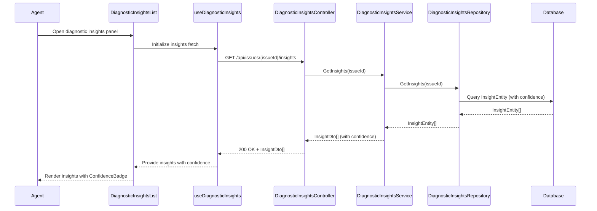

# LDD - SCRUM-33093 - Insight Confidence Indicators

a. Story Summary (2-3 lines)
- Add confidence indicators to each AI-generated diagnostic insight displayed in the diagnostic panel.
- The indicator must use a consistent numeric or categorical scale and visual representation so agents can judge reliability.

b. Architecture Mapping (brief)
- Frontend:
  - DiagnosticInsightsList (Component): Extend to display confidence indicators for each insight.
  - ConfidenceBadge (Component): Visualize confidence value using color and label.
  - useDiagnosticInsights (Custom Hook): Ensure confidence values are fetched and provided to UI.
  - api/diagnosticsClient (API client module): Include confidence fields in responses.
- Backend:
  - DiagnosticInsightsController (Controller): Return insights including confidence values.
  - DiagnosticInsightsService (Service): Calculate/map confidence scores and ensure standardized scale.
  - DiagnosticInsightsRepository (Repository): Persist and retrieve confidence scores for insights.
  - InsightEntity (Entity): Store confidence score and/or band.
  - InsightDto (DTO): Expose confidence fields to clients.
- Recommended Folder Structure
  - React src/: `src/components/DiagnosticInsightsList.tsx`, `src/components/ConfidenceBadge.tsx`, `src/hooks/useDiagnosticInsights.ts`, `src/api/diagnosticsClient.ts`.
  - .NET: `Controllers/DiagnosticInsightsController.cs`, `Services/DiagnosticInsightsService.cs`, `Repositories/DiagnosticInsightsRepository.cs`, `Models/Entities/InsightEntity.cs`, `Models/Dtos/InsightDto.cs`.

c. Component Specifications (table format)
| Name                          | Layer      | Artifact Type        | Responsibility                                                              | Key Dependencies                                      |
|-------------------------------|-----------|----------------------|----------------------------------------------------------------------------|-------------------------------------------------------|
| DiagnosticInsightsList        | React     | Presentational Comp. | Render insights including title, description, and confidence badge.        | ConfidenceBadge, insight props                        |
| ConfidenceBadge               | React     | Presentational Comp. | Show confidence score/band with consistent color and label.                | CSS modules, confidence props                         |
| useDiagnosticInsights         | React     | Custom Hook          | Fetch insights including confidence fields and provide to components.      | diagnosticsClient, useState/useEffect                 |
| diagnosticsClient             | React     | API Client Module    | Fetch insights from backend and map confidence fields.                     | Axios/fetch, insights API                             |
| DiagnosticInsightsController  | API       | Controller           | Expose insights including confidence in responses.                         | DiagnosticInsightsService                             |
| DiagnosticInsightsService     | Service   | C# Service Class     | Map or calculate standardized confidence values for insights.              | DiagnosticInsightsRepository                          |
| DiagnosticInsightsRepository  | Data      | Repository           | Persist and retrieve insight entities with confidence fields.              | DbContext, InsightEntity                              |
| InsightEntity                 | Data      | EF Core Entity       | Represent stored insight including confidence score and band.              | EF Core DbContext                                     |
| InsightDto                    | API       | DTO                  | Represent insight data including confidence for the API response.          | Mapping from InsightEntity                            |

d. API Contract (table format)
| Method | Route                          | Request DTO | Response DTO  | Status Codes        |
|--------|--------------------------------|-------------|---------------|----------------------|
| GET    | /api/issues/{issueId}/insights | None        | InsightDto[]  | 200, 400, 404, 500   |

e. Data Model (brief)
- C# Entities/DTOs
  - `InsightEntity`: `Id: Guid`, `IssueId: Guid`, `Title: string`, `Description: string`, `Recommendation: string`, `ConfidenceScore: double`, `ConfidenceBand: string`, `CreatedAt: DateTime`.
  - `InsightDto`: `id: Guid`, `issueId: Guid`, `title: string`, `description: string`, `recommendation: string`, `confidenceScore: number`, `confidenceBand: string`.
- TypeScript Shapes
  - `Insight`: `{ id: string; issueId: string; title: string; description: string; recommendation: string; confidenceScore: number; confidenceBand: string; }`.

f. Data Flow (one paragraph)
When an agent views diagnostic insights, useDiagnosticInsights calls diagnosticsClient to request insights from DiagnosticInsightsController; the controller invokes DiagnosticInsightsService, which retrieves InsightEntity objects with stored ConfidenceScore and ConfidenceBand from DiagnosticInsightsRepository, applies any necessary normalization, and maps them to InsightDto; the hook receives the array, stores it in React state, and passes it to DiagnosticInsightsList; each list item renders a ConfidenceBadge using the confidenceScore and confidenceBand to show a consistent visual indicator in the UI.

g. Primary Sequence Diagram (ONE only)

h. Implementation Notes (brief)
- Extend existing insight components and hooks to include confidence fields without breaking existing consumers.
- Use consistent mapping of confidenceScore to ConfidenceBand (e.g., Low/Medium/High) in the service layer.
- Apply conditional CSS classes in ConfidenceBadge based on band for color coding.
- Ensure new fields are included in API contracts and versioning strategy if needed.
- Update EF Core migrations to add confidence columns to the insights table.

i. Assumptions (brief)
- Confidence scores are provided by upstream AI model as a 0–1 or 0–100 numeric value.
- A simple three-band scale (Low/Medium/High) is sufficient for current use cases.
- All existing insights will either be backfilled or default to a medium confidence until recalculated.

j. Error Handling (ONE line)
- Rely on global API error handling and show any fetch failures as non-blocking UI messages in the insights panel.

k. Security Notes (ONE line)
- Standard input validation and secure API calls assumed.
