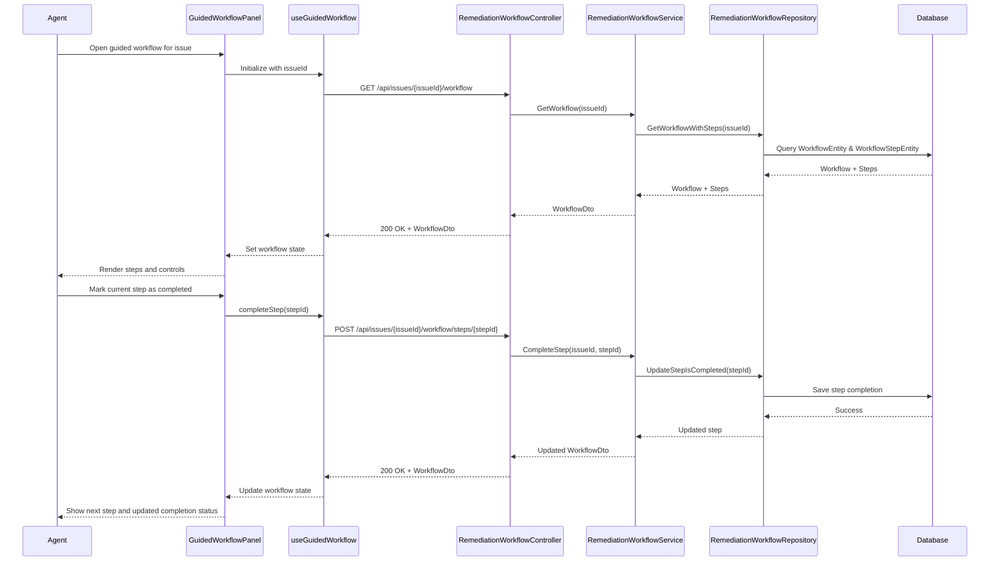

# LLD - SCRUM-33094 - Guided Resolution Workflow

a. Story Summary (2-3 lines)
- Implement a guided remediation workflow within the diagnostic panel that presents a sequence of remediation steps for a member issue.
- Agents can start the workflow, navigate through each step in order, and mark steps as completed as they resolve the issue.

b. Architecture Mapping (brief)
- Frontend:
  - GuidedWorkflowPanel (React Component): Display remediation steps and control navigation through the workflow.
  - WorkflowStepItem (Component): Render individual workflow steps with completion controls.
  - useGuidedWorkflow (Custom Hook): Manage workflow state, step progression, and syncing completion with backend.
  - api/workflowClient (API client module): Handle REST calls for fetching and updating remediation workflows.
- Backend:
  - RemediationWorkflowController (Controller): Expose endpoints to retrieve and update remediation workflows for an issue.
  - RemediationWorkflowService (Service): Contain business logic for workflow sequencing and step completion.
  - RemediationWorkflowRepository (Repository): Persist workflow definitions and step completion status.
  - WorkflowEntity & WorkflowStepEntity (Entities): Represent workflows and their steps.
  - WorkflowDto & WorkflowStepDto (DTOs): API shapes for workflows and steps.
- Recommended Folder Structure
  - React src/: `src/components/GuidedWorkflowPanel.tsx`, `src/components/WorkflowStepItem.tsx`, `src/hooks/useGuidedWorkflow.ts`, `src/api/workflowClient.ts`.
  - .NET: `Controllers/RemediationWorkflowController.cs`, `Services/RemediationWorkflowService.cs`, `Repositories/RemediationWorkflowRepository.cs`, `Models/Entities/WorkflowEntity.cs`, `Models/Entities/WorkflowStepEntity.cs`, `Models/Dtos/WorkflowDto.cs`.

c. Component Specifications (table format)
| Name                          | Layer      | Artifact Type        | Responsibility                                                                | Key Dependencies                                     |
|-------------------------------|-----------|----------------------|-------------------------------------------------------------------------------|------------------------------------------------------|
| GuidedWorkflowPanel           | React     | Container Component  | Display remediation steps, current step, and control navigation/completion.  | useGuidedWorkflow, WorkflowStepItem                  |
| WorkflowStepItem              | React     | Presentational Comp. | Render single step with description and completion checkbox/button.          | Props (step), CSS modules                            |
| useGuidedWorkflow             | React     | Custom Hook          | Fetch workflow, track active step, and sync completion state to backend.     | workflowClient, useState/useEffect                   |
| workflowClient                | React     | API Client Module    | Provide functions to get workflow and update step completion.                | Axios/fetch, workflow API endpoints                  |
| RemediationWorkflowController | API       | Controller           | REST endpoints for retrieving and updating remediation workflows.            | RemediationWorkflowService                          |
| RemediationWorkflowService    | Service   | C# Service Class     | Implement workflow sequencing and completion rules.                          | RemediationWorkflowRepository                        |
| RemediationWorkflowRepository | Data      | Repository           | Load and persist workflows and step statuses.                                | DbContext, WorkflowEntity, WorkflowStepEntity        |
| WorkflowEntity                | Data      | EF Core Entity       | Represent a remediation workflow for a member issue.                         | EF Core DbContext                                    |
| WorkflowStepEntity            | Data      | EF Core Entity       | Represent individual steps within a workflow.                                | EF Core DbContext, WorkflowEntity                    |
| WorkflowDto                   | API       | DTO                  | Represent workflow with ordered steps for the client.                        | Mapping from WorkflowEntity                          |
| WorkflowStepDto               | API       | DTO                  | Represent a single workflow step for the client.                             | Mapping from WorkflowStepEntity                      |

d. API Contract (table format)
| Method | Route                                            | Request DTO                | Response DTO         | Status Codes                |
|--------|--------------------------------------------------|----------------------------|----------------------|----------------------------|
| GET    | /api/issues/{issueId}/workflow                   | None                       | WorkflowDto          | 200, 400, 404, 500         |
| POST   | /api/issues/{issueId}/workflow/steps/{stepId}    | StepCompletionRequestDto   | WorkflowDto          | 200, 400, 404, 409, 500    |

e. Data Model (brief)
- C# Entities/DTOs
  - `WorkflowEntity`: `Id: Guid`, `IssueId: Guid`, `Name: string`, `Description: string`, `CreatedAt: DateTime`, `UpdatedAt: DateTime`.
  - `WorkflowStepEntity`: `Id: Guid`, `WorkflowId: Guid`, `Order: int`, `Title: string`, `Instruction: string`, `IsCompleted: bool`, `CompletedAt: DateTime?`.
  - `WorkflowDto`: `id: Guid`, `issueId: Guid`, `name: string`, `description: string`, `steps: WorkflowStepDto[]`.
  - `WorkflowStepDto`: `id: Guid`, `order: number`, `title: string`, `instruction: string`, `isCompleted: bool`.
  - `StepCompletionRequestDto`: `stepId: Guid`, `isCompleted: bool`.
- TypeScript Shapes
  - `Workflow`: `{ id: string; issueId: string; name: string; description: string; steps: WorkflowStep[]; }`.
  - `WorkflowStep`: `{ id: string; order: number; title: string; instruction: string; isCompleted: boolean; }`.
  - `StepCompletionRequest`: `{ stepId: string; isCompleted: boolean; }`.

f. Data Flow (one paragraph)
When the agent starts the guided workflow from the panel, GuidedWorkflowPanel uses useGuidedWorkflow to call workflowClient, which requests the workflow for the issue from RemediationWorkflowController; the controller calls RemediationWorkflowService, which retrieves WorkflowEntity and WorkflowStepEntity data via RemediationWorkflowRepository and maps them to WorkflowDto; the React component renders steps using WorkflowStepItem and tracks the active step; when the agent marks a step as completed, useGuidedWorkflow calls the step completion endpoint, the controller forwards to the service, which validates order and updates the step entity through the repository, saves changes to the database, and returns the updated WorkflowDto, which the hook uses to refresh local state and update the UI.

g. Primary Sequence Diagram (ONE only)

h. Implementation Notes (brief)
- Manage workflow state in the custom hook using `useState`, and refetch or patch state when a step is completed.
- Ensure backend uses async EF Core calls and transactional updates when modifying workflow steps.
- Use DTO mapping to shield clients from internal IDs or extra fields not needed on the frontend.
- Prevent out-of-order completion in the service by validating current step before accepting completion.
- Handle optimistic concurrency on step updates to avoid conflicting writes.

i. Assumptions (brief)
- Workflow steps are pre-generated and ordered by upstream AI or rules engine.
- Only one active guided workflow exists per issue at a time.
- Agents can only mark steps as completed in sequence, not skip steps.

j. Error Handling (ONE line)
- Use centralized API error handling returning ProblemDetails and display workflow errors via inline messages or toast notifications.

k. Security Notes (ONE line)
- Standard input validation and secure API calls assumed.
