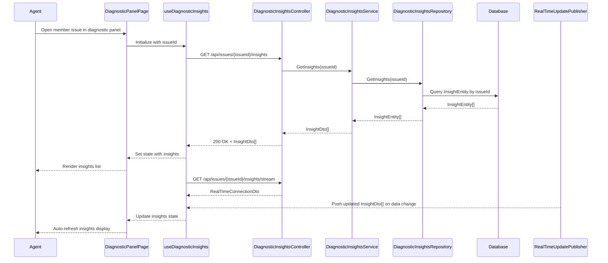

# LLD - SCRUM-33095 - Real-Time Panel Refresh

a. Story Summary (2-3 lines)
- Implement real-time refresh of diagnostic insights and remediation recommendations in the diagnostic panel without manual page reloads.
- When new relevant member issue data arrives, the panel must update its content automatically for the agent currently viewing the issue.

b. Architecture Mapping (brief)
- Frontend:
  - DiagnosticPanelPage (React Page): Host diagnostic panel UI for a selected member issue and manage real-time subscription lifecycle.
  - DiagnosticInsightsList (Component): Render list of diagnostic insights and remediation recommendations.
  - useDiagnosticInsights (Custom Hook): Fetch and subscribe to real-time updates for insights for a specific member issue.
  - api/diagnosticsClient (API client module): Wrap REST calls for initial load and real-time channel negotiation (if using SignalR).
- Backend:
  - DiagnosticInsightsController (Controller): Expose endpoints to get current insights and negotiate real-time connections.
  - DiagnosticInsightsService (Service): Coordinate retrieval of insights and publishing of updates.
  - DiagnosticInsightsRepository (Repository): Query insights from persistence store.
  - InsightEntity (Entity): Represent diagnostic insight records.
  - InsightDto (DTO): Serialized representation of an insight for the frontend.
  - RealTimeUpdatePublisher (Service/Helper): Publish new insight events via SignalR or similar.
- Recommended Folder Structure
  - React src/: `src/pages/DiagnosticPanelPage.tsx`, `src/components/DiagnosticInsightsList.tsx`, `src/hooks/useDiagnosticInsights.ts`, `src/api/diagnosticsClient.ts`.
  - .NET: `Controllers/DiagnosticInsightsController.cs`, `Services/DiagnosticInsightsService.cs`, `Repositories/DiagnosticInsightsRepository.cs`, `Models/Entities/InsightEntity.cs`, `Models/Dtos/InsightDto.cs`, `RealTime/RealTimeUpdatePublisher.cs`.

c. Component Specifications (table format)
| Name                          | Layer      | Artifact Type        | Responsibility                                                                 | Key Dependencies                                      |
|-------------------------------|-----------|----------------------|-------------------------------------------------------------------------------|-------------------------------------------------------|
| DiagnosticPanelPage           | React     | Page Component       | Display diagnostic panel for a member issue and manage real-time hook usage. | useDiagnosticInsights, DiagnosticInsightsList         |
| DiagnosticInsightsList        | React     | Presentational Comp. | Render list of insights and remediation recommendations with updated data.   | Insight list props, CSS modules                       |
| useDiagnosticInsights         | React     | Custom Hook          | Fetch initial insights and maintain subscription for real-time updates.      | diagnosticsClient, WebSocket/SignalR client           |
| diagnosticsClient             | React     | API Client Module    | Provide functions to call insights REST API and negotiate real-time channel. | Axios/fetch, backend REST endpoints                   |
| DiagnosticInsightsController  | API       | Controller           | Provide endpoints for retrieving insights and negotiating realtime updates.  | DiagnosticInsightsService, RealTimeUpdatePublisher    |
| DiagnosticInsightsService     | Service   | C# Service Class     | Implement business logic for insight retrieval and publishing updates.       | DiagnosticInsightsRepository, RealTimeUpdatePublisher |
| DiagnosticInsightsRepository  | Data      | Repository           | Query and persist diagnostic insight entities.                               | DbContext, InsightEntity                              |
| RealTimeUpdatePublisher       | Service   | Helper/Publisher     | Send insight update notifications to connected clients.                      | SignalR Hub or equivalent                             |
| InsightEntity                 | Data      | EF Core Entity       | Represent stored diagnostic insight with fields for issue and content.       | EF Core DbContext                                     |
| InsightDto                    | API       | DTO                  | Shape of insight data returned to clients.                                   | Mapping from InsightEntity                            |

d. API Contract (table format)
| Method | Route                                   | Request DTO          | Response DTO             | Status Codes                |
|--------|-----------------------------------------|----------------------|--------------------------|----------------------------|
| GET    | /api/issues/{issueId}/insights          | None                 | InsightDto[]             | 200, 400, 404, 500         |
| GET    | /api/issues/{issueId}/insights/stream   | None (negotiation)   | RealTimeConnectionDto    | 200, 400, 404, 500         |
| POST   | /api/issues/{issueId}/insights/refresh  | InsightRefreshRequestDto | None                 | 202, 400, 404, 500         |

e. Data Model (brief)
- C# Entities/DTOs
  - `InsightEntity`: `Id: Guid`, `IssueId: Guid`, `Title: string`, `Description: string`, `Recommendation: string`, `CreatedAt: DateTime`, `UpdatedAt: DateTime`, `IsActive: bool`.
  - `InsightDto`: `id: Guid`, `issueId: Guid`, `title: string`, `description: string`, `recommendation: string`, `updatedAt: DateTime`.
  - `RealTimeConnectionDto`: `connectionUrl: string`, `accessToken: string` (if needed), `hubName: string`.
  - `InsightRefreshRequestDto`: `issueId: Guid`, `triggerSource: string`.
- TypeScript Shapes
  - `Insight`: `{ id: string; issueId: string; title: string; description: string; recommendation: string; updatedAt: string; }`.
  - `RealTimeConnection`: `{ connectionUrl: string; accessToken?: string; hubName: string; }`.
  - `InsightRefreshRequest`: `{ issueId: string; triggerSource?: string; }`.

f. Data Flow (one paragraph)
When an agent opens a member issue, DiagnosticPanelPage uses useDiagnosticInsights to call diagnosticsClient, which requests current insights from DiagnosticInsightsController; the controller invokes DiagnosticInsightsService, which fetches InsightEntity records via DiagnosticInsightsRepository from the database and maps them to InsightDto for the response; the frontend renders the data via DiagnosticInsightsList and then useDiagnosticInsights negotiates a real-time connection and subscribes to updates; when new InsightEntity records or changes are persisted, DiagnosticInsightsService uses RealTimeUpdatePublisher to broadcast updated InsightDto payloads to connected clients, which the hook receives and merges into local state, causing the UI to refresh automatically.

g. Primary Sequence Diagram (ONE only)

h. Implementation Notes (brief)
- Use a custom hook with `useEffect` and `useState` to manage initial fetch and subscription, ensuring cleanup on unmount.
- Implement backend service and repository with dependency injection and async EF Core calls.
- Use DTO mapping (e.g., AutoMapper) between InsightEntity and InsightDto.
- Handle real-time updates via SignalR client in the React app, encapsulated in the hook or a dedicated utility.
- Ensure idempotent refresh handling on the backend to avoid duplicate insight records.

i. Assumptions (brief)
- Real-time updates are delivered via SignalR over WebSockets; fallback transports are handled by the platform.
- Only agents viewing the specific issue receive updates for that issue.
- New relevant data is determined by upstream systems and stored as new or updated InsightEntity records.

j. Error Handling (ONE line)
- Use ASP.NET Core global exception middleware returning ProblemDetails and show UI errors via a toast/notification component in the panel.

k. Security Notes (ONE line)
- Standard JWT bearer authentication with role-based [Authorize] on diagnostics endpoints and secure HTTPS WebSocket connections.
