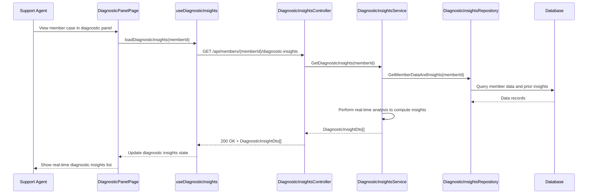

# a. Story Summary
Support agents require real-time diagnostic insights within a diagnostic panel to quickly understand a member’s issue.
The system must analyze member data on demand and display a clear list of current diagnostic insights relevant to the issue.

# b. Architecture Mapping (brief)
- Frontend
  - DiagnosticPanelPage (Page): Hosts the member case view and diagnostic insights section.
  - DiagnosticInsightsList (Component): Displays the list of current diagnostic insights.
  - useDiagnosticInsights (Custom Hook): Manages loading and real-time refresh of diagnostic insights.
  - api/diagnosticsClient (Module): Encapsulates calls to diagnostic insights APIs.
- Backend
  - DiagnosticInsightsController (Controller): Provides real-time diagnostic insights endpoints.
  - DiagnosticInsightsService (Service): Performs or orchestrates real-time analysis of member data.
  - DiagnosticInsightsRepository (Repository): Accesses member data and cached insight results.
  - DiagnosticInsight (Entity): Represents a diagnostic insight record.
  - DiagnosticInsightDto (DTO): API response shape for diagnostic insights.
- Recommended Folder Structure
  - React (src/): components/diagnostics/, hooks/, api/, pages/DiagnosticPanelPage.tsx, types/
  - .NET: Controllers/, Services/, Repositories/, Models/Entities/, Models/DTOs/

# c. Component Specifications
| Name                         | Layer       | Artifact Type      | Responsibility                                                 | Key Dependencies                              |
|------------------------------|------------|--------------------|----------------------------------------------------------------|-----------------------------------------------|
| DiagnosticPanelPage          | React      | Page Component     | Layout and orchestrate diagnostic insights within case view.   | useDiagnosticInsights, DiagnosticInsightsList |
| DiagnosticInsightsList       | React      | Presentational Comp| Render list of diagnostic insights for a member.               | DiagnosticInsightViewModel                    |
| useDiagnosticInsights        | React      | Custom Hook        | Fetch and manage real-time diagnostic insights state.          | diagnosticsClient                             |
| diagnosticsClient            | API        | API Client Module  | Call backend diagnostic insights endpoints.                    | Axios/fetch, DiagnosticInsightDto            |
| DiagnosticInsightsController | API        | ASP.NET Controller | Handle GET requests for real-time insights.                    | DiagnosticInsightsService                     |
| DiagnosticInsightsService    | Service    | C# Service Class   | Analyze member data and build current insights.                | DiagnosticInsightsRepository, analysis engine |
| DiagnosticInsightsRepository | Data       | C# Repository      | Read member data and existing insight records.                 | DbContext, DiagnosticInsight entity           |
| DiagnosticInsight            | Data       | EF Core Entity     | Persist diagnostic insight details per member.                 | DbContext                                     |
| DiagnosticInsightDto         | Service/API| DTO                | Represent insights for API responses.                          | DiagnosticInsight                             |

# d. API Contract
| Method | Route                                   | Request DTO | Response DTO           | Status Codes              |
|--------|-----------------------------------------|-------------|------------------------|--------------------------|
| GET    | /api/members/{memberId}/diagnostic-insights | n/a      | DiagnosticInsightDto[] | 200, 400, 404, 500       |

# e. Data Model (brief)
- C# Entities/DTOs
  - DiagnosticInsight (Entity)
    - Guid Id
    - Guid MemberId
    - string Category
    - string Description
    - string Severity
    - DateTime GeneratedAt
  - DiagnosticInsightDto
    - Guid Id
    - string Category
    - string Description
    - string Severity
    - DateTime GeneratedAt
- TypeScript Types
  - type DiagnosticInsight = {
      id: string;
      category: string;
      description: string;
      severity: string;
      generatedAt: string; // ISO timestamp
    };

# f. Data Flow (one paragraph)
When a support agent views a member’s case, DiagnosticPanelPage triggers useDiagnosticInsights, which calls diagnosticsClient GET /diagnostic-insights; DiagnosticInsightsController receives the request and invokes DiagnosticInsightsService, which reads member data and/or cached insights via DiagnosticInsightsRepository, performs real-time analysis, builds a list of DiagnosticInsightDto objects, returns them through the controller to the client; the hook updates its state and DiagnosticInsightsList renders the current insights list for the agent.

# g. Primary Sequence Diagram

# h. Implementation Notes (brief)
- useDiagnosticInsights uses useEffect to load data on mount and can be extended later for polling/websocket updates.
- diagnosticsClient centralizes HTTP configuration and maps errors into a consistent shape.
- Backend uses async/await with EF Core to avoid blocking calls during real-time analysis.
- Separate analysis logic into dedicated classes/services to keep controller thin and testable.
- Ensure DTOs are versioned or extensible as diagnostic needs evolve.

# i. Assumptions (brief)
- Real-time means on-demand computation on each request rather than continuous streaming updates for this story.
- Member data needed for analysis is already available in internal systems and accessible via the repository.
- No pagination is required for the insights list; all relevant insights are returned in one response.

# j. Error Handling (ONE line)
Centralized API error handling returns ProblemDetails; React shows a non-intrusive message if diagnostics cannot be loaded.

# k. Security Notes (ONE line)
Standard input validation and secure API calls assumed.