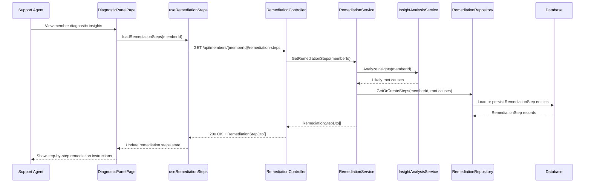

# a. Story Summary
Support agents need AI-generated step-by-step remediation instructions tied to a member’s diagnostic insights so they can resolve issues efficiently.
The system must identify likely root causes and present tailored remediation steps associated with the member’s issue.

# b. Architecture Mapping (brief)
- Frontend
  - DiagnosticPanelPage (Page): Hosts diagnostic insights and remediation steps.
  - RemediationStepsSection (Component): Displays AI-generated remediation steps for the selected member.
  - RemediationStepItem (Component): Shows individual step details (title/description/order).
  - useRemediationSteps (Custom Hook): Fetches and manages remediation steps data.
  - api/remediationClient (Module): Provides functions for retrieving remediation steps.
- Backend
  - RemediationController (Controller): Exposes endpoints for generating and returning remediation steps.
  - RemediationService (Service): Identifies likely root causes and builds tailored steps based on insights.
  - InsightAnalysisService (Service): Encapsulates AI/ML or rule-based diagnostics to find root causes.
  - RemediationRepository (Repository): Persists/remembers generated remediation steps per member.
  - RemediationStep (Entity): Represents a single remediation step.
  - RemediationStepDto (DTO): API-facing representation of remediation steps.
- Recommended Folder Structure
  - React (src/): components/diagnostics/, components/remediation/, hooks/, api/, pages/DiagnosticPanelPage.tsx, types/
  - .NET: Controllers/, Services/, Repositories/, Models/Entities/, Models/DTOs/

# c. Component Specifications
| Name                         | Layer       | Artifact Type      | Responsibility                                                 | Key Dependencies                            |
|------------------------------|------------|--------------------|----------------------------------------------------------------|---------------------------------------------|
| DiagnosticPanelPage          | React      | Page Component     | Layout diagnostics and remediation sections for a member.      | RemediationStepsSection, useRemediationSteps|
| RemediationStepsSection      | React      | Container Component| Display list of AI-generated remediation steps.                | useRemediationSteps, RemediationStepItem    |
| RemediationStepItem          | React      | Presentational Comp| Render individual remediation step details in order.           | step data                                   |
| useRemediationSteps          | React      | Custom Hook        | Load and manage remediation steps state from API.              | remediationClient                           |
| remediationClient            | API        | API Client Module  | Call backend remediation endpoints.                            | Axios/fetch, RemediationStepDto             |
| RemediationController        | API        | ASP.NET Controller | Handle GET requests for remediation steps for a member.        | RemediationService                          |
| RemediationService           | Service    | C# Service Class   | Build remediation steps based on diagnostic insights.          | InsightAnalysisService, RemediationRepository|
| InsightAnalysisService       | Service    | C# Service Class   | Determine likely root causes from diagnostic insights.         | InsightsRepository or external AI service   |
| RemediationRepository        | Data       | C# Repository      | Persist/retrieve remediation steps associated with a member.   | DbContext, RemediationStep entity           |
| RemediationStep              | Data       | EF Core Entity     | Store remediation step metadata (order, description, etc.).    | DbContext                                   |
| RemediationStepDto           | Service/API| DTO                | Represent steps for API responses.                             | RemediationStep                             |

# d. API Contract
| Method | Route                                                | Request DTO | Response DTO          | Status Codes              |
|--------|------------------------------------------------------|-------------|-----------------------|--------------------------|
| GET    | /api/members/{memberId}/remediation-steps            | n/a         | RemediationStepDto[]  | 200, 400, 404, 500       |

# e. Data Model (brief)
- C# Entities/DTOs
  - RemediationStep (Entity)
    - Guid Id
    - Guid MemberId
    - int Order
    - string Title
    - string Description
    - string RootCauseId // link to root cause if needed
  - RemediationStepDto
    - Guid Id
    - int Order
    - string Title
    - string Description
- TypeScript Types
  - type RemediationStep = {
      id: string;
      order: number;
      title: string;
      description: string;
    };

# f. Data Flow (one paragraph)
When a support agent views a member’s diagnostic insights, DiagnosticPanelPage triggers useRemediationSteps, which calls remediationClient GET /remediation-steps; RemediationController receives the request and delegates to RemediationService, which uses InsightAnalysisService to identify likely root causes, generates or retrieves RemediationStep entities through RemediationRepository, maps them to RemediationStepDto, returns them via the controller to the client; the hook updates state and RemediationStepsSection renders the ordered list of RemediationStepItem components showing tailored instructions.

# g. Primary Sequence Diagram

# h. Implementation Notes (brief)
- React side uses hooks and lightweight state; no global state needed if steps are only used in the diagnostic panel.
- remediationClient should handle base URL, auth headers, and error translation in one place.
- ASP.NET Core RemediationController uses dependency injection to consume RemediationService and returns ActionResult<IEnumerable<RemediationStepDto>>.
- InsightAnalysisService encapsulates AI/ML integration or rules so it can be mocked for tests without external dependencies.
- EF Core migrations manage the RemediationStep table; repository encapsulates LINQ queries.

# i. Assumptions (brief)
- AI-generated logic is abstracted behind InsightAnalysisService and may call external services not covered by this story.
- Remediation steps are read-only for agents in this story (no editing or reordering by users).
- Steps are generated lazily when first requested and cached/persisted for subsequent calls.

# j. Error Handling (ONE line)
Central exception handling returns ProblemDetails; the React UI shows a friendly message in the remediation section on failure.

# k. Security Notes (ONE line)
Standard input validation and secure API calls assumed.