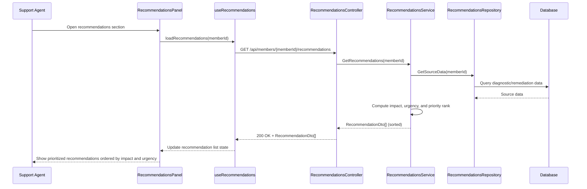

# a. Story Summary
Support agents require prioritized issue recommendations within the diagnostic panel so they can focus on the most impactful actions first.
The system must display recommended actions ordered by impact and urgency when the agent opens the recommendations section.

# b. Architecture Mapping (brief)
- Frontend
  - RecommendationsPanel (Component): Displays prioritized recommendations within the panel.
  - RecommendationItem (Component): Renders a single recommendation with impact/urgency indicators.
  - useRecommendations (Custom Hook): Fetches and manages recommendation list state.
  - api/recommendationsClient (Module): Provides API calls for retrieving recommendations.
- Backend
  - RecommendationsController (Controller): Exposes endpoints to get prioritized recommendations for a member.
  - RecommendationsService (Service): Applies prioritization logic using impact and urgency.
  - RecommendationsRepository (Repository): Fetches source diagnostic insights and remediation data.
  - Recommendation (Entity): Represents a recommendation record with priority.
  - RecommendationDto (DTO): API-facing shape for recommendations.
- Recommended Folder Structure
  - React (src/): components/recommendations/, hooks/, api/, pages/DiagnosticPanelPage.tsx, types/
  - .NET: Controllers/, Services/, Repositories/, Models/Entities/, Models/DTOs/

# c. Component Specifications
| Name                       | Layer       | Artifact Type      | Responsibility                                                 | Key Dependencies                              |
|----------------------------|------------|--------------------|----------------------------------------------------------------|-----------------------------------------------|
| RecommendationsPanel       | React      | Container Component| Show ordered list of recommendations.                          | useRecommendations, RecommendationItem        |
| RecommendationItem         | React      | Presentational Comp| Render recommendation text with impact/urgency cues.           | recommendation data                           |
| useRecommendations         | React      | Custom Hook        | Load, sort (if needed), and manage recommendation state.       | recommendationsClient                         |
| recommendationsClient      | API        | API Client Module  | Call backend recommendations endpoint.                         | Axios/fetch, RecommendationDto               |
| RecommendationsController  | API        | ASP.NET Controller | Handle HTTP GET requests for recommendations.                  | RecommendationsService                        |
| RecommendationsService     | Service    | C# Service Class   | Determine ordering based on impact and urgency.                | RecommendationsRepository, Recommendation     |
| RecommendationsRepository  | Data       | C# Repository      | Retrieve underlying diagnostic/remediation data for recs.      | DbContext, related entities                   |
| Recommendation             | Data       | EF Core Entity     | Persist recommendation details and computed priority.          | DbContext                                     |
| RecommendationDto          | Service/API| DTO                | Shape recommendations for client display.                      | Recommendation                                |

# d. API Contract
| Method | Route                                       | Request DTO | Response DTO          | Status Codes              |
|--------|---------------------------------------------|-------------|-----------------------|--------------------------|
| GET    | /api/members/{memberId}/recommendations     | n/a         | RecommendationDto[]   | 200, 400, 404, 500       |

# e. Data Model (brief)
- C# Entities/DTOs
  - Recommendation (Entity)
    - Guid Id
    - Guid MemberId
    - string Title
    - string Description
    - int ImpactScore // higher means more impact
    - int UrgencyScore // higher means more urgent
    - int PriorityRank // combined ordering value
  - RecommendationDto
    - Guid Id
    - string Title
    - string Description
    - int ImpactScore
    - int UrgencyScore
    - int PriorityRank
- TypeScript Types
  - type Recommendation = {
      id: string;
      title: string;
      description: string;
      impactScore: number;
      urgencyScore: number;
      priorityRank: number;
    };

# f. Data Flow (one paragraph)
When the agent opens the recommendations section, RecommendationsPanel invokes useRecommendations, which calls recommendationsClient GET /recommendations; RecommendationsController delegates to RecommendationsService, which gathers underlying diagnostic/remediation data via RecommendationsRepository, computes a priority rank using impact and urgency, returns a sorted list of RecommendationDto objects to the controller, which sends them to the client; the hook updates local state and RecommendationsPanel renders RecommendationItem components in priority order so the agent can act on the most impactful items first.

# g. Primary Sequence Diagram

# h. Implementation Notes (brief)
- Use React list rendering with keys based on recommendation id and maintain minimal local UI state (e.g., selected recommendation).
- recommendationsClient encapsulates base URL and shared headers and can be reused by other diagnostic features.
- ASP.NET Core service computes priority rank in a single function to keep logic centralized and testable.
- Use dependency injection for RecommendationsService/Repository and async EF Core LINQ queries.
- Consider returning already sorted data from the backend to minimize client-side sorting complexity.

# i. Assumptions (brief)
- Impact and urgency scores are precomputed or can be derived from existing data; exact algorithm is out of scope.
- Recommendations list is read-only in this story (no user editing or dismissing recommendations).
- Only one member’s recommendations are displayed at a time based on context in the diagnostic panel.

# j. Error Handling (ONE line)
Global exception handler returns ProblemDetails; frontend shows an inline error banner within the recommendations panel on failures.

# k. Security Notes (ONE line)
Standard input validation and secure API calls assumed.