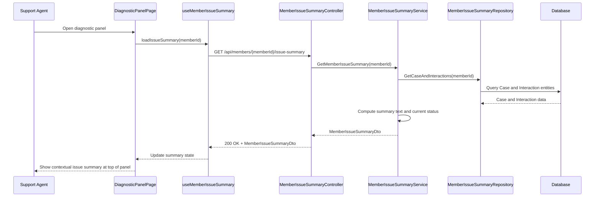

# a. Story Summary
Support agents need a contextual summary of a member’s issue at the top of the diagnostic panel, aggregating relevant case and interaction data into a concise view.
The system must derive and display the current status of the member’s issue so agents can quickly understand the situation.

# b. Architecture Mapping (brief)
- Frontend
  - DiagnosticPanelPage (Page): Hosts the diagnostic panel including the contextual summary.
  - MemberIssueSummaryHeader (Component): Displays concise issue summary and current status at the top.
  - useMemberIssueSummary (Custom Hook): Fetches and manages the member issue summary state.
  - api/memberSummaryClient (Module): Encapsulates HTTP calls related to member issue summaries.
- Backend
  - MemberIssueSummaryController (Controller): Serves contextual member issue summaries.
  - MemberIssueSummaryService (Service): Aggregates case and interaction data into a summary.
  - MemberIssueSummaryRepository (Repository): Retrieves case and interaction data from persistence.
  - MemberIssueSummary (Value Object/DTO): Represents the computed summary for transfer.
  - Case and Interaction Entities (Entities): Underlying raw data sources for aggregation.
- Recommended Folder Structure
  - React (src/): components/diagnostics/, components/member/, hooks/, api/, pages/DiagnosticPanelPage.tsx, types/
  - .NET: Controllers/, Services/, Repositories/, Models/Entities/, Models/DTOs/

# c. Component Specifications
| Name                         | Layer       | Artifact Type      | Responsibility                                                   | Key Dependencies                                  |
|------------------------------|------------|--------------------|------------------------------------------------------------------|---------------------------------------------------|
| DiagnosticPanelPage          | React      | Page Component     | Layout diagnostic panel and include member issue summary header. | MemberIssueSummaryHeader, useMemberIssueSummary   |
| MemberIssueSummaryHeader     | React      | Presentational Comp| Render concise summary text and current status for the member.   | MemberIssueSummary data                           |
| useMemberIssueSummary        | React      | Custom Hook        | Load and manage member issue summary and loading/error states.   | memberSummaryClient                               |
| memberSummaryClient          | API        | API Client Module  | Perform HTTP calls to summary backend endpoint.                  | Axios/fetch, MemberIssueSummaryResponse types     |
| MemberIssueSummaryController | API        | ASP.NET Controller | Handle GET requests for contextual member issue summaries.       | MemberIssueSummaryService                         |
| MemberIssueSummaryService    | Service    | C# Service Class   | Aggregate case and interaction data into a computed summary.     | MemberIssueSummaryRepository, mapping utilities   |
| MemberIssueSummaryRepository | Data       | C# Repository      | Retrieve case and interaction records from DB.                   | DbContext, Case and Interaction entities          |
| Case                         | Data       | EF Core Entity     | Represent a member case record.                                  | DbContext                                         |
| Interaction                  | Data       | EF Core Entity     | Represent member interactions (calls, chats, etc.).              | DbContext                                         |
| MemberIssueSummary           | Service/API| DTO/Value Object   | Hold summary text and status for API responses.                  | Derived from Case and Interaction data            |

# d. API Contract
| Method | Route                                   | Request DTO | Response DTO            | Status Codes            |
|--------|-----------------------------------------|-------------|-------------------------|------------------------|
| GET    | /api/members/{memberId}/issue-summary   | n/a         | MemberIssueSummaryDto   | 200, 400, 404, 500     |

# e. Data Model (brief)
- C# Entities/DTOs
  - Case (Entity)
    - Guid Id
    - Guid MemberId
    - string Title
    - string Status // e.g., Open, In Progress, Resolved
    - DateTime CreatedAt
    - DateTime? UpdatedAt
  - Interaction (Entity)
    - Guid Id
    - Guid MemberId
    - string Channel // e.g., Phone, Chat
    - string Summary
    - DateTime OccurredAt
  - MemberIssueSummaryDto
    - Guid MemberId
    - string SummaryText
    - string CurrentStatus
    - DateTime LastUpdatedAt
- TypeScript Types
  - type MemberIssueSummary = {
      memberId: string;
      summaryText: string;
      currentStatus: string;
      lastUpdatedAt: string; // ISO timestamp
    };

# f. Data Flow (one paragraph)
When a support agent opens the diagnostic panel, DiagnosticPanelPage invokes useMemberIssueSummary, which calls memberSummaryClient GET /issue-summary; MemberIssueSummaryController receives the request, uses MemberIssueSummaryService to aggregate case and interaction data fetched via MemberIssueSummaryRepository and EF Core entities, constructs a MemberIssueSummaryDto, returns it to the client, where the hook updates state and MemberIssueSummaryHeader renders the concise summary and current status at the top of the panel.

# g. Primary Sequence Diagram

# h. Implementation Notes (brief)
- Use React hooks for data fetching and show skeleton/loading state in MemberIssueSummaryHeader while fetching.
- memberSummaryClient centralizes base URL, headers, and error translation to a uniform shape.
- ASP.NET Core controller uses route attributes and returns ActionResult<MemberIssueSummaryDto> with async methods.
- Service layer isolates aggregation logic making it testable with in-memory repositories or mocks.
- Cache or short-lived memoization can be added later if repeated calls are frequent, but not required for this story.

# i. Assumptions (brief)
- Only one primary case per member is surfaced in the summary; if multiple exist, business rules choose the latest active one.
- Interactions from multiple channels are combined chronologically to derive the summary.
- Current status is derived primarily from the case status field, not separate logic.

# j. Error Handling (ONE line)
Unified backend error handling returns ProblemDetails; frontend displays a non-blocking error banner if the summary fails to load.

# k. Security Notes (ONE line)
Standard input validation and secure API calls assumed.