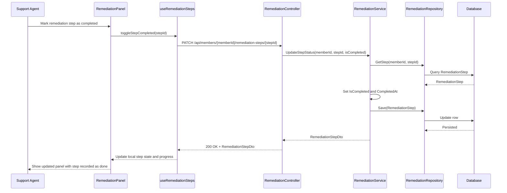

# a. Story Summary
Support agents need to track completion of AI-generated remediation steps within a panel so they can manage progress while assisting a member.
The panel must allow marking steps as done and clearly reflect overall remediation progress.

# b. Architecture Mapping (brief)
- Frontend
  - RemediationPanel (Component): Displays AI-generated remediation steps and their completion state.
  - RemediationStepItem (Component): Represents a single step with a checkbox/toggle for completion.
  - useRemediationSteps (Custom Hook): Loads, tracks, and updates step completion state.
  - api/remediationClient (Module): Provides functions to fetch and update remediation steps.
  - ProgressBar (Component): Visualizes remediation completion percentage within the panel.
- Backend
  - RemediationController (Controller): Exposes endpoints for listing and updating remediation steps for a member/case.
  - RemediationService (Service): Applies business rules for step completion and progress.
  - RemediationRepository (Repository): Persists remediation steps and completion state.
  - RemediationStep (Entity): Stores step details and completion metadata.
  - RemediationStepDto (DTO): Used for transferring remediation steps to/from the client.
- Recommended Folder Structure
  - React (src/): components/remediation/, hooks/, api/, pages/DiagnosticPanelPage.tsx, types/
  - .NET: Controllers/, Services/, Repositories/, Models/Entities/, Models/DTOs/

# c. Component Specifications
| Name                     | Layer       | Artifact Type      | Responsibility                                                | Key Dependencies                           |
|--------------------------|------------|--------------------|---------------------------------------------------------------|--------------------------------------------|
| RemediationPanel         | React      | Container Component| Show list of remediation steps and overall progress.         | useRemediationSteps, RemediationStepItem, ProgressBar |
| RemediationStepItem      | React      | Presentational Comp| Render step description with completion toggle control.       | step data, onToggle callback               |
| ProgressBar              | React      | UI Component       | Display visual completion percentage of remediation steps.    | remediationSteps data                      |
| useRemediationSteps      | React      | Custom Hook        | Manage loading, state, and updating of step completion.       | remediationClient                          |
| remediationClient        | API        | API Client Module  | Call backend remediation endpoints.                           | Axios/fetch, RemediationStepDto           |
| RemediationController    | API        | ASP.NET Controller | Handle CRUD-like operations for remediation steps.            | RemediationService                         |
| RemediationService       | Service    | C# Service Class   | Apply completion rules and compute progress metrics.          | RemediationRepository, RemediationStep     |
| RemediationRepository    | Data       | C# Repository      | Persist and retrieve remediation steps and statuses.          | DbContext, RemediationStep entity          |
| RemediationStep          | Data       | EF Core Entity     | Store remediation step details and completion metadata.       | DbContext                                  |
| RemediationStepDto       | Service/API| DTO                | Represent remediation steps for API requests/responses.       | RemediationStep                            |

# d. API Contract
| Method | Route                                                | Request DTO                 | Response DTO              | Status Codes                  |
|--------|------------------------------------------------------|-----------------------------|---------------------------|------------------------------|
| GET    | /api/members/{memberId}/remediation-steps            | n/a                         | RemediationStepDto[]      | 200, 400, 404, 500           |
| PATCH  | /api/members/{memberId}/remediation-steps/{stepId}   | UpdateRemediationStepStatusRequest | RemediationStepDto  | 200, 400, 404, 409, 500      |

# e. Data Model (brief)
- C# Entities/DTOs
  - RemediationStep (Entity)
    - Guid Id
    - Guid MemberId
    - int Order
    - string Description
    - bool IsCompleted
    - DateTime? CompletedAt
  - RemediationStepDto
    - Guid Id
    - int Order
    - string Description
    - bool IsCompleted
  - UpdateRemediationStepStatusRequest
    - bool IsCompleted
- TypeScript Types
  - type RemediationStep = {
      id: string;
      order: number;
      description: string;
      isCompleted: boolean;
    };
  - type UpdateRemediationStepStatusRequest = {
      isCompleted: boolean;
    };

# f. Data Flow (one paragraph)
The support agent views the remediation panel, RemediationPanel uses useRemediationSteps, which calls remediationClient GET /remediation-steps; RemediationController fetches steps via RemediationService and RemediationRepository from the database and returns RemediationStepDto[]; the hook populates state, RemediationStepItem components render each step, and when the agent marks a step as completed, useRemediationSteps issues a PATCH request, the backend updates the entity via the repository, returns the updated DTO, and the hook updates state causing the panel and progress bar to reflect the new completion status.

# g. Primary Sequence Diagram

# h. Implementation Notes (brief)
- Use controlled checkbox/toggle inputs in RemediationStepItem, with state lifted to RemediationPanel via useRemediationSteps.
- Implement optimistic UI updates (update local state immediately, revert on API failure) for better UX.
- Back-end uses dependency injection for RemediationService and RemediationRepository and async/await for DB operations.
- Map RemediationStep to RemediationStepDto using a small mapping helper or AutoMapper profile.
- Handle concurrent updates by leveraging EF Core concurrency tokens or status-based checks in the service.

# i. Assumptions (brief)
- AI-generated remediation steps are created elsewhere and this story focuses only on tracking completion.
- Steps are ordered and progress is simply completedSteps/totalSteps without weighting.
- Only one agent edits a given member’s remediation steps at a time (no complex multi-user conflict resolution).

# j. Error Handling (ONE line)
Backend uses centralized exception handling returning ProblemDetails; frontend displays errors with a toast and reverts local state on failed updates.

# k. Security Notes (ONE line)
Standard JWT-protected API with [Authorize] on remediation endpoints and secure HTTPS calls from the React client.