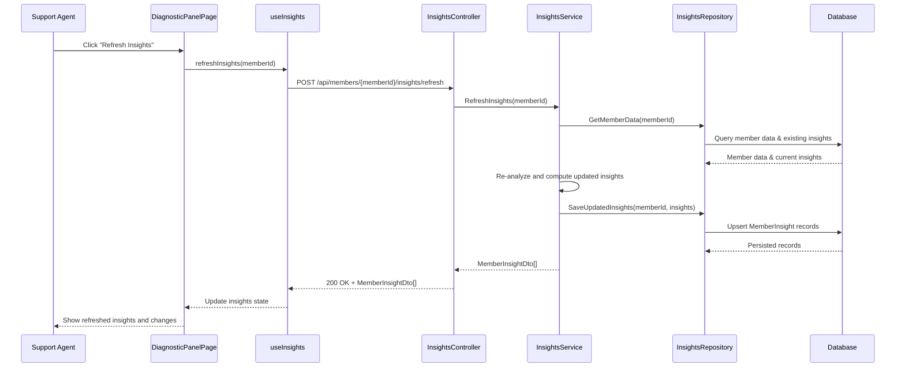

# a. Story Summary
Support agents need the diagnostic panel to refresh insights after remediation actions, re-running analysis on member data and showing updated issue status.
The system must clearly indicate changes in diagnostic insights so agents can confirm whether the member’s issue is improving.

# b. Architecture Mapping (brief)
- Frontend
  - DiagnosticPanelPage (React Page): Hosts member diagnostic content, including remediation actions and insights.
  - InsightsList (Component): Renders current diagnostic insights and highlights changes after refresh.
  - RefreshInsightsButton (Component): Triggers re-analysis and displays loading state.
  - useInsights (Custom Hook): Encapsulates fetching and refreshing diagnostic insights from the API.
  - api/insightsClient (Module): Provides typed functions to call insights-related Web APIs.
- Backend
  - InsightsController (Controller): Exposes REST endpoints to get current and refreshed diagnostic insights.
  - InsightsService (Service): Orchestrates re-analysis of member data and computes updated insights.
  - InsightsRepository (Repository): Reads member data and persisted insights from the database.
  - MemberInsight (Entity): Stores diagnostic insight snapshots for a member.
  - MemberInsightDto (DTO): Shapes insight data for API responses.
- Recommended Folder Structure
  - React (src/): components/diagnostics/, hooks/, api/, pages/DiagnosticPanelPage.tsx, types/
  - .NET: Controllers/, Services/, Repositories/, Models/Entities/, Models/DTOs/

# c. Component Specifications
| Name                     | Layer       | Artifact Type      | Responsibility                                             | Key Dependencies                          |
|--------------------------|------------|--------------------|------------------------------------------------------------|-------------------------------------------|
| DiagnosticPanelPage      | React      | Page Component     | Layout and orchestration of member diagnostic content.     | InsightsList, RefreshInsightsButton, useInsights |
| InsightsList             | React      | Presentational Comp| Render list of insights with visual indicators of changes. | DiagnosticInsightViewModel                |
| RefreshInsightsButton    | React      | UI Component       | Provide control to trigger insights refresh and show state.| useInsights                               |
| useInsights              | React      | Custom Hook        | Manage loading, error, and data state for insights.        | insightsClient                            |
| insightsClient           | API        | API Client Module  | Call backend endpoints for getting/refreshed insights.     | Axios/fetch, MemberInsightResponse types  |
| InsightsController       | API        | ASP.NET Controller | Handle HTTP requests to retrieve/refresh insights.         | InsightsService, MemberInsightDto         |
| InsightsService          | Service    | C# Service Class   | Re-analyze member data and compute updated insights.       | InsightsRepository, MemberInsight, mapper |
| InsightsRepository       | Data       | C# Repository      | Access member data and existing insights in DB.            | DbContext, MemberInsight entity           |
| MemberInsight            | Data       | EF Core Entity     | Persist diagnostic insight details per member snapshot.    | DbContext                                 |
| MemberInsightDto         | Service/API| DTO                | Capture insight details for API responses.                 | MemberInsight                             |

# d. API Contract
| Method | Route                                   | Request DTO             | Response DTO              | Status Codes                  |
|--------|-----------------------------------------|-------------------------|---------------------------|------------------------------|
| GET    | /api/members/{memberId}/insights        | n/a                     | MemberInsightDto[]        | 200, 400, 404, 500           |
| POST   | /api/members/{memberId}/insights/refresh| RefreshInsightsRequest? | MemberInsightDto[]        | 200, 400, 404, 409, 500      |

# e. Data Model (brief)
- C# Entities/DTOs
  - MemberInsight (Entity)
    - Guid Id
    - Guid MemberId
    - string Category
    - string Description
    - string Severity
    - string Status // e.g., Active, Resolved, Improving
    - DateTime GeneratedAt
  - MemberInsightDto
    - Guid Id
    - string Category
    - string Description
    - string Severity
    - string Status
    - DateTime GeneratedAt
  - RefreshInsightsRequest (optional)
    - Guid? CorrelationId
- TypeScript Types
  - type MemberInsight = {
      id: string;
      category: string;
      description: string;
      severity: string;
      status: string;
      generatedAt: string; // ISO timestamp
    };

# f. Data Flow (one paragraph)
The support agent clicks the refresh button in DiagnosticPanelPage, which calls useInsights; the hook uses insightsClient to POST /insights/refresh, InsightsController receives the request and invokes InsightsService, which re-analyzes member data via InsightsRepository and EF Core, stores or retrieves the updated MemberInsight records, then returns MemberInsightDto[] back through the controller to the client, where useInsights updates state and InsightsList re-renders showing the updated insights and any changed statuses.

# g. Primary Sequence Diagram

# h. Implementation Notes (brief)
- Use React hooks (useState/useEffect) in useInsights to manage loading and refreshed data, with a simple context if shared across panel sections.
- Implement API client with Axios/fetch wrapped in insightsClient to centralize error handling and base URL configuration.
- In ASP.NET Core, inject InsightsService into InsightsController via constructor and implement async methods using async/await.
- Use AutoMapper or manual mapping between MemberInsight and MemberInsightDto to keep API models decoupled from EF entities.
- Consider optimistic concurrency in the refresh endpoint (e.g., correlation IDs) if multiple refreshes can occur concurrently.

# i. Assumptions (brief)
- System automatically decides when data is sufficiently updated; no manual scheduling UI is needed.
- Insights refresh is idempotent and can be triggered multiple times without side effects beyond recomputation.
- Changes in insights are indicated via simple visual cues (e.g., badges or icons) without separate audit history UI.

# j. Error Handling (ONE line)
Global ASP.NET Core exception middleware returns ProblemDetails JSON; frontend shows inline error message/toast when refresh fails.

# k. Security Notes (ONE line)
JWT bearer authentication with [Authorize] on insights endpoints and secure HTTPS API calls from the React client.