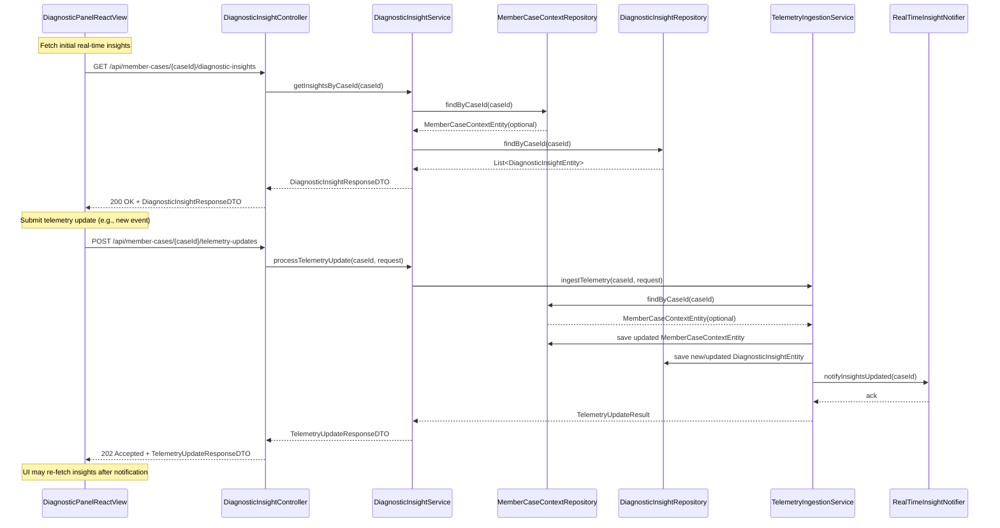
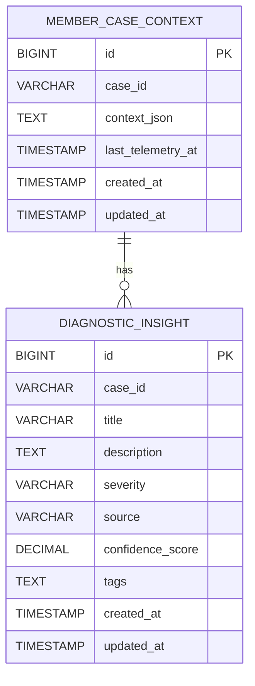

# Repository: APB_Demo
# Branch: APPMRN146
# Folder: LLD

1. Objective
The objective is to provide real-time diagnostic insights for active member cases within a diagnostic panel. The system will consume updated telemetry and context to compute AI-generated diagnostic insights and expose them via a Spring Boot API. A React-based diagnostic panel will display these insights and automatically refresh when new data becomes available.

2. Backend Spring Boot API Details
2.1. API Model
2.1.1. Common Components/Services
- DiagnosticInsightController: REST controller exposing endpoints to retrieve real-time diagnostic insights for a member case.
- DiagnosticInsightService: Service layer component encapsulating business logic for retrieving and updating diagnostic insights.
- TelemetryIngestionService: Service responsible for processing incoming telemetry/context updates and triggering re-computation of insights.
- DiagnosticInsightRepository: Spring Data JPA repository for persisting and retrieving DiagnosticInsight entities.
- MemberCaseContextRepository: Spring Data JPA repository for member case context entities used for diagnostics.
- DiagnosticInsightMapper: Utility to map between DiagnosticInsight entities and DiagnosticInsightDTO for API responses.
- RealTimeInsightNotifier: Component responsible for publishing events that indicate new or updated insights (used by polling or future push mechanisms).

2.1.2. API Details
| Operation                          | REST Method | Type    | URL                                               | Request JSON                                                                                                      | Response JSON                                                                                                                                              |
|------------------------------------|------------|---------|---------------------------------------------------|-------------------------------------------------------------------------------------------------------------------|------------------------------------------------------------------------------------------------------------------------------------------------------------|
| Get real-time diagnostic insights  | GET        | Query   | /api/member-cases/{caseId}/diagnostic-insights    | N/A                                                                                                               | {"caseId":"string","lastUpdated":"2025-01-01T12:00:00Z","insights":[{"id":"string","title":"string","description":"string","severity":"LOW|MEDIUM|HIGH","source":"AI_ENGINE","confidenceScore":0.92,"tags":["string"],"createdAt":"2025-01-01T12:00:00Z","updatedAt":"2025-01-01T12:05:00Z"}]} |
| Register telemetry update          | POST       | Command | /api/member-cases/{caseId}/telemetry-updates      | {"sourceSystem":"string","telemetryType":"string","payload":"{...}","receivedAt":"2025-01-01T12:00:00Z"} | {"caseId":"string","status":"QUEUED","message":"Telemetry update accepted for processing","correlationId":"string"}                           |

2.1.3. Exceptions
- MemberCaseNotFoundException: Thrown when the specified caseId does not exist.
- DiagnosticInsightNotFoundException: Thrown when no insights are available for a given case and the caller expects at least one.
- TelemetryPayloadInvalidException: Thrown when incoming telemetry payload is malformed or fails validation.
- TelemetryProcessingException: Thrown when internal errors occur while processing telemetry updates.
- GlobalExceptionHandler: @ControllerAdvice to map exceptions to HTTP responses (e.g., 404 for not found, 400 for validation errors, 500 for server errors).

2.2. Functional Design
2.2.1. Class Diagram

```mermaid
classDiagram
    class DiagnosticInsightController {
        +ResponseEntity~DiagnosticInsightResponseDTO~ getDiagnosticInsights(String caseId)
        +ResponseEntity~TelemetryUpdateResponseDTO~ registerTelemetryUpdate(String caseId, TelemetryUpdateRequestDTO request)
    }

    class DiagnosticInsightService {
        +DiagnosticInsightResponseDTO getInsightsByCaseId(String caseId)
        +TelemetryUpdateResult processTelemetryUpdate(String caseId, TelemetryUpdateRequestDTO request)
    }

    class TelemetryIngestionService {
        +TelemetryUpdateResult ingestTelemetry(String caseId, TelemetryUpdateRequestDTO request)
        -void recomputeInsights(String caseId)
    }

    class RealTimeInsightNotifier {
        +void notifyInsightsUpdated(String caseId)
    }

    class DiagnosticInsightRepository {
        +List~DiagnosticInsightEntity~ findByCaseId(String caseId)
        +DiagnosticInsightEntity save(DiagnosticInsightEntity entity)
    }

    class MemberCaseContextRepository {
        +Optional~MemberCaseContextEntity~ findByCaseId(String caseId)
    }

    class DiagnosticInsightEntity {
        +Long id
        +String caseId
        +String title
        +String description
        +String severity
        +String source
        +Double confidenceScore
        +String tags
        +OffsetDateTime createdAt
        +OffsetDateTime updatedAt
    }

    class MemberCaseContextEntity {
        +Long id
        +String caseId
        +String contextJson
        +OffsetDateTime lastTelemetryAt
        +OffsetDateTime createdAt
        +OffsetDateTime updatedAt
    }

    class DiagnosticInsightDTO {
        +String id
        +String title
        +String description
        +String severity
        +String source
        +Double confidenceScore
        +List~String~ tags
        +OffsetDateTime createdAt
        +OffsetDateTime updatedAt
    }

    class DiagnosticInsightResponseDTO {
        +String caseId
        +OffsetDateTime lastUpdated
        +List~DiagnosticInsightDTO~ insights
    }

    class TelemetryUpdateRequestDTO {
        +String sourceSystem
        +String telemetryType
        +String payload
        +OffsetDateTime receivedAt
    }

    class TelemetryUpdateResponseDTO {
        +String caseId
        +String status
        +String message
        +String correlationId
    }

    class DiagnosticInsightMapper {
        +DiagnosticInsightDTO toDto(DiagnosticInsightEntity entity)
        +List~DiagnosticInsightDTO~ toDtoList(List~DiagnosticInsightEntity~ entities)
    }

    DiagnosticInsightController --> DiagnosticInsightService
    DiagnosticInsightService --> DiagnosticInsightRepository
    DiagnosticInsightService --> TelemetryIngestionService
    DiagnosticInsightService --> MemberCaseContextRepository
    DiagnosticInsightService --> DiagnosticInsightMapper
    TelemetryIngestionService --> DiagnosticInsightRepository
    TelemetryIngestionService --> MemberCaseContextRepository
    TelemetryIngestionService --> RealTimeInsightNotifier
```

2.2.2. UML Sequence Diagram

2.2.3. Components
| Component Name               | Description                                                                       | Existing/New |
|-----------------------------|-----------------------------------------------------------------------------------|--------------|
| DiagnosticInsightController | Exposes REST endpoints for retrieving diagnostic insights and telemetry updates. | New          |
| DiagnosticInsightService    | Encapsulates business logic for insights retrieval and telemetry processing.     | New          |
| TelemetryIngestionService   | Handles telemetry ingestion and triggers insight recomputation.                  | New          |
| RealTimeInsightNotifier     | Publishes events when insights are updated (for UI polling/refresh strategies). | New          |
| DiagnosticInsightRepository | Persists and loads DiagnosticInsightEntity instances.                            | New          |
| MemberCaseContextRepository | Persists and loads MemberCaseContextEntity instances.                            | New          |
| DiagnosticInsightMapper     | Maps entities to DTOs for API responses.                                         | New          |

2.3. Service Layer Business Logic
- Service Architecture & Dependency Injection:
  - DiagnosticInsightController uses constructor injection to depend on DiagnosticInsightService.
  - DiagnosticInsightService depends on DiagnosticInsightRepository, MemberCaseContextRepository, TelemetryIngestionService, and DiagnosticInsightMapper (also via constructor injection).
  - TelemetryIngestionService depends on MemberCaseContextRepository, DiagnosticInsightRepository, and RealTimeInsightNotifier.
  - All services are annotated with @Service and repositories with @Repository, using Spring Boot auto-configuration.
- Workflow:
  - For GET /api/member-cases/{caseId}/diagnostic-insights:
    - Validate caseId format.
    - Retrieve MemberCaseContextEntity by caseId. If not found, throw MemberCaseNotFoundException.
    - Retrieve all DiagnosticInsightEntity rows for the caseId.
    - Map entities to DiagnosticInsightDTO list and compute lastUpdated from the max updatedAt value.
    - Build DiagnosticInsightResponseDTO and return.
  - For POST /api/member-cases/{caseId}/telemetry-updates:
    - Validate caseId and TelemetryUpdateRequestDTO fields.
    - Call TelemetryIngestionService.ingestTelemetry with the request.
    - TelemetryIngestionService updates or creates the MemberCaseContextEntity with new telemetry and timestamps.
    - TelemetryIngestionService recomputes insights for the case (placeholder algorithmic logic can be AI-generated or rule-based) and persists DiagnosticInsightEntity records.
    - TelemetryIngestionService calls RealTimeInsightNotifier.notifyInsightsUpdated to publish an event.
    - Return TelemetryUpdateResponseDTO with status QUEUED or PROCESSED and a correlationId.
- Caching Strategy:
  - Use a simple in-memory cache (e.g., Spring Cache) for DiagnosticInsightResponseDTO keyed by caseId to avoid redundant DB reads for frequently refreshed panels.
  - Evict cache entries for a caseId whenever TelemetryIngestionService completes recomputeInsights.
- Validation Rules:
  - caseId must be non-null, non-empty, and match a configured pattern (e.g., alphanumeric with dashes).
  - TelemetryUpdateRequestDTO.sourceSystem and telemetryType must be non-empty.
  - TelemetryUpdateRequestDTO.payload must not exceed a configured maximum length.
  - receivedAt must not be in the far future beyond an allowed clock skew.

Validation rules
| Field Name                        | Validation                                                 | Error Message                                      | Class Used                   |
|-----------------------------------|------------------------------------------------------------|---------------------------------------------------|------------------------------|
| caseId                            | Not blank, pattern ^[A-Za-z0-9\-]+$                        | "caseId must be alphanumeric with dashes only"   | DiagnosticInsightService     |
| TelemetryUpdateRequestDTO.sourceSystem | Not blank, max length 100                          | "sourceSystem is required"                       | TelemetryIngestionService    |
| TelemetryUpdateRequestDTO.telemetryType | Not blank, max length 100                        | "telemetryType is required"                      | TelemetryIngestionService    |
| TelemetryUpdateRequestDTO.payload | Not null, max length 10000                               | "payload size exceeds limit"                     | TelemetryIngestionService    |
| TelemetryUpdateRequestDTO.receivedAt | Not null, not more than 5 minutes in future       | "receivedAt is invalid"                          | TelemetryIngestionService    |

2.4. Service Integrations
| System      | Integrated For                                 | Integration Type |
|-------------|------------------------------------------------|------------------|
| AI_ENGINE   | Computing AI-generated diagnostic insights     | Synchronous in-process (placeholder stub) |
| TELEMETRY_SOURCE | Receiving telemetry/context updates (via API) | REST (incoming POST) |

3. Front End React Details
3.1. UI Component Architecture
- Component Hierarchy and Data Flow:
  - DiagnosticPanelApp (top-level container for the diagnostic experience).
  - MemberDiagnosticPanelPage
    - RealTimeDiagnosticInsightsPanel
      - RealTimeDiagnosticInsightsList
        - RealTimeDiagnosticInsightItem
  - Data flows from MemberDiagnosticPanelPage to RealTimeDiagnosticInsightsPanel via props, and from RealTimeDiagnosticInsightsPanel to its child components.
- State Management:
  - MemberDiagnosticPanelPage uses React hooks (useState, useEffect) to manage caseId and loading/error states.
  - RealTimeDiagnosticInsightsPanel maintains state for insights, lastUpdated, isLoading, and error.
  - No global state manager is assumed; local component state suffices.
- Props Interfaces (TypeScript-style naming, applicable for JS as JSDoc):
  - MemberDiagnosticPanelPage
    - props: { caseId: string }
  - RealTimeDiagnosticInsightsPanel
    - props: { caseId: string }
  - RealTimeDiagnosticInsightsList
    - props: { insights: RealTimeDiagnosticInsightViewModel[] }
  - RealTimeDiagnosticInsightItem
    - props: { insight: RealTimeDiagnosticInsightViewModel }
  - RealTimeDiagnosticInsightViewModel
    - { id: string; title: string; description: string; severity: 'LOW'|'MEDIUM'|'HIGH'; source: string; confidenceScore: number; tags: string[]; updatedAt: string }
- Routing:
  - A route is defined in the host application, e.g., /member-cases/:caseId/diagnostic-panel, which renders MemberDiagnosticPanelPage and passes caseId from route params.

3.2. UI Specifications
- Wireframes/Pages:
  - MemberDiagnosticPanelPage displays the RealTimeDiagnosticInsightsPanel alongside other case information (assumed existing container).
  - RealTimeDiagnosticInsightsPanel shows:
    - Header: "Real-Time Diagnostic Insights" with last updated timestamp.
    - List of insights with severity badge, title, description, tags, and confidence indicator.
- Responsive Breakpoints:
  - Desktop: 3-column layout where insights panel occupies one column; list items are horizontal cards.
  - Tablet/Mobile: insights panel collapses to full width; insight items stacked vertically.
- Form Structures with Validation:
  - No explicit user-initiated forms for this story; telemetry updates are assumed system-driven.
- User Interaction Patterns:
  - Panel auto-refreshes insights periodically (e.g., every 30 seconds) or on notification (via future event mechanism).
  - Loading state: skeleton or spinner when fetching insights.
  - Error state: inline error message with retry button.

3.3. API Integration
- HTTP Client Configuration:
  - Use fetch or axios via a custom hook named useRealTimeDiagnosticInsights.
  - Base URL configured via environment variable (e.g., REACT_APP_API_BASE_URL).
- Call Patterns and Error Handling:
  - useRealTimeDiagnosticInsights(caseId) performs GET /api/member-cases/{caseId}/diagnostic-insights.
  - It sets isLoading before the call, updates data on success, and captures errors for display.
  - Retries are manual via user-initiated refresh or automatic via polling interval.
- Loading States:
  - RealTimeDiagnosticInsightsPanel renders a loading spinner when isLoading is true.
- Data Transformation:
  - The hook maps DiagnosticInsightResponseDTO to RealTimeDiagnosticInsightViewModel[], formatting dates and normalizing severity labels.

4. Database Details
4.1. ER Model

4.2. Database Validations
- MEMBER_CASE_CONTEXT.case_id is NOT NULL and unique.
- DIAGNOSTIC_INSIGHT.case_id is NOT NULL and indexed for efficient lookup.
- DIAGNOSTIC_INSIGHT.severity constrained via application-level validation to allowed values (LOW, MEDIUM, HIGH).
- DIAGNOSTIC_INSIGHT.confidence_score constrained via application-level validation between 0.0 and 1.0.

5. Non-Functional Requirements
5.1. Performance
- GET insights endpoint should return within 300 ms for typical payload sizes under normal load.
- Indexes on case_id fields ensure O(log n) lookups for insights and context.
- Telemetry ingestion is processed synchronously for small payloads; heavy computation is deferred or simplified in this scope.

5.2. Security (Authentication & Authorization)
- All endpoints are protected via existing OAuth2/JWT-based authentication.
- Access to /api/member-cases/{caseId}/* requires a role such as ROLE_SUPPORT_AGENT.
- Case-level authorization ensures agents can only access cases assigned to their organization or tenant.

5.3. Logging (Application, Audit, Monitoring)
- Application logs include request identifiers, caseId, and correlationId for telemetry updates.
- Audit logs record access to diagnostic insights with user identity, caseId, and timestamp.
- Basic metrics (request count, latency) are exposed via existing Spring Actuator endpoints for monitoring.

6. Dependencies
- Spring Boot Web, Spring Data JPA, Spring Validation, Spring Cache.
- Database: PostgreSQL or equivalent relational database.
- React 18+, React Router, optionally axios for HTTP requests.

7. Assumptions
- Member cases and their basic metadata are managed by an existing system exposed via MemberCaseContextEntity, and this story only adds diagnostic insights on top of it.
- Real-time behavior is implemented via periodic polling from the UI rather than server push for this iteration.
- AI_ENGINE integration is represented as a placeholder in-process component; actual external AI service integration is handled in a separate story.
