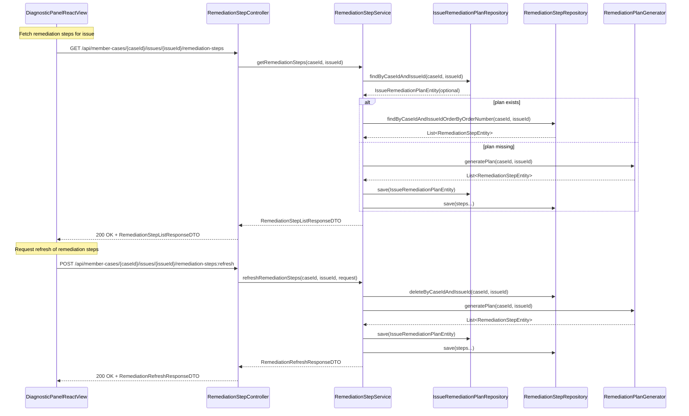
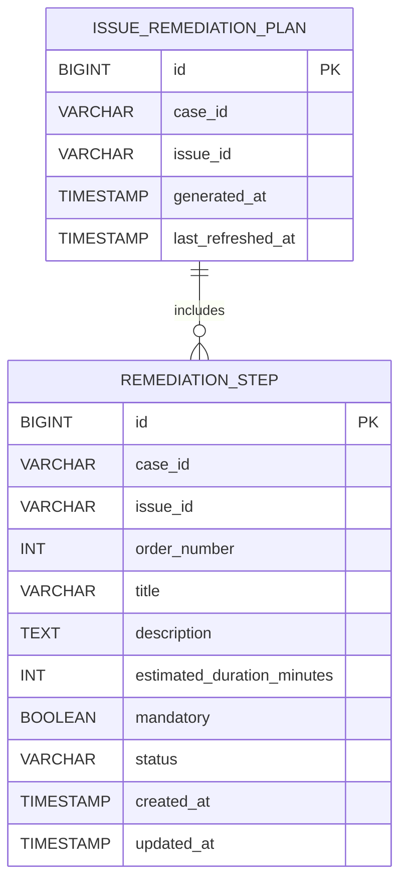

# Repository: APB_Demo
# Branch: APPMRN146
# Folder: LLD

1. Objective
The objective is to provide AI-guided, step-by-step remediation instructions for identified member issues in the diagnostic panel. The backend will expose ordered remediation steps via a Spring Boot API, generated by or retrieved from an AI or rules engine. The React frontend will render these steps clearly so support agents can follow them to resolve issues efficiently and consistently.

2. Backend Spring Boot API Details
2.1. API Model
2.1.1. Common Components/Services
- RemediationStepController: REST controller exposing endpoints to retrieve remediation steps for a given member case and issue.
- RemediationStepService: Service layer encapsulating business logic for retrieving and ordering remediation steps.
- RemediationStepRepository: Spring Data JPA repository for persisting and fetching RemediationStepEntity instances.
- IssueRemediationPlanRepository: Repository managing IssueRemediationPlanEntity representing the remediation plan for a specific issue.
- RemediationStepMapper: Utility for mapping RemediationStepEntity to RemediationStepDTO.
- RemediationPlanGenerator: Component integrating with AI or rule logic to create remediation plans when none exist or when a refresh is required.

2.1.2. API Details
| Operation                               | REST Method | Type  | URL                                                           | Request JSON                                                                                              | Response JSON                                                                                                                                                     |
|-----------------------------------------|------------|-------|---------------------------------------------------------------|-----------------------------------------------------------------------------------------------------------|-------------------------------------------------------------------------------------------------------------------------------------------------------------------|
| Get remediation steps for an issue      | GET        | Query | /api/member-cases/{caseId}/issues/{issueId}/remediation-steps | N/A                                                                                                       | {"caseId":"string","issueId":"string","steps":[{"id":"string","orderNumber":1,"title":"string","description":"string","estimatedDurationMinutes":5,"mandatory":true,"status":"PENDING"}]} |
| Refresh remediation steps for an issue  | POST       | Command | /api/member-cases/{caseId}/issues/{issueId}/remediation-steps:refresh | {"reason":"string"}                                                                                     | {"caseId":"string","issueId":"string","status":"REFRESHED","stepCount":3}                                                                                |

2.1.3. Exceptions
- MemberCaseNotFoundException: Raised when caseId is unknown.
- IssueNotFoundException: Raised when issueId is unknown or not associated with the case.
- RemediationPlanNotFoundException: Raised when no remediation plan exists and cannot be generated.
- RemediationPlanGenerationException: Raised when AI/rule engine fails to generate steps.
- GlobalExceptionHandler: @ControllerAdvice mapping these to appropriate HTTP statuses (404, 400, 500).

2.2. Functional Design
2.2.1. Class Diagram

```mermaid
classDiagram
    class RemediationStepController {
        +ResponseEntity~RemediationStepListResponseDTO~ getRemediationSteps(String caseId, String issueId)
        +ResponseEntity~RemediationRefreshResponseDTO~ refreshRemediationSteps(String caseId, String issueId, RemediationRefreshRequestDTO request)
    }

    class RemediationStepService {
        +RemediationStepListResponseDTO getRemediationSteps(String caseId, String issueId)
        +RemediationRefreshResponseDTO refreshRemediationSteps(String caseId, String issueId, RemediationRefreshRequestDTO request)
        -List~RemediationStepEntity~ ensurePlanExists(String caseId, String issueId)
    }

    class RemediationPlanGenerator {
        +List~RemediationStepEntity~ generatePlan(String caseId, String issueId)
    }

    class RemediationStepRepository {
        +List~RemediationStepEntity~ findByCaseIdAndIssueIdOrderByOrderNumber(String caseId, String issueId)
        +RemediationStepEntity save(RemediationStepEntity entity)
        +void deleteByCaseIdAndIssueId(String caseId, String issueId)
    }

    class IssueRemediationPlanRepository {
        +Optional~IssueRemediationPlanEntity~ findByCaseIdAndIssueId(String caseId, String issueId)
        +IssueRemediationPlanEntity save(IssueRemediationPlanEntity entity)
    }

    class RemediationStepEntity {
        +Long id
        +String caseId
        +String issueId
        +Integer orderNumber
        +String title
        +String description
        +Integer estimatedDurationMinutes
        +Boolean mandatory
        +String status
        +OffsetDateTime createdAt
        +OffsetDateTime updatedAt
    }

    class IssueRemediationPlanEntity {
        +Long id
        +String caseId
        +String issueId
        +OffsetDateTime generatedAt
        +OffsetDateTime lastRefreshedAt
    }

    class RemediationStepDTO {
        +String id
        +Integer orderNumber
        +String title
        +String description
        +Integer estimatedDurationMinutes
        +Boolean mandatory
        +String status
    }

    class RemediationStepListResponseDTO {
        +String caseId
        +String issueId
        +List~RemediationStepDTO~ steps
    }

    class RemediationRefreshRequestDTO {
        +String reason
    }

    class RemediationRefreshResponseDTO {
        +String caseId
        +String issueId
        +String status
        +Integer stepCount
    }

    class RemediationStepMapper {
        +RemediationStepDTO toDto(RemediationStepEntity entity)
        +List~RemediationStepDTO~ toDtoList(List~RemediationStepEntity~ entities)
    }

    RemediationStepController --> RemediationStepService
    RemediationStepService --> RemediationStepRepository
    RemediationStepService --> IssueRemediationPlanRepository
    RemediationStepService --> RemediationPlanGenerator
    RemediationStepService --> RemediationStepMapper
```

2.2.2. UML Sequence Diagram

2.2.3. Components
| Component Name                 | Description                                                                 | Existing/New |
|--------------------------------|-----------------------------------------------------------------------------|--------------|
| RemediationStepController      | REST controller exposing remediation step retrieval and refresh endpoints. | New          |
| RemediationStepService         | Business logic for managing remediation plans and steps.                   | New          |
| RemediationPlanGenerator       | Generates remediation steps via AI or rules.                               | New          |
| RemediationStepRepository      | Persistence for remediation step entities.                                 | New          |
| IssueRemediationPlanRepository | Persistence for issue remediation plan metadata.                           | New          |
| RemediationStepMapper          | Maps entities to DTOs for API responses.                                   | New          |

2.3. Service Layer Business Logic
- Service Architecture & Dependency Injection:
  - RemediationStepController uses constructor injection to depend on RemediationStepService.
  - RemediationStepService depends on RemediationStepRepository, IssueRemediationPlanRepository, RemediationPlanGenerator, and RemediationStepMapper.
  - RemediationPlanGenerator is a @Component encapsulating AI or rule-based plan generation.
- Workflow:
  - GET /api/member-cases/{caseId}/issues/{issueId}/remediation-steps:
    - Validate caseId and issueId formats.
    - Look up IssueRemediationPlanEntity via IssueRemediationPlanRepository.
    - If plan exists, fetch associated RemediationStepEntity ordered by orderNumber.
    - If plan does not exist, call RemediationPlanGenerator.generatePlan, persist the plan and steps, then return them.
    - Map step entities to RemediationStepDTO and return RemediationStepListResponseDTO.
  - POST /api/member-cases/{caseId}/issues/{issueId}/remediation-steps:refresh:
    - Validate caseId, issueId, and RemediationRefreshRequestDTO.reason.
    - Delete existing steps for the case and issue via RemediationStepRepository.
    - Generate a new plan via RemediationPlanGenerator.generatePlan.
    - Save the new IssueRemediationPlanEntity and associated steps.
    - Return RemediationRefreshResponseDTO with status REFRESHED and stepCount.
- Caching Strategy:
  - Cache remediation steps keyed by (caseId, issueId) for read operations.
  - Evict cache entries on refresh or regeneration.
- Validation Rules:
  - caseId and issueId must be non-empty and conform to alphanumeric-with-dash pattern.
  - orderNumber for RemediationStepEntity must be positive and unique per (caseId, issueId).
  - RemediationRefreshRequestDTO.reason is optional but, if supplied, has a max length.

Validation rules
| Field Name                             | Validation                                                 | Error Message                                              | Class Used                  |
|----------------------------------------|------------------------------------------------------------|-----------------------------------------------------------|-----------------------------|
| caseId                                 | Not blank, pattern ^[A-Za-z0-9\-]+$                        | "caseId must be alphanumeric with dashes only"           | RemediationStepService      |
| issueId                                | Not blank, pattern ^[A-Za-z0-9\-]+$                        | "issueId must be alphanumeric with dashes only"          | RemediationStepService      |
| RemediationStepEntity.orderNumber      | > 0, unique per (caseId, issueId)                          | "orderNumber must be positive and unique"                | RemediationStepService      |
| RemediationStepEntity.title            | Not blank, max length 255                                  | "title is required"                                      | RemediationPlanGenerator    |
| RemediationStepEntity.description      | Not blank, max length 2000                                 | "description is required"                                | RemediationPlanGenerator    |
| RemediationRefreshRequestDTO.reason    | Max length 500                                             | "reason exceeds maximum length"                          | RemediationStepService      |

2.4. Service Integrations
| System    | Integrated For                            | Integration Type                        |
|-----------|-------------------------------------------|-----------------------------------------|
| AI_ENGINE | Generating remediation steps per issue    | Synchronous in-process (placeholder)    |

3. Front End React Details
3.1. UI Component Architecture
- Component Hierarchy and Data Flow:
  - MemberDiagnosticPanelPage
    - IssueRemediationStepsPanel
      - IssueRemediationStepsList
        - IssueRemediationStepItem
- State Management:
  - IssueRemediationStepsPanel uses React hooks to manage steps, loading, and error state for a given caseId and issueId.
  - Steps are stored as an array of IssueRemediationStepViewModel.
- Props Interfaces:
  - IssueRemediationStepsPanel
    - props: { caseId: string; issueId: string }
  - IssueRemediationStepsList
    - props: { steps: IssueRemediationStepViewModel[] }
  - IssueRemediationStepItem
    - props: { step: IssueRemediationStepViewModel }
  - IssueRemediationStepViewModel
    - { id: string; orderNumber: number; title: string; description: string; estimatedDurationMinutes?: number; mandatory: boolean; status: 'PENDING'|'IN_PROGRESS'|'COMPLETED' }
- Routing:
  - Existing diagnostic panel route passes both caseId and issueId to IssueRemediationStepsPanel (issueId may derive from selected diagnostic insight).

3.2. UI Specifications
- Wireframes/Pages:
  - IssueRemediationStepsPanel displays a header "Remediation Steps" followed by an ordered list.
  - Each IssueRemediationStepItem includes step number, title, description, and optional estimated duration.
- Responsive Breakpoints:
  - Desktop: step list shown as vertically stacked cards with clear numbering.
  - Tablet/Mobile: cards stack with full-width and readable typography.
- Form Structures with Validation:
  - No user input forms; steps are read-only in this story.
- User Interaction Patterns:
  - Steps are displayed in the order provided by the backend (orderNumber).
  - The panel highlights the next step to follow based on status when combined with outcome tracking (separate story).

3.3. API Integration
- HTTP Client Configuration:
  - useIssueRemediationSteps hook abstracts HTTP calls.
  - GET /api/member-cases/{caseId}/issues/{issueId}/remediation-steps is used to load steps.
- Call Patterns and Error Handling:
  - On mount, IssueRemediationStepsPanel calls useIssueRemediationSteps(caseId, issueId) to fetch steps.
  - Errors (network or server) are captured and displayed as a non-blocking inline message with a retry option.
- Loading States:
  - A spinner or skeleton is displayed while steps load.
- Data Transformation:
  - IssueRemediationStepViewModel is derived directly from RemediationStepDTO, with minor formatting (e.g., adding "min" to durations).

4. Database Details
4.1. ER Model

4.2. Database Validations
- ISSUE_REMEDIATION_PLAN.case_id and ISSUE_REMEDIATION_PLAN.issue_id are NOT NULL and jointly unique.
- REMEDIATION_STEP.case_id and REMEDIATION_STEP.issue_id are NOT NULL and indexed.
- REMEDIATION_STEP.order_number is NOT NULL and must be unique per (case_id, issue_id) enforced via unique constraint.

5. Non-Functional Requirements
5.1. Performance
- Retrieval of remediation steps should complete within 300 ms under normal load, with index-based lookup on case_id and issue_id.
- Plan generation is expected to be fast; if slow, asynchronous generation will be addressed in another story.

5.2. Security (Authentication & Authorization)
- Endpoints are secured using existing authentication mechanisms (e.g., OAuth2/JWT).
- Only users with ROLE_SUPPORT_AGENT or equivalent can access remediation endpoints.

5.3. Logging (Application, Audit, Monitoring)
- Application logs include caseId and issueId for tracing remediation requests.
- Audit logs record when remediation plans are generated or refreshed, including user identity and timestamp.

6. Dependencies
- Spring Boot Web, Spring Data JPA, Spring Validation.
- React 18+ and React Router for frontend routing.

7. Assumptions
- An "issue" corresponds to a specific diagnostic finding already identified in the diagnostic panel.
- AI or rules engine integration will be encapsulated inside RemediationPlanGenerator and may be mocked for now.
- Remediation steps are read-only for support agents in this story; editing is out of scope.
