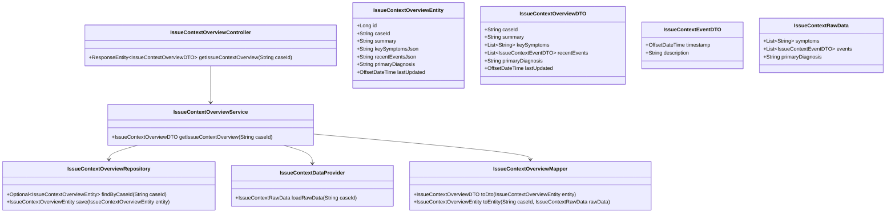
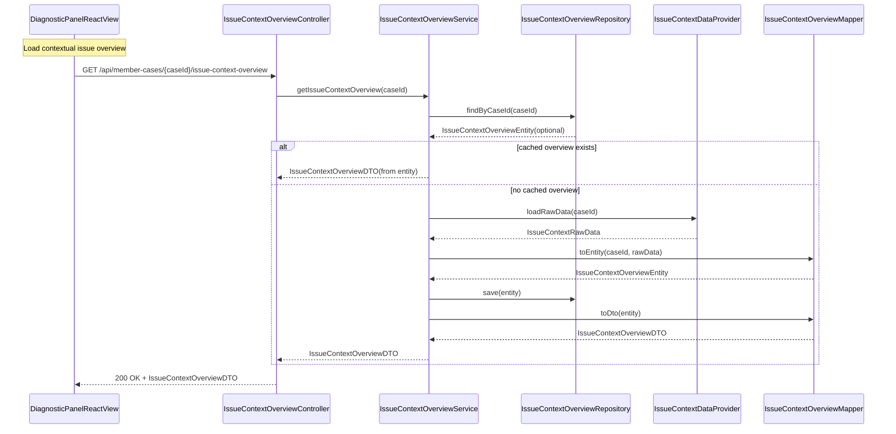
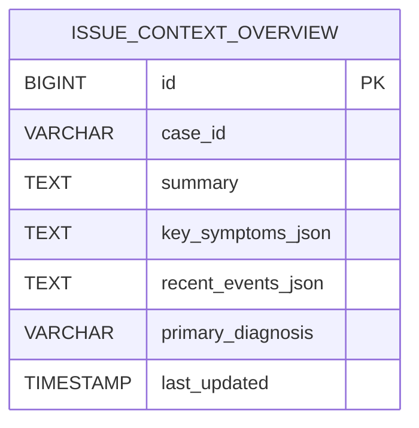

# Repository: APB_Demo
# Branch: APPMRN146
# Folder: LLD

1. Objective
The objective is to provide a contextual overview of a member’s issue within the diagnostic panel. The backend will aggregate relevant case data and diagnostics to produce a concise issue summary. The frontend will display this summary so agents can quickly understand key symptoms and recent events before taking action.

2. Backend Spring Boot API Details
2.1. API Model
2.1.1. Common Components/Services
- IssueContextOverviewController: REST controller exposing endpoints to retrieve contextual issue overviews for a member case.
- IssueContextOverviewService: Service component aggregating data and building contextual issue summaries.
- IssueContextOverviewRepository: Repository for persisting precomputed issue context summaries when needed.
- IssueContextOverviewMapper: Utility mapping entities to DTOs.
- IssueContextDataProvider: Component that fetches and aggregates raw data (symptoms, events, diagnostics) from existing systems.

2.1.2. API Details
| Operation                          | REST Method | Type  | URL                                                      | Request JSON | Response JSON                                                                                                                                                                                                                           |
|------------------------------------|------------|-------|----------------------------------------------------------|-------------|------------------------------------------------------------------------------------------------------------------------------------------------------------------------------------------------------------------------------------------|
| Get contextual member issue overview | GET        | Query | /api/member-cases/{caseId}/issue-context-overview        | N/A         | {"caseId":"string","summary":"string","keySymptoms":["string"],"recentEvents":[{"timestamp":"2025-01-01T12:00:00Z","description":"string"}],"primaryDiagnosis":"string","lastUpdated":"2025-01-01T12:05:00Z"} |

2.1.3. Exceptions
- MemberCaseNotFoundException: Thrown when caseId is not recognized.
- IssueContextUnavailableException: Thrown when foundational data required to build the context is missing.
- GlobalExceptionHandler: Maps exceptions to HTTP codes and standardized error payloads.

2.2. Functional Design
2.2.1. Class Diagram

2.2.2. UML Sequence Diagram

2.2.3. Components
| Component Name                 | Description                                                           | Existing/New |
|--------------------------------|-----------------------------------------------------------------------|--------------|
| IssueContextOverviewController | REST controller for contextual issue overview retrieval.             | New          |
| IssueContextOverviewService    | Aggregates data and produces context overview DTOs.                  | New          |
| IssueContextOverviewRepository | Persists precomputed issue context summaries.                         | New          |
| IssueContextDataProvider       | Loads raw case data (symptoms, events, diagnostics) from sources.     | New          |
| IssueContextOverviewMapper     | Maps between entity and DTO representations of issue context.        | New          |

2.3. Service Layer Business Logic
- Service Architecture & Dependency Injection:
  - IssueContextOverviewController uses constructor injection to depend on IssueContextOverviewService.
  - IssueContextOverviewService depends on IssueContextOverviewRepository, IssueContextDataProvider, and IssueContextOverviewMapper.
- Workflow:
  - Validate caseId.
  - Check IssueContextOverviewRepository for existing cached overview; if present and fresh enough (e.g., within 5 minutes), return it.
  - Otherwise, use IssueContextDataProvider.loadRawData to fetch symptoms, events, and primary diagnosis from upstream systems.
  - Use IssueContextOverviewMapper.toEntity to build IssueContextOverviewEntity, including a synthesized summary string.
  - Persist the entity via IssueContextOverviewRepository and convert to IssueContextOverviewDTO for response.
- Caching Strategy:
  - Use DB plus optional in-memory caching keyed by caseId.
  - Cache TTL of a few minutes to avoid excessive recomputation while keeping context reasonably fresh.
- Validation Rules:
  - caseId must be non-null, non-empty, and conform to alphanumeric-with-dash pattern.
  - IssueContextRawData must include at least one symptom or one recent event; otherwise IssueContextUnavailableException is thrown.

Validation rules
| Field Name                    | Validation                                                 | Error Message                                             | Class Used                     |
|-------------------------------|------------------------------------------------------------|----------------------------------------------------------|--------------------------------|
| caseId                        | Not blank, pattern ^[A-Za-z0-9\-]+$                        | "caseId must be alphanumeric with dashes only"          | IssueContextOverviewService    |
| IssueContextRawData.symptoms  | At least one symptom or one event must be present          | "Issue context is unavailable for this case"           | IssueContextOverviewService    |

2.4. Service Integrations
| System         | Integrated For                                 | Integration Type                     |
|----------------|------------------------------------------------|--------------------------------------|
| CASE_DATA_API  | Fetching case metadata and historical events   | REST client (used inside provider)   |
| DIAGNOSTIC_API | Fetching primary diagnosis and current issues  | REST client (used inside provider)   |

3. Front End React Details
3.1. UI Component Architecture
- Component Hierarchy:
  - MemberDiagnosticPanelPage
    - IssueContextOverviewPanel
- State Management:
  - IssueContextOverviewPanel manages loading, error, and overview data state via hooks.
- Props Interfaces:
  - IssueContextOverviewPanel
    - props: { caseId: string }
  - IssueContextOverviewViewModel
    - { caseId: string; summary: string; keySymptoms: string[]; recentEvents: { timestamp: string; description: string }[]; primaryDiagnosis?: string; lastUpdated: string }
- Routing:
  - Same host route /member-cases/:caseId/diagnostic-panel renders IssueContextOverviewPanel alongside other sections.

3.2. UI Specifications
- Wireframes/Pages:
  - IssueContextOverviewPanel displays:
    - Summary paragraph at the top.
    - Bullet list of key symptoms.
    - List of recent events with timestamps.
    - Primary diagnosis label.
- Responsive Breakpoints:
  - Desktop: panel occupies a column with structured lists.
  - Mobile: elements stacked with increased spacing for readability.
- Form Structures with Validation:
  - No forms; purely informational.
- User Interaction Patterns:
  - When panel loads, it shows a skeleton or spinner until data arrives.
  - If context is unavailable, a friendly message is displayed (e.g., "No context available").

3.3. API Integration
- HTTP Client Configuration:
  - Custom hook useIssueContextOverview(caseId) encapsulates HTTP calls.
  - GET /api/member-cases/{caseId}/issue-context-overview.
- Call Patterns and Error Handling:
  - On mount, IssueContextOverviewPanel triggers the hook.
  - Errors are shown inline with a retry button.
- Loading States:
  - Loading spinner or skeleton view shown while waiting for response.
- Data Transformation:
  - API DTO is mapped into IssueContextOverviewViewModel, including date formatting for timestamps.

4. Database Details
4.1. ER Model

4.2. Database Validations
- ISSUE_CONTEXT_OVERVIEW.case_id is NOT NULL and unique.
- summary, key_symptoms_json, and recent_events_json are NOT NULL.

5. Non-Functional Requirements
5.1. Performance
- Overview retrieval should complete within 300 ms for cached data and 600 ms when recomputing.
- Index on case_id ensures fast lookup.

5.2. Security (Authentication & Authorization)
- Endpoint is secured by existing authentication.
- Only authorized support agents can access context for a case.

5.3. Logging (Application, Audit, Monitoring)
- Logs record caseId and user identity for each overview request.
- Errors in data provider integrations are logged with upstream system identifiers.

6. Dependencies
- Spring Boot Web, Spring Data JPA.
- React 18+, React Router.

7. Assumptions
- Upstream systems (CASE_DATA_API and DIAGNOSTIC_API) already expose required case and diagnosis data.
- Summary text is generated using simple concatenation and templates; advanced NLP summarization is out of scope.
