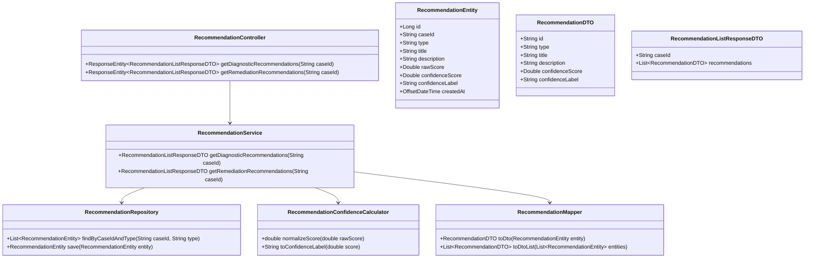
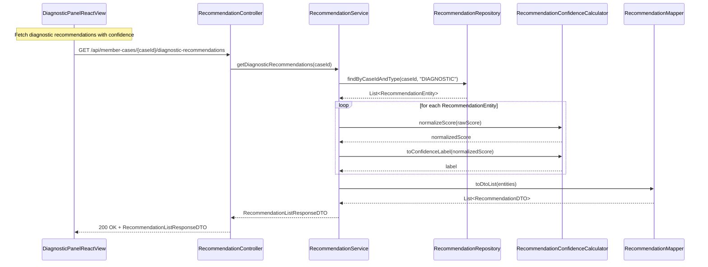
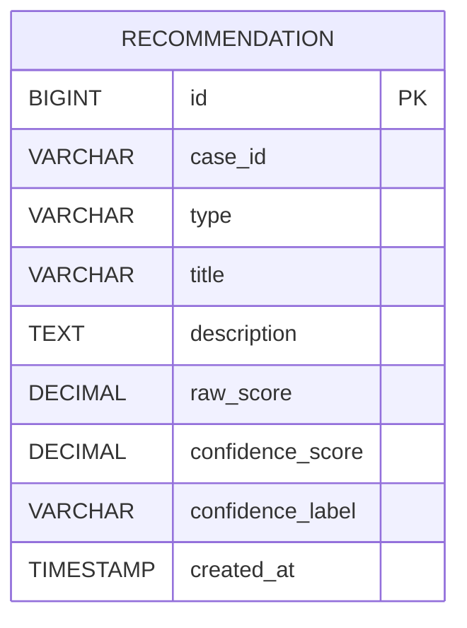

# Repository: APB_Demo
# Branch: APPMRN146
# Folder: LLD

1. Objective
The objective is to display confidence scores for AI-based diagnostic or remediation recommendations in the diagnostic panel. The backend will append confidence indicators to each recommendation exposed via the API. The frontend will render these scores so agents can gauge how strongly they should rely on each recommendation.

2. Backend Spring Boot API Details
2.1. API Model
2.1.1. Common Components/Services
- RecommendationController: REST controller exposing endpoints for diagnostic and remediation recommendations enriched with confidence scores.
- RecommendationService: Service layer managing retrieval and formatting of recommendations.
- RecommendationRepository: Repository for persisting RecommendationEntity instances (if persisted).
- RecommendationMapper: Maps RecommendationEntity or AI outputs to RecommendationDTO.
- RecommendationConfidenceCalculator: Component encapsulating logic for computing or normalizing confidence scores from AI outputs.

2.1.2. API Details
| Operation                                   | REST Method | Type  | URL                                                           | Request JSON | Response JSON                                                                                                                                                                                                                 |
|---------------------------------------------|------------|-------|---------------------------------------------------------------|-------------|------------------------------------------------------------------------------------------------------------------------------------------------------------------------------------------------------------------------------|
| Get diagnostic recommendations with confidence | GET        | Query | /api/member-cases/{caseId}/diagnostic-recommendations         | N/A         | {"caseId":"string","recommendations":[{"id":"string","type":"DIAGNOSTIC","title":"string","description":"string","confidenceScore":0.87,"confidenceLabel":"HIGH"}]}                                 |
| Get remediation recommendations with confidence | GET        | Query | /api/member-cases/{caseId}/remediation-recommendations        | N/A         | {"caseId":"string","recommendations":[{"id":"string","type":"REMEDIATION","title":"string","description":"string","confidenceScore":0.64,"confidenceLabel":"MEDIUM"}]}                                 |

2.1.3. Exceptions
- MemberCaseNotFoundException: Thrown when caseId is invalid.
- RecommendationUnavailableException: Thrown when no recommendations are available from AI or data source.
- GlobalExceptionHandler: Maps these to standard HTTP responses.

2.2. Functional Design
2.2.1. Class Diagram

2.2.2. UML Sequence Diagram

2.2.3. Components
| Component Name                     | Description                                                                  | Existing/New |
|------------------------------------|------------------------------------------------------------------------------|--------------|
| RecommendationController           | REST controller for recommendation endpoints.                                | New          |
| RecommendationService              | Business logic for retrieving and enriching recommendations.                 | New          |
| RecommendationRepository           | Persistence access for RecommendationEntity.                                  | New          |
| RecommendationConfidenceCalculator | Computes normalized scores and human-readable labels.                        | New          |
| RecommendationMapper               | Maps entities to DTOs.                                                       | New          |

2.3. Service Layer Business Logic
- Service Architecture & Dependency Injection:
  - RecommendationController uses constructor injection to depend on RecommendationService.
  - RecommendationService depends on RecommendationRepository, RecommendationConfidenceCalculator, and RecommendationMapper.
- Workflow:
  - For diagnostic recommendations:
    - Validate caseId.
    - Fetch RecommendationEntity records with type DIAGNOSTIC.
    - For each entity, compute confidenceScore via RecommendationConfidenceCalculator.normalizeScore(rawScore) and confidenceLabel via toConfidenceLabel.
    - Update entity or construct DTO with computed values.
    - Build and return RecommendationListResponseDTO.
  - For remediation recommendations:
    - Same as above but type REMEDIATION.
- Caching Strategy:
  - Cache recommendations by (caseId, type) as they change less frequently than telemetry.
- Validation Rules:
  - caseId must be non-empty and pattern-valid.
  - rawScore, if present, must be between 0.0 and 1.0 or normalized within the calculator.

Validation rules
| Field Name                         | Validation                                                 | Error Message                                           | Class Used                  |
|------------------------------------|------------------------------------------------------------|--------------------------------------------------------|-----------------------------|
| caseId                             | Not blank, pattern ^[A-Za-z0-9\-]+$                        | "caseId must be alphanumeric with dashes only"        | RecommendationService       |
| RecommendationEntity.rawScore      | Nullable, if non-null between 0.0 and 1.0                  | "rawScore out of range"                               | RecommendationConfidenceCalculator |

2.4. Service Integrations
| System    | Integrated For                          | Integration Type                     |
|-----------|-----------------------------------------|--------------------------------------|
| AI_ENGINE | Providing base recommendations and raw scores | Synchronous in-process (placeholder) |

3. Front End React Details
3.1. UI Component Architecture
- Component Hierarchy:
  - MemberDiagnosticPanelPage
    - RecommendationListPanel
      - DiagnosticRecommendationList
        - RecommendationItem
      - RemediationRecommendationList
        - RecommendationItem
- State Management:
  - RecommendationListPanel maintains separate state blocks for diagnostic and remediation recommendations.
- Props Interfaces:
  - RecommendationListPanel
    - props: { caseId: string }
  - DiagnosticRecommendationList
    - props: { recommendations: RecommendationViewModel[] }
  - RemediationRecommendationList
    - props: { recommendations: RecommendationViewModel[] }
  - RecommendationItem
    - props: { recommendation: RecommendationViewModel }
  - RecommendationViewModel
    - { id: string; type: 'DIAGNOSTIC'|'REMEDIATION'; title: string; description: string; confidenceScore: number; confidenceLabel: 'LOW'|'MEDIUM'|'HIGH' }
- Routing:
  - Integrated into existing /member-cases/:caseId/diagnostic-panel route.

3.2. UI Specifications
- Wireframes/Pages:
  - RecommendationListPanel displays two sections: Diagnostic Recommendations and Remediation Recommendations.
  - Each RecommendationItem includes title, description, and a confidence badge (e.g., HIGH, MEDIUM, LOW) alongside a numeric percentage.
- Responsive Breakpoints:
  - Desktop: recommendations shown in stacked cards with badges on the right.
  - Mobile: cards full-width with badges on top of the card.
- Form Structures with Validation:
  - No forms; display-only.
- User Interaction Patterns:
  - Confidence badges are color-coded (e.g., green for HIGH, amber for MEDIUM, red for LOW) following accessibility guidelines.

3.3. API Integration
- HTTP Client Configuration:
  - useCaseRecommendations hook encapsulates two HTTP calls.
  - GET /api/member-cases/{caseId}/diagnostic-recommendations and /remediation-recommendations.
- Call Patterns and Error Handling:
  - On mount, RecommendationListPanel calls both endpoints in parallel.
  - Errors in one list do not prevent display of the other; each section handles its own error state.
- Loading States:
  - Show section-level loading indicators while each list loads.
- Data Transformation:
  - ConfidenceScore is displayed as a percentage (score * 100 rounded) and label used for badge text.

4. Database Details
4.1. ER Model

4.2. Database Validations
- RECOMMENDATION.case_id is NOT NULL and indexed.
- RECOMMENDATION.type is constrained via application logic to DIAGNOSTIC or REMEDIATION.
- raw_score and confidence_score are constrained within 0.0 and 1.0 via application validation.

5. Non-Functional Requirements
5.1. Performance
- Recommendation retrieval should complete within 300 ms under normal load.

5.2. Security (Authentication & Authorization)
- Endpoints protected by existing authentication.
- Only authorized agents may view recommendations.

5.3. Logging (Application, Audit, Monitoring)
- Logs include caseId and type for each recommendation fetch.

6. Dependencies
- Spring Boot Web, Spring Data JPA.
- React 18+.

7. Assumptions
- AI engine already produces a rawScore field per recommendation, and this story focuses on exposing confidenceScore and confidenceLabel.
- Recommendations are read-only in this context; agents do not provide feedback on confidence.
