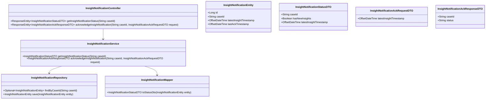
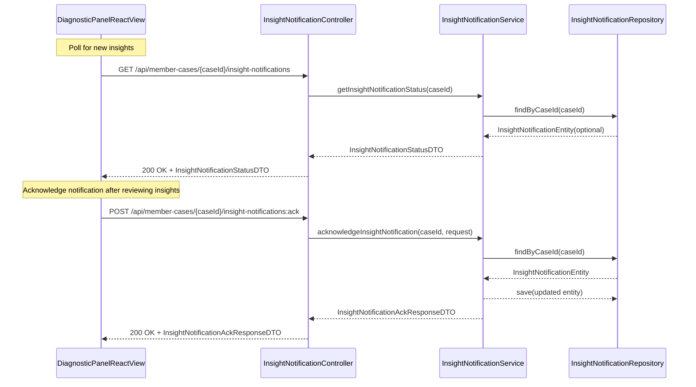
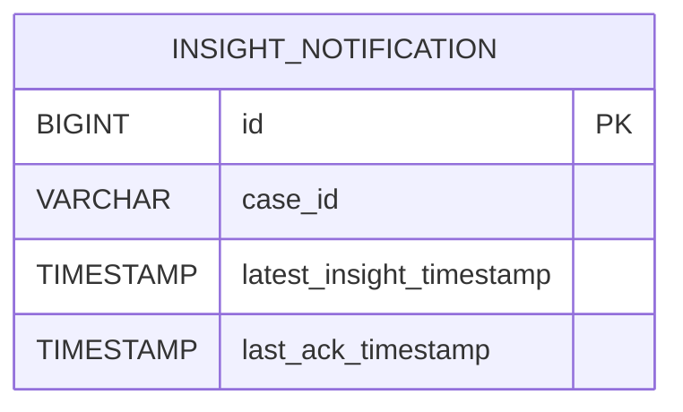

# Repository: APB_Demo
# Branch: APPMRN146
# Folder: LLD

1. Objective
The objective is to notify support agents when new or updated AI insights become available while they are viewing or working on a member case. The backend will expose an endpoint to check for new insights and emit update notifications, while the frontend will show clear prompts in the diagnostic panel and refresh data as needed.

2. Backend Spring Boot API Details
2.1. API Model
2.1.1. Common Components/Services
- InsightNotificationController: REST controller exposing endpoints to check for new insights and to list notification metadata.
- InsightNotificationService: Service encapsulating logic for detecting new or updated insights for a member case.
- InsightNotificationRepository: Repository managing InsightNotificationEntity for audit and tracking purposes.
- InsightNotificationMapper: Maps entities to DTOs.

2.1.2. API Details
| Operation                               | REST Method | Type  | URL                                                        | Request JSON                                                                                              | Response JSON                                                                                                                                                                 |
|-----------------------------------------|------------|-------|------------------------------------------------------------|-----------------------------------------------------------------------------------------------------------|-------------------------------------------------------------------------------------------------------------------------------------------------------------------------------|
| Check for new insights for a case       | GET        | Query | /api/member-cases/{caseId}/insight-notifications           | N/A                                                                                                       | {"caseId":"string","hasNewInsights":true,"latestInsightTimestamp":"2025-01-01T12:05:00Z"}                                                                           |
| Acknowledge insight notification        | POST       | Command | /api/member-cases/{caseId}/insight-notifications:ack       | {"latestInsightTimestamp":"2025-01-01T12:05:00Z"}                                                       | {"caseId":"string","status":"ACKNOWLEDGED"}                                                                                                                           |

2.1.3. Exceptions
- MemberCaseNotFoundException: Thrown when caseId is invalid.
- InsightNotificationConflictException: Thrown if the acknowledgement timestamp is stale compared to current state.
- GlobalExceptionHandler: Standard mapping to HTTP status codes.

2.2. Functional Design
2.2.1. Class Diagram

2.2.2. UML Sequence Diagram

2.2.3. Components
| Component Name                    | Description                                                        | Existing/New |
|-----------------------------------|--------------------------------------------------------------------|--------------|
| InsightNotificationController     | REST controller for notification status and acknowledgement.       | New          |
| InsightNotificationService        | Contains logic for checking and updating notification state.       | New          |
| InsightNotificationRepository     | Persists notification metadata per case.                           | New          |
| InsightNotificationMapper         | Maps entities to status DTOs.                                      | New          |

2.3. Service Layer Business Logic
- Service Architecture & Dependency Injection:
  - InsightNotificationController uses constructor injection to depend on InsightNotificationService.
  - InsightNotificationService depends on InsightNotificationRepository and InsightNotificationMapper.
- Workflow:
  - getInsightNotificationStatus:
    - Validate caseId.
    - Load InsightNotificationEntity by caseId; if missing, assume hasNewInsights=false and no timestamp.
    - Determine hasNewInsights by comparing latestInsightTimestamp with lastAckTimestamp.
    - Build and return InsightNotificationStatusDTO.
  - acknowledgeInsightNotification:
    - Validate caseId and request.latestInsightTimestamp.
    - Load InsightNotificationEntity; if none, create one with latestInsightTimestamp from request.
    - If request.latestInsightTimestamp is older than stored latestInsightTimestamp, throw InsightNotificationConflictException.
    - Update lastAckTimestamp and persist.
    - Return status ACKNOWLEDGED.
- Caching Strategy:
  - No explicit caching; notification records are small and accessed infrequently.
- Validation Rules:
  - caseId must be non-empty and valid.
  - latestInsightTimestamp in acknowledgement must not be null and not in the future beyond allowed skew.

Validation rules
| Field Name                                | Validation                                                 | Error Message                                      | Class Used                     |
|-------------------------------------------|------------------------------------------------------------|---------------------------------------------------|--------------------------------|
| caseId                                    | Not blank, pattern ^[A-Za-z0-9\-]+$                        | "caseId must be alphanumeric with dashes only"   | InsightNotificationService     |
| InsightNotificationAckRequestDTO.latestInsightTimestamp | Not null, not more than 5 minutes in future  | "latestInsightTimestamp is invalid"              | InsightNotificationService     |

2.4. Service Integrations
| System         | Integrated For                                         | Integration Type |
|----------------|--------------------------------------------------------|------------------|
| DIAGNOSTIC_API | Updating latest insight timestamps for member cases    | In-process/DB    |

3. Front End React Details
3.1. UI Component Architecture
- Component Hierarchy:
  - MemberDiagnosticPanelPage
    - InsightNotificationBadge
- State Management:
  - InsightNotificationBadge uses hooks to track hasNewInsights and latestInsightTimestamp.
- Props Interfaces:
  - InsightNotificationBadge
    - props: { caseId: string; onNewInsightsDetected?: () => void }
  - InsightNotificationStatusViewModel
    - { caseId: string; hasNewInsights: boolean; latestInsightTimestamp?: string }
- Routing:
  - Embedded in existing /member-cases/:caseId/diagnostic-panel route.

3.2. UI Specifications
- Wireframes/Pages:
  - InsightNotificationBadge appears within the diagnostic panel header or toolbar.
  - When hasNewInsights=true, the badge displays a visual indicator (e.g., dot or label "New insights available").
- Responsive Breakpoints:
  - On smaller screens, the badge shrinks to an icon with a notification dot.
- Form Structures with Validation:
  - No user input forms.
- User Interaction Patterns:
  - Component polls the backend periodically (e.g., every 30 seconds) using the GET notification endpoint.
  - When hasNewInsights becomes true, it calls onNewInsightsDetected callback to trigger data refresh in other panels.
  - When the user reviews new insights, a POST acknowledgement can be sent to clear the notification.

3.3. API Integration
- HTTP Client Configuration:
  - useInsightNotifications hook encapsulates HTTP polling and acknowledgement calls.
  - GET /api/member-cases/{caseId}/insight-notifications.
  - POST /api/member-cases/{caseId}/insight-notifications:ack.
- Call Patterns and Error Handling:
  - Polling implemented with setInterval inside the hook, cleaned up on unmount.
  - Errors logged to console and optionally shown as a subtle warning; polling continues with backoff.
- Loading States:
  - Initial load shows neutral state (no spinner) to avoid UI noise; badge appears when new data is known.
- Data Transformation:
  - API DTO mapped directly to InsightNotificationStatusViewModel.

4. Database Details
4.1. ER Model

4.2. Database Validations
- INSIGHT_NOTIFICATION.case_id is NOT NULL and unique.

5. Non-Functional Requirements
5.1. Performance
- Notification checks are lightweight and should complete within 100 ms.

5.2. Security (Authentication & Authorization)
- Notification endpoints secured with existing authentication.

5.3. Logging (Application, Audit, Monitoring)
- Logging of notification status checks is minimal to avoid noise.

6. Dependencies
- Spring Boot Web, Spring Data JPA.
- React 18+.

7. Assumptions
- Real-time behavior is implemented by polling; push mechanisms like WebSockets are out of scope.
- DIAGNOSTIC_API or other components update INSIGHT_NOTIFICATION.latest_insight_timestamp when insights change.
