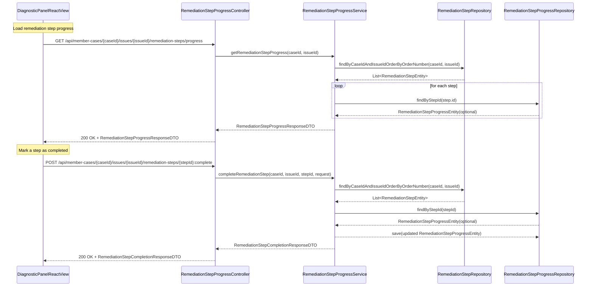
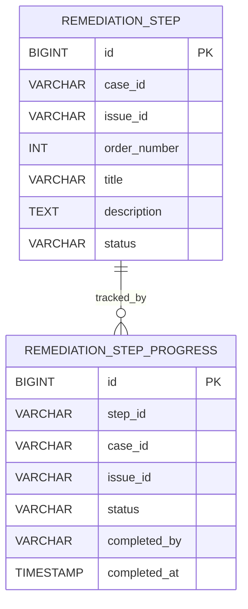

# Repository: APB_Demo
# Branch: APPMRN146
# Folder: LLD

1. Objective
The objective is to allow support agents to mark remediation steps as completed and track their progress through a remediation sequence. The backend will persist step completion status, and the frontend will provide interactions to mark steps as done and visually reflect progress.

2. Backend Spring Boot API Details
2.1. API Model
2.1.1. Common Components/Services
- RemediationStepProgressController: REST controller exposing endpoints to update and retrieve remediation step completion status.
- RemediationStepProgressService: Service containing business logic for tracking step completion and overall progress.
- RemediationStepRepository: Existing repository from remediation story used to fetch steps.
- RemediationStepProgressRepository: Repository for persisting completion state for each step.
- RemediationStepProgressMapper: Maps entities to DTOs for API responses.

2.1.2. API Details
| Operation                                     | REST Method | Type   | URL                                                                          | Request JSON                                                                                                      | Response JSON                                                                                                                                                                                                               |
|-----------------------------------------------|------------|--------|------------------------------------------------------------------------------|-------------------------------------------------------------------------------------------------------------------|-----------------------------------------------------------------------------------------------------------------------------------------------------------------------------------------------------------------------------|
| Get remediation step progress for an issue    | GET        | Query  | /api/member-cases/{caseId}/issues/{issueId}/remediation-steps/progress      | N/A                                                                                                               | {"caseId":"string","issueId":"string","steps":[{"stepId":"string","orderNumber":1,"title":"string","status":"PENDING","completedAt":null}],"completionPercentage":0.0}                                   |
| Mark remediation step as completed            | POST       | Command | /api/member-cases/{caseId}/issues/{issueId}/remediation-steps/{stepId}:complete | {"completedBy":"string","completedAt":"2025-01-01T12:05:00Z"}                                              | {"caseId":"string","issueId":"string","stepId":"string","status":"COMPLETED","completionPercentage":50.0}                                                                                                     |

2.1.3. Exceptions
- MemberCaseNotFoundException: Thrown when caseId is invalid.
- IssueNotFoundException: Thrown when issueId is invalid.
- RemediationStepNotFoundException: Thrown when stepId is not part of the issue plan.
- StepCompletionConflictException: Thrown if attempting to complete a step already completed or out of sequence (if enforced).
- GlobalExceptionHandler: Maps exceptions to standardized error responses.

2.2. Functional Design
2.2.1. Class Diagram

```mermaid
classDiagram
    class RemediationStepProgressController {
        +ResponseEntity~RemediationStepProgressResponseDTO~ getRemediationStepProgress(String caseId, String issueId)
        +ResponseEntity~RemediationStepCompletionResponseDTO~ completeRemediationStep(String caseId, String issueId, String stepId, RemediationStepCompletionRequestDTO request)
    }

    class RemediationStepProgressService {
        +RemediationStepProgressResponseDTO getRemediationStepProgress(String caseId, String issueId)
        +RemediationStepCompletionResponseDTO completeRemediationStep(String caseId, String issueId, String stepId, RemediationStepCompletionRequestDTO request)
    }

    class RemediationStepRepository {
        +List~RemediationStepEntity~ findByCaseIdAndIssueIdOrderByOrderNumber(String caseId, String issueId)
    }

    class RemediationStepProgressRepository {
        +Optional~RemediationStepProgressEntity~ findByStepId(String stepId)
        +RemediationStepProgressEntity save(RemediationStepProgressEntity entity)
    }

    class RemediationStepEntity {
        +Long id
        +String caseId
        +String issueId
        +Integer orderNumber
        +String title
        +String description
        +String status
    }

    class RemediationStepProgressEntity {
        +Long id
        +String stepId
        +String caseId
        +String issueId
        +String status
        +String completedBy
        +OffsetDateTime completedAt
    }

    class RemediationStepProgressDTO {
        +String stepId
        +Integer orderNumber
        +String title
        +String status
        +OffsetDateTime completedAt
    }

    class RemediationStepProgressResponseDTO {
        +String caseId
        +String issueId
        +List~RemediationStepProgressDTO~ steps
        +Double completionPercentage
    }

    class RemediationStepCompletionRequestDTO {
        +String completedBy
        +OffsetDateTime completedAt
    }

    class RemediationStepCompletionResponseDTO {
        +String caseId
        +String issueId
        +String stepId
        +String status
        +Double completionPercentage
    }

    class RemediationStepProgressMapper {
        +RemediationStepProgressDTO toDto(RemediationStepEntity stepEntity, RemediationStepProgressEntity progressEntity)
        +List~RemediationStepProgressDTO~ toDtoList(List~RemediationStepEntity~ steps, List~RemediationStepProgressEntity~ progresses)
    }

    RemediationStepProgressController --> RemediationStepProgressService
    RemediationStepProgressService --> RemediationStepRepository
    RemediationStepProgressService --> RemediationStepProgressRepository
    RemediationStepProgressService --> RemediationStepProgressMapper
```

2.2.2. UML Sequence Diagram

2.2.3. Components
| Component Name                     | Description                                                                      | Existing/New |
|------------------------------------|----------------------------------------------------------------------------------|--------------|
| RemediationStepProgressController  | REST controller for remediation step progress retrieval and completion updates. | New          |
| RemediationStepProgressService     | Business logic for tracking remediation step completion and progress.           | New          |
| RemediationStepRepository          | Existing repository for remediation steps.                                      | Existing     |
| RemediationStepProgressRepository  | Repository for tracking completion state.                                       | New          |
| RemediationStepProgressMapper      | Maps step and progress data into DTOs.                                          | New          |

2.3. Service Layer Business Logic
- Service Architecture & Dependency Injection:
  - RemediationStepProgressController uses constructor injection to depend on RemediationStepProgressService.
  - RemediationStepProgressService depends on RemediationStepRepository, RemediationStepProgressRepository, and RemediationStepProgressMapper.
- Workflow:
  - getRemediationStepProgress:
    - Validate caseId and issueId.
    - Retrieve ordered steps for the case and issue.
    - For each step, load corresponding RemediationStepProgressEntity if exists.
    - Build RemediationStepProgressDTO list; status is derived from progress entity or defaults to PENDING.
    - Compute completionPercentage as completedSteps / totalSteps * 100.
    - Return RemediationStepProgressResponseDTO.
  - completeRemediationStep:
    - Validate caseId, issueId, stepId, and request.completedBy.
    - Verify that stepId belongs to the given caseId and issueId.
    - Optionally enforce sequence rules (e.g., cannot complete step 3 if step 2 is not completed).
    - Load or create RemediationStepProgressEntity and set status to COMPLETED, with completedBy and completedAt.
    - Persist progress entity.
    - Recompute completionPercentage and return RemediationStepCompletionResponseDTO.
- Caching Strategy:
  - No dedicated cache; progress updates should be real-time.
- Validation Rules:
  - caseId, issueId, and stepId must be non-empty and match expected patterns.
  - completedBy must be non-empty.
  - completedAt must not be in the future beyond allowed skew.

Validation rules
| Field Name                              | Validation                                                 | Error Message                                      | Class Used                         |
|-----------------------------------------|------------------------------------------------------------|---------------------------------------------------|------------------------------------|
| caseId                                  | Not blank, pattern ^[A-Za-z0-9\-]+$                        | "caseId must be alphanumeric with dashes only"   | RemediationStepProgressService     |
| issueId                                 | Not blank, pattern ^[A-Za-z0-9\-]+$                        | "issueId must be alphanumeric with dashes only"  | RemediationStepProgressService     |
| stepId                                  | Not blank, pattern ^[A-Za-z0-9\-]+$                        | "stepId must be alphanumeric with dashes only"   | RemediationStepProgressService     |
| RemediationStepCompletionRequestDTO.completedBy | Not blank, max length 255                         | "completedBy is required"                        | RemediationStepProgressService     |
| RemediationStepCompletionRequestDTO.completedAt | Not null, not more than 5 minutes in future      | "completedAt is invalid"                         | RemediationStepProgressService     |

2.4. Service Integrations
| System | Integrated For                                    | Integration Type |
|--------|---------------------------------------------------|------------------|
| None   | No external integration in this story             | N/A              |

3. Front End React Details
3.1. UI Component Architecture
- Component Hierarchy:
  - IssueRemediationStepsPanel
    - RemediationStepProgressList
      - RemediationStepProgressItem
- State Management:
  - IssueRemediationStepsPanel manages steps with status state via a hook named useRemediationStepProgress.
- Props Interfaces:
  - RemediationStepProgressList
    - props: { steps: RemediationStepProgressViewModel[]; onStepComplete: (stepId: string) => void }
  - RemediationStepProgressItem
    - props: { step: RemediationStepProgressViewModel; onComplete: (stepId: string) => void }
  - RemediationStepProgressViewModel
    - { stepId: string; orderNumber: number; title: string; status: 'PENDING'|'IN_PROGRESS'|'COMPLETED'; completedAt?: string }

3.2. UI Specifications
- Wireframes/Pages:
  - RemediationStepProgressList shows steps with checkboxes or buttons to mark as completed.
  - A progress indicator (e.g., percentage or bar) is displayed at the top reflecting completionPercentage.
- Responsive Breakpoints:
  - Desktop: steps shown as rows with a completion control on the right.
  - Mobile: completion control shown below the step title.
- Form Structures with Validation:
  - Mark-as-complete action is implemented as a button; minimal client-side validation (e.g., disable repeated clicks when already COMPLETED).
- User Interaction Patterns:
  - Clicking "Mark as done" triggers the completion API.
  - On success, status is updated to COMPLETED and progress bar refreshes.

3.3. API Integration
- HTTP Client Configuration:
  - useRemediationStepProgress(caseId, issueId) hook encapsulates calls.
  - GET /api/member-cases/{caseId}/issues/{issueId}/remediation-steps/progress loads current progress.
  - POST /api/member-cases/{caseId}/issues/{issueId}/remediation-steps/{stepId}:complete marks a step as completed.
- Call Patterns and Error Handling:
  - On page load, progress is retrieved.
  - On completion, optimistic UI update may be applied; on failure, revert state and show error.
- Loading States:
  - Spinner while initial progress loads; button-level loading indicators on completion.
- Data Transformation:
  - API DTO mapped to RemediationStepProgressViewModel with human-readable timestamps.

4. Database Details
4.1. ER Model

4.2. Database Validations
- REMEDIATION_STEP.id is unique and used as stepId in progress table.
- REMEDIATION_STEP_PROGRESS.step_id is NOT NULL and indexed.
- REMEDIATION_STEP_PROGRESS.status constrained to PENDING, IN_PROGRESS, COMPLETED via application logic.

5. Non-Functional Requirements
5.1. Performance
- Progress retrieval should complete within 300 ms for typical remediation plans.

5.2. Security (Authentication & Authorization)
- Endpoints protected by existing authentication.
- Only authorized agents may update completion status.

5.3. Logging (Application, Audit, Monitoring)
- Audit logs capture who completed each remediation step and when.

6. Dependencies
- Spring Boot Web, Spring Data JPA.
- React 18+.

7. Assumptions
- Remediation steps themselves are immutable; only status is tracked in this story.
- Step identifiers are stable across reloads and user sessions.
