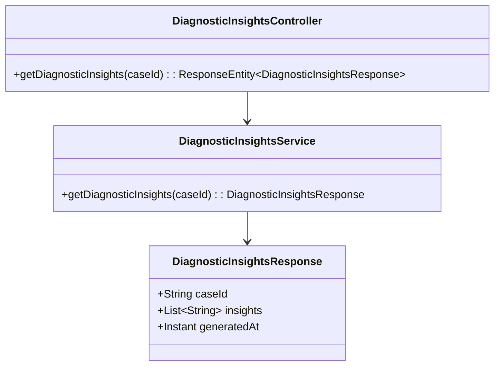
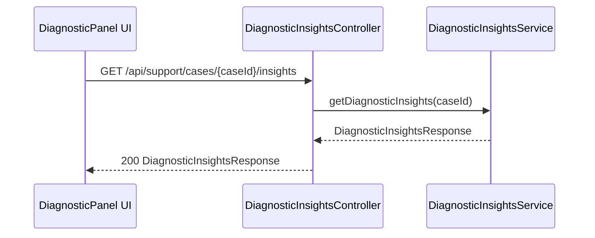
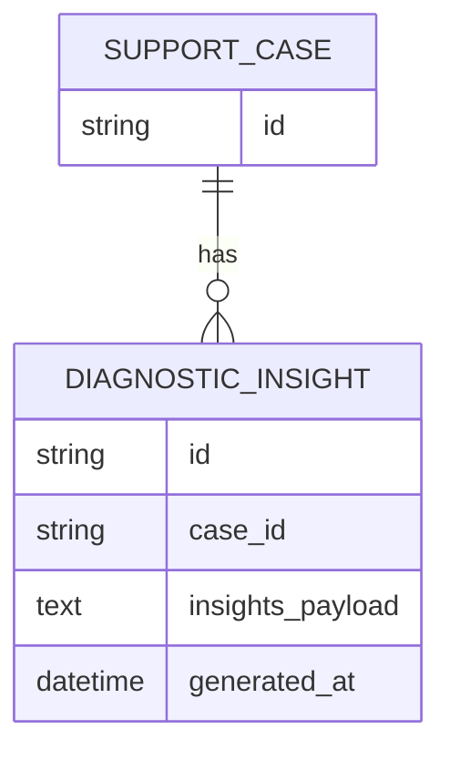

# Repository: APB_Demo
# Branch: intdemotesting2
# Folder: LLD

1. Objective
The objective is to present real-time AI-generated diagnostic insights for member issues in the diagnostic panel. The system will analyze case context and recent member interactions to produce insights quickly. This enables support agents to understand issues accurately and respond in real time.

2. Backend Spring Boot API Details
2.1. API Model
2.1.1. Common Components/Services
- DiagnosticInsightsService: Service that generates AI-based diagnostic insights for support cases.

2.1.2. API Details
| Operation                     | REST Method | Type   | URL                                      | Request JSON | Response JSON                                                                                     |
|-------------------------------|------------|--------|------------------------------------------|-------------|--------------------------------------------------------------------------------------------------|
| Get real-time diagnostic insights | GET     | Public | /api/support/cases/{caseId}/insights     | N/A         | {"caseId": string, "insights": [string], "generatedAt": string}                               |

2.1.3. Exceptions
- CaseNotFoundException: Thrown when the specified caseId does not exist.
- DiagnosticInsightsUnavailableException: Thrown when insights cannot be generated.

2.2. Functional Design
2.2.1. Class Diagram

2.2.2. UML Sequence Diagram

2.2.3. Components
| Component Name                     | Description                                                            | Existing/New |
|-----------------------------------|------------------------------------------------------------------------|-------------|
| DiagnosticInsightsController      | REST controller exposing diagnostic insights endpoint.                | New         |
| DiagnosticInsightsService         | Service generating AI-based diagnostic insights.                      | New         |
| DiagnosticInsightsResponse        | DTO containing diagnostic insights for a case.                        | New         |

2.3. Service Layer Business Logic
- Service architecture & DI: DiagnosticInsightsService is injected into DiagnosticInsightsController.
- Workflow: The service collects case context and recent member interactions, invokes AI diagnostic logic (assumed internal), composes insights list, and returns it.
- Caching strategy: No long-lived caching; insights are generated per request to remain up to date.
- Validation rules: Validate that caseId exists.

Validation rules
| Field Name | Validation                       | Error Message          | Class Used                        |
|-----------|----------------------------------|------------------------|-----------------------------------|
| caseId    | Must refer to existing case      | "Case not found"      | DiagnosticInsightsService         |

2.4. Service Integrations
| System                 | Integrated For                           | Integration Type |
|------------------------|------------------------------------------|------------------|
| AI Diagnostic Engine   | Generating diagnostic insights           | Synchronous      |

3. Front End React Details
3.1. UI Component Architecture
- Component hierarchy: DiagnosticPanelPage contains DiagnosticInsightsPanel.
- Data flow: DiagnosticInsightsPanel receives caseId as a prop, calls the insights endpoint, and renders insights list.
- State management: Local state with React hooks; stores insights, loading, and error state.
- Props interfaces: DiagnosticInsightsPanelProps: { caseId: string }.
- Routing: DiagnosticPanelPage mounted at /support/cases/:caseId/diagnostic.

3.2. UI Specifications
- Wireframes/pages: DiagnosticInsightsPanel displays a list of insights with timestamps and brief descriptions.
- Responsive breakpoints: List layout is vertical and adjusts to panel width.
- Form structures with validation: None; display only.
- User interaction patterns: Agents can refresh insights manually via a button that re-calls the API.

3.3. API Integration
- HTTP client configuration: Uses shared Axios instance.
- Call patterns and error handling: On mount, DiagnosticInsightsPanel calls GET /api/support/cases/{caseId}/insights; failures show inline error with retry.
- Loading states: Spinner while fetching.
- Data transformation: Minimal; array of strings from response mapped directly to list items.

4. Database Details
4.1. ER Model

4.2. Database Validations
- NOT NULL constraints on case_id, insights_payload, and generated_at.
- Foreign key from DIAGNOSTIC_INSIGHT.case_id to SUPPORT_CASE.id.

5. Non-Functional Requirements
5.1. Performance
- Insights should be returned within 1 second under normal load.

5.2. Security (Authentication & Authorization)
- Only authenticated support agents can access diagnostic insights.

5.3. Logging (Application, Audit, Monitoring)
- Log each insight request with caseId at INFO.
- Log AI engine errors at WARN/ERROR.

6. Dependencies
- Spring Boot Web starter.
- AI diagnostic engine client.
- React with Axios (or equivalent HTTP client).

7. Assumptions
- AI diagnostic engine is available as a synchronous service call.
