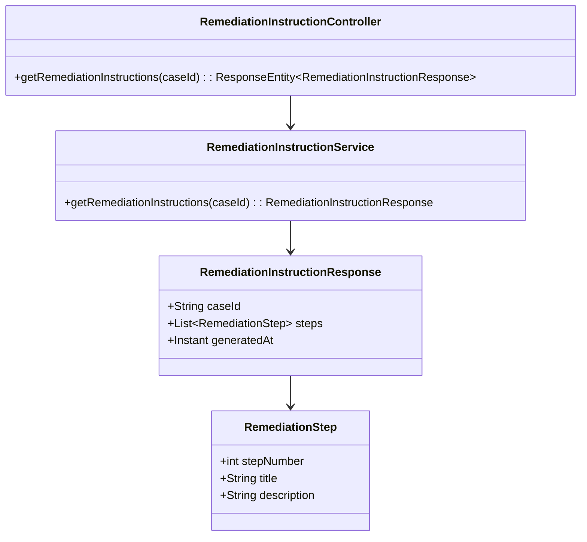
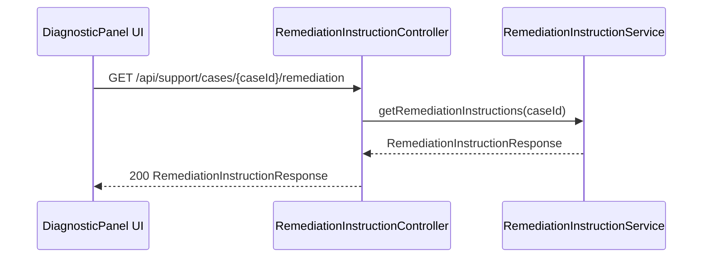
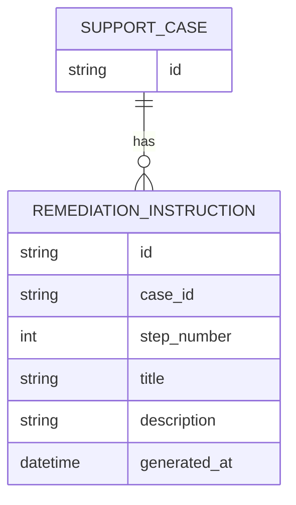

# Repository: APB_Demo
# Branch: intdemotesting2
# Folder: LLD

1. Objective
The objective is to provide step-by-step AI-generated remediation instructions for support agents. The system will present numbered remediation steps tailored to the member’s issue within the diagnostic panel. This ensures consistent and efficient resolution of issues by following guided instructions.

2. Backend Spring Boot API Details
2.1. API Model
2.1.1. Common Components/Services
- RemediationInstructionService: Service to generate and retrieve AI-based remediation instructions for a given case.

2.1.2. API Details
| Operation                         | REST Method | Type   | URL                                              | Request JSON | Response JSON                                                                                                                                   |
|-----------------------------------|------------|--------|--------------------------------------------------|-------------|--------------------------------------------------------------------------------------------------------------------------------------------------|
| Get remediation instructions      | GET        | Public | /api/support/cases/{caseId}/remediation         | N/A         | {"caseId": string, "steps": [{"stepNumber": number, "title": string, "description": string}], "generatedAt": string}                      |

2.1.3. Exceptions
- CaseNotFoundException: Thrown when the specified caseId does not exist.
- RemediationInstructionsUnavailableException: Thrown when instructions cannot be generated.

2.2. Functional Design
2.2.1. Class Diagram

2.2.2. UML Sequence Diagram

2.2.3. Components
| Component Name                     | Description                                                               | Existing/New |
|-----------------------------------|---------------------------------------------------------------------------|-------------|
| RemediationInstructionController  | REST controller exposing remediation instructions endpoint.              | New         |
| RemediationInstructionService     | Service generating remediation steps for a case.                          | New         |
| RemediationStep                   | DTO representing a single remediation step.                               | New         |
| RemediationInstructionResponse    | DTO holding the remediation instructions for a case.                      | New         |

2.3. Service Layer Business Logic
- Service architecture & DI: RemediationInstructionService is injected into RemediationInstructionController.
- Workflow: The service invokes AI logic (assumed internal) to generate remediation steps for the case, ensures steps are ordered with stepNumber starting from 1, and returns them.
- Caching strategy: No caching; remediation steps are generated per request to reflect latest diagnostics.
- Validation rules: Validate that caseId exists.

Validation rules
| Field Name | Validation                       | Error Message          | Class Used                        |
|-----------|----------------------------------|------------------------|-----------------------------------|
| caseId    | Must refer to existing case      | "Case not found"      | RemediationInstructionService     |

2.4. Service Integrations
| System                | Integrated For                                   | Integration Type |
|-----------------------|--------------------------------------------------|------------------|
| AI Remediation Engine | Generating step-by-step remediation instructions | Synchronous      |

3. Front End React Details
3.1. UI Component Architecture
- Component hierarchy: DiagnosticPanelPage contains RemediationInstructionsPanel.
- Data flow: RemediationInstructionsPanel receives caseId as a prop, calls the remediation endpoint, and displays the numbered list of steps.
- State management: Local React hook state for loading, errors, and steps.
- Props interfaces: RemediationInstructionsPanelProps: { caseId: string }.
- Routing: DiagnosticPanelPage mounted at /support/cases/:caseId/diagnostic.

3.2. UI Specifications
- Wireframes/pages: RemediationInstructionsPanel renders steps as a numbered ordered list with title and description for each step.
- Responsive breakpoints: List is vertical and naturally responsive; text wraps based on panel width.
- Form structures with validation: No forms; read-only content.
- User interaction patterns: Agents can expand/collapse long descriptions and mark steps as visually completed in the UI (local-only state).

3.3. API Integration
- HTTP client configuration: Uses shared Axios instance.
- Call patterns and error handling: On mount or when caseId changes, RemediationInstructionsPanel calls GET /api/support/cases/{caseId}/remediation; on error, an inline message and retry button are displayed.
- Loading states: Spinner while loading.
- Data transformation: Response steps are mapped to UI list items with index-based keys.

4. Database Details
4.1. ER Model

4.2. Database Validations
- NOT NULL constraints on case_id, step_number, title, description, and generated_at.
- Foreign key from REMEDIATION_INSTRUCTION.case_id to SUPPORT_CASE.id.

5. Non-Functional Requirements
5.1. Performance
- Remediation instructions should be returned within 1 second for a typical case.

5.2. Security (Authentication & Authorization)
- Only authenticated support agents can access remediation instructions.

5.3. Logging (Application, Audit, Monitoring)
- Log each remediation request with caseId at INFO.
- Log AI engine failures at WARN/ERROR.

6. Dependencies
- Spring Boot Web starter.
- AI remediation engine client.
- React with Axios (or equivalent HTTP client).

7. Assumptions
- AI remediation engine is available as a synchronous service call.
