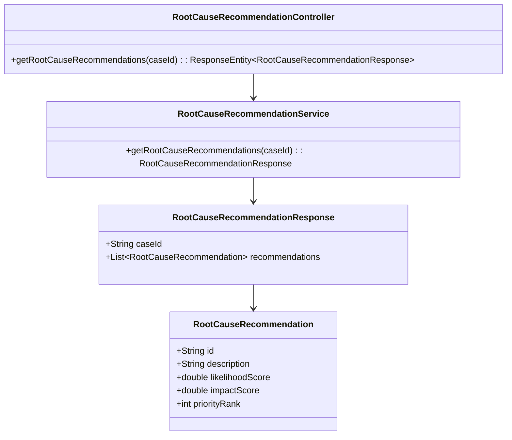
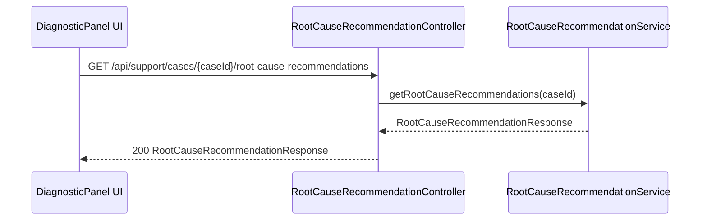
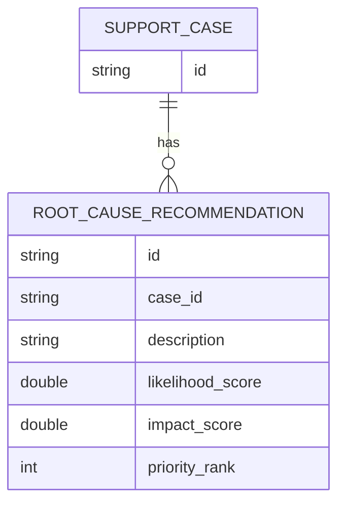

# Repository: APB_Demo
# Branch: intdemotesting2
# Folder: LLD

1. Objective
The objective is to provide prioritized AI recommendations for likely root causes of member issues. The system will present recommendations ordered by likelihood and impact within the diagnostic panel. This helps support agents focus on the most impactful actions first.

2. Backend Spring Boot API Details
2.1. API Model
2.1.1. Common Components/Services
- RootCauseRecommendationService: Service that retrieves and prioritizes AI-generated root-cause recommendations for a given case.

2.1.2. API Details
| Operation                               | REST Method | Type   | URL                                             | Request JSON                                                                                 | Response JSON                                                                                                                                                    |
|-----------------------------------------|------------|--------|-------------------------------------------------|----------------------------------------------------------------------------------------------|-------------------------------------------------------------------------------------------------------------------------------------------------------------------|
| Get prioritized root-cause recommendations | GET      | Public | /api/support/cases/{caseId}/root-cause-recommendations | N/A                                                                                          | {"caseId": string, "recommendations": [{"id": string, "description": string, "likelihoodScore": number, "impactScore": number, "priorityRank": number}]} |

2.1.3. Exceptions
- CaseNotFoundException: Thrown when the specified caseId does not exist.
- RootCauseRecommendationsUnavailableException: Thrown when recommendations cannot be generated.

2.2. Functional Design
2.2.1. Class Diagram

2.2.2. UML Sequence Diagram

2.2.3. Components
| Component Name                        | Description                                                                   | Existing/New |
|--------------------------------------|-------------------------------------------------------------------------------|-------------|
| RootCauseRecommendationController    | REST controller exposing root-cause recommendations endpoint.                | New         |
| RootCauseRecommendationService       | Service generating and prioritizing root-cause recommendations.              | New         |
| RootCauseRecommendation              | DTO representing a single root-cause recommendation with scores and rank.    | New         |
| RootCauseRecommendationResponse      | DTO containing list of prioritized root-cause recommendations.               | New         |

2.3. Service Layer Business Logic
- Service architecture & DI: RootCauseRecommendationService is injected into RootCauseRecommendationController.
- Workflow: The service fetches AI-generated recommendations (assumed internal), calculates priorityRank based on likelihoodScore and impactScore (e.g., descending combined score), sorts recommendations, and returns them.
- Caching strategy: No explicit caching; recommendations are generated per request to reflect latest case insights.
- Validation rules: Validate that caseId exists.

Validation rules
| Field Name | Validation                       | Error Message          | Class Used                        |
|-----------|----------------------------------|------------------------|-----------------------------------|
| caseId    | Must refer to existing case      | "Case not found"      | RootCauseRecommendationService    |

2.4. Service Integrations
| System                | Integrated For                                  | Integration Type |
|-----------------------|-------------------------------------------------|------------------|
| AI Root Cause Engine  | Generating raw root-cause recommendations       | Synchronous      |

3. Front End React Details
3.1. UI Component Architecture
- Component hierarchy: DiagnosticPanelPage contains RootCauseRecommendationsPanel.
- Data flow: RootCauseRecommendationsPanel receives caseId as a prop, calls the root-cause recommendations API, and renders the prioritized list.
- State management: Local state using React hooks for loading, error, and recommendations data.
- Props interfaces: RootCauseRecommendationsPanelProps: { caseId: string }.
- Routing: DiagnosticPanelPage is rendered under /support/cases/:caseId/diagnostic.

3.2. UI Specifications
- Wireframes/pages: RootCauseRecommendationsPanel displays each recommendation with description and badges for likelihood and impact; priorityRank is shown as an ordered list number.
- Responsive breakpoints: On small screens, recommendations stack vertically; on larger screens, two-column layout may be used for description and scores.
- Form structures with validation: No forms; read-only display.
- User interaction patterns: Agents can click a recommendation to expand more details if available; default view shows sorted list.

3.3. API Integration
- HTTP client configuration: Uses shared Axios instance.
- Call patterns and error handling: On mount, RootCauseRecommendationsPanel calls GET /api/support/cases/{caseId}/root-cause-recommendations; errors are displayed inline with retry.
- Loading states: Spinner or skeleton while fetching.
- Data transformation: Response mapped to view model including display labels for likelihood and impact.

4. Database Details
4.1. ER Model

4.2. Database Validations
- NOT NULL constraints on case_id, description, likelihood_score, impact_score, and priority_rank.
- Foreign key from ROOT_CAUSE_RECOMMENDATION.case_id to SUPPORT_CASE.id.

5. Non-Functional Requirements
5.1. Performance
- Recommendations should be returned within 1 second for a typical case.

5.2. Security (Authentication & Authorization)
- Only authenticated support agents may access root-cause recommendations.

5.3. Logging (Application, Audit, Monitoring)
- Log each recommendation request with caseId at INFO.
- Log errors from AI root cause engine at WARN/ERROR.

6. Dependencies
- Spring Boot Web starter.
- AI root cause engine client library.
- React with Axios (or equivalent HTTP client).

7. Assumptions
- AI root cause engine is available as a synchronous service call.
- Persistent storage of recommendations is optional and provided as needed for reporting.
